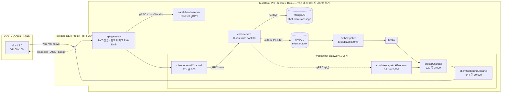
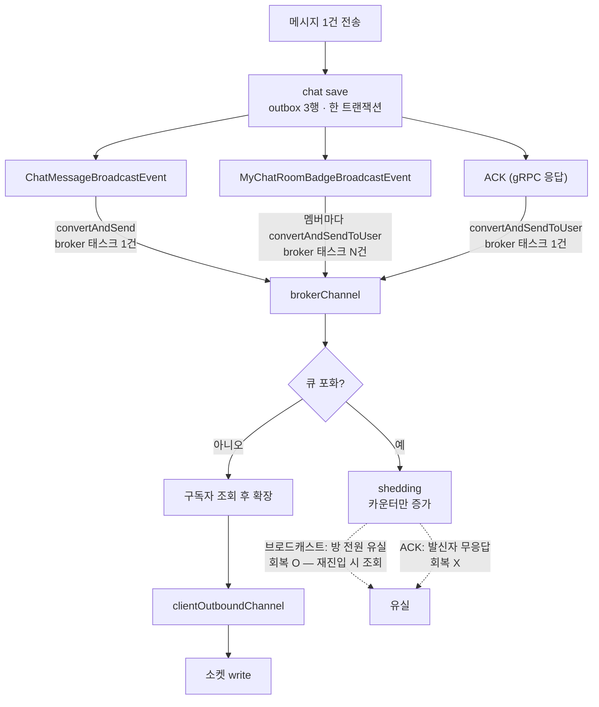
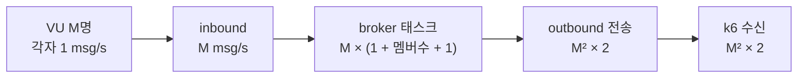

# 2차 부하테스트 — 2026-08-28

1차(2026-05-08)의 결론을 재검증하고 병목을 다시 잡았다. **1차 결론은 틀렸다.**

## 요약

| | 1차 결론 | 2차 실측 |
|---|---|---|
| 병목 | STOMP outbound 스레드 포화 | **커넥션 점유시간 · 거절 정책 · executor 크기 · 뱃지 부하** |
| 대응 | 스레드 64 → 96 (효과 없었음) | 아래 5건 |
| 측정 성격 | 10초 버스트 | **60초 지속** |

**스레드는 한 번도 원인이 아니었다.**

---

## 0. 측정 대상 아키텍처

### 메시지 경로와 측정 지점



### brokerChannel 이 세 종류를 함께 나른다

**측정에서 제일 중요한 구조다.** ACK 가 브로드캐스트와 같은 채널·같은 거절 핸들러를 쓴다.



- 채팅 브로드캐스트는 broker 태스크 **1건**, 확장은 채널 내부에서 구독자 N명으로
- 뱃지는 `convertAndSendToUser` 를 **멤버마다** 호출 → broker 태스크 **N건**
- ACK 도 같은 채널을 지나므로 shedding 대상이 된다

### 부하 증폭



`M = 80` 이면 초당 12,800건, `M = 100` 이면 20,000건이다. **인원의 제곱이라 인스턴스 증설로는 못 따라간다.**

---

## 1. 1차 측정 재해석

### 버스트를 지속으로 읽었다

k6 기본값이 `MESSAGE_COUNT=10` · `COLLECT_WINDOW_MS=30000` 이다. **10초 발송 후 30초 더 받는다.**

```
130 VU 발생량   130 × 130 × 10초 = 169,000건
관측 처리량     약 6,000/s
소화 시간       28초  <  총 창 40초
```

미도달 0% 는 "버텼다"가 아니라 **"드레인 구간에 늦게 다 왔다"** 였다.
지속 부하 기준 한계는 `M ≤ √(C/r)` 로 훨씬 낮다.

### 집계 착시

k6 는 기대치를 `VUS × VUS × MESSAGE_COUNT` 로 잡는다. **연결에 실패한 VU 가 있으면 분모만 커진다.**

```
k6 기대치     4,800 × 80 = 384,000
실제 기대치   4,740 × 79 = 374,460    (ws upgrade ✗1)
```

이 보정 없이 읽으면 유실 10.06% 가 실제로는 0.23% 다. **`subscribe_frame_count` 와 `send_count` 로 항상 보정한다.**

---

## 2. 찾아낸 병목과 대응

### 2-1. 커넥션 점유시간 — 트랜잭션이 Mongo I/O 를 품고 있었다

`ChatMessageCommandService.save` 가 `@Transactional` 안에서 `chatRoomPersistencePort.findById`(Mongo)를
호출한 뒤 outbox 를 INSERT 한다. `LazyConnectionDataSourceProxy` 가 없어 **Mongo 왕복 내내 MySQL 커넥션을 붙들었다.**

| 지표 | 전 | 후 |
|---|---:|---:|
| `hikaricp_connections_usage_seconds_max` | **5.139초** | **1.289초** |
| `connections_pending` 최대 | 118 | **0** |
| `connections_timeout_total` | **360건** | **0건** |
| 브로드캐스트 유실 | 10.06% | **0%** |
| p90 | 8,683ms | **1,216ms** |

인과가 숫자로 닫힌다.

```
커넥션 타임아웃 360 / 전송 3,600     = 10.0%
브로드캐스트 유실 21,720 / 216,000   = 10.06%
360 × 60명 = 21,600 ≈ 21,720
```

같은 실행에서 `stomp_executor_rejected_total{pool="outbound"}` 는 **0건**이었다.
**병목은 팬아웃이 아니라 커넥션이었다.** (PR #257)

### 2-2. 거절 정책 — 버리는 비용이 병목이었다

`AbortPolicy` 는 예외 메시지를 만들며 `ThreadPoolExecutor.toString()` 을 부르고, 그 안에서 `mainLock` 을 잡는다.
**정상 경로는 이 락을 쓰지 않고 거부 경로만 쓴다.** 거부가 폭주하면 제출 스레드가 전부 락에서 직렬화된다.

```
1차 JFR   락 대기 3,637건 중 3,613건이 이 경로
2차 JFR   jdk.JavaMonitorEnter 198건
```

카운터만 올리는 핸들러로 교체해 해소했다. 로그가 아니라 카운터인 이유는 폭주 구간에서 로깅이 다음 병목이 되기 때문이다. (PR #255)

### 2-3. executor 크기 — 많다고 좋은 게 아니다

VU 80 동일 조건, 스레드만 변경:

**broker**

| 스레드 | 활성 최대 | 거절 | 큐 최대 | p90 |
|---:|---:|---:|---:|---:|
| 64 | 5 | 17,250 | 3,000 (포화) | 5,951ms |
| **32** | 5 | **6,942** | **286** | **5,705ms** |
| 16 | 8 | 5,413 | 1,649 | 10,649ms |

**outbound**

| 스레드 | 활성 최대 | p90 | ACK |
|---:|---:|---:|---:|
| 96 | 17 | 31,507~38,648ms | 35~43% |
| **64** | 15 | **4,333ms** | **99.92%** |
| 32 | 14 | 45,833ms | 28.3% |

**U자 곡선이다.** 32 도 96 도 아닌 64 에서 p90 이 8~10배 낮다.

`executor_active_threads` 는 **그 순간 실행 중인 수**(Little's Law 의 `L = λ × W`)이지 활용률이 아니다.
셋 다 활성이 14~17 로 비슷한데 결과는 10배 차이다 — **활성 수로 병목을 판단하면 안 되고 큐 깊이를 봐야 한다.**
(PR #258 · #259 · #260 · #261)

### 2-4. 뱃지 — 부하의 절반이 측정에서 빠져 있었다

`StompMyChatRoomBadgeAdapter` 는 **멤버마다** `convertAndSendToUser` 를 호출한다.

| | brokerChannel 태스크 |
|---|---|
| 채팅 브로드캐스트 | 1건 (토픽 → SimpleBroker 가 구독자 N명으로 확장) |
| **뱃지** | **멤버 수만큼** |
| ACK | 1건 |

k6 가 `/user/queue/chat/badge` 를 구독하지 않아 SimpleBroker 가 확장을 0건으로 끝내고 있었다.
구독을 추가하니 뱃지 수신량이 채팅과 거의 같게 나온다(VU 80: 채팅 384,000 · 뱃지 382,113).

**즉 이전 측정은 실제 부하의 절반만 걸고 있었다.**

### 2-5. ACK 가 브로드캐스트와 같은 채널에서 잘린다 — 미해결

`ExecutorConfig` 는 ACK 풀에만 `CallerRunsPolicy` 를 걸어 "ACK 는 버리지 않는다"를 의도했으나 **방어 위치가 틀렸다.**

```
chatMessageAckExecutor      CallerRunsPolicy — 여기선 안 버림
  → SimpMessagingTemplate.convertAndSendToUser()
    → brokerChannel         shedding 핸들러. 여기서 버려진다
```

`SimpMessagingTemplate`(= `brokerMessagingTemplate`)은 brokerChannel 을 물고 만들어진다. ACK 와 브로드캐스트가 같은 채널을 쓴다.

| 유실 | 회복 |
|---|---|
| 브로드캐스트 | 방 재진입 시 Mongo 조회 — 회복 O |
| Kafka lag | 따라잡음 — 회복 O |
| **ACK** | 발신자가 영영 모름 — **회복 X** |

**회복 불가능한 쪽을 버리고 있다.** 양으로도 ACK 는 브로드캐스트의 1/80 이라 보호 비용이 가장 싸다. (→ `TODO.md` 5.8)

---

## 3. 측정 방법 — 확립한 것

| | 이유 |
|---|---|
| **k6 를 별도 머신에서** | 로컬 실행 시 k6 가 맥 CPU 484%(4.8/6코어) 점유. 매 회차 `ws upgrade` 1~2개 실패 |
| **회차마다 워밍업** | 배포 직후 회차는 JIT 미컴파일로 왜곡. outbound 32 첫 실행 유실 31.45% → 워밍업 후 0% |
| **지속 부하** | `MESSAGE_COUNT=60`. 버스트는 드레인 구간이 결과를 만든다 |
| **`ACK_TIMEOUT_MS` > gRPC deadline** | 11,000ms. 거절과 지연이 갈린다 |
| **뱃지 구독** | 서버 부하의 절반 |
| **집계 보정** | `subscribe_frame_count` · `send_count` 로 실제 기대치 재계산 |
| **scrape 5s** | 10s 에서 executor 큐 피크를 놓쳤다 |
| **swapin 기록** | 호스트 메모리 압박이 지연에 섞인다 |

### k6 분리 효과

| | 로컬 k6 | 클라우드 k6 |
|---|---:|---:|
| k6 CPU (VU 60) | **247%** | **79%** |
| 연결 성공 | 59/60 | **60/60** |
| p90 | 773ms | 899ms |

**연결이 처음으로 100% 됐고 집계 보정이 불필요해졌다.** +126ms 는 Tailscale DERP 릴레이 왕복(실측 75ms)이다.

---

## 4. 최종 곡선

측정 조건: 방 1개 · 뱃지 포함 · 지속 60초 · k6 는 OCI(4 OCPU/16GB) · Tailscale relay

| 게이트웨이 | VU | 수신률 | 유실 | p90 | ACK | 판정 |
|---|---:|---:|---:|---:|---:|---|
| 1대 | 60 | 100% | 0 | 6,454ms | 99.50% | ✅ |
| **1대** | **80** | **99.92%** | 320 | **4,333ms** | **99.92%** | **✅ 한계** |
| 1대 | 100 | 91.27% | 52,398 | 51,969ms | 24.96% | ❌ |
| 2대 | 100 | 99.88% | 750 | 36,281ms | 14.38% | ❌ |

### 스케일아웃은 유실을 없앴지만 지연은 못 잡았다

| | 1대 | 2대 |
|---|---:|---:|
| broker 거절 | 75,694 | **0** |
| outbound 거절 | 2,120 | **0** |
| outbound 큐 최대 | 11,880 | 3,059 / 2,001 |
| p90 | 51,969ms | 36,281ms |

부하는 균등하게 나뉘었다(outbound 완료 태스크 2,430,062 / 2,404,279).

**그럼에도 SLO 미달이다.** VU 100 구간에서 상류는 전부 여유였다.

```
DB pending 4 · DB 점유 0.8초 · Kafka lag 0 · broker 큐 105
outbound 큐 3,794 / 4,258      ← 여기만 쌓인다
게이트웨이 CPU 1~4%             ← 계산이 아니라 대기
Pages free 43 MB                ← 호스트 메모리 바닥
```

---

## 5. 측정 환경의 한계 — 반드시 함께 읽는다

16GB · 6코어 단일 장비에 인프라 · 모니터링 · 서비스 컨테이너를 모두 실행했다.

- 회차별 `swapin` 4,430 ~ 25,340 MB. VU 100 구간에서 `Pages free` 43MB
- 게이트웨이 2대 구성은 컨테이너 메모리를 +768MB 요구해 호스트 압박을 키운다
- CPU 사용률이 1~4% 인데 큐가 쌓이는 것은 계산이 아니라 **페이지 폴트 대기**를 시사한다
- 회차 간 편차가 크다 (VU 100 2대: 수신률 71.58% ~ 100%)

**따라서 위 수치는 하드웨어 한계가 아니라 하한이다.** 자원이 분리된 환경에서는 더 나온다.
반대로 말하면 **소프트웨어 병목은 이 환경에서 걷어낼 수 있는 만큼 걷어냈다.**

---

## 6. 남은 과제

### 배칭이 유일하게 자릿수를 바꾼다 (→ `TODO.md` 5.3)

```
지금    메시지 30건 × 구독자 80명 = 2,400 전송 / 100ms
배칭    1프레임 × 80명            =    80 전송 / 100ms      1/30
```

앞선 최적화는 2~10배였고 이것은 30배다. **팬아웃이 `M²` 인 이상 하드웨어로는 못 이긴다.**

```
500명 한 방  →  500² × 2(뱃지) = 500,000 전달/s
```

대가는 STOMP wire payload 가 배열이 되는 **외부 계약 변경**이다(프론트 · k6 동반 수정).

### 그 외

- ACK 보호 위치 정정 (→ 5.8)
- 뱃지의 `convertAndSendToUser` 루프 구조 — 방이 커질수록 broker 태스크가 O(멤버수) (→ 5.9)
- VU별 자격증명 — 계정 2개 공유로 ACK·뱃지가 세션 수만큼 증폭 (→ 5.4)
- Kafka 컨슈머 그룹 누수 — 배포마다 `${app.instance-id}` 로 새 그룹이 생기고 옛 그룹이 남는다. 이번에 21개 삭제

---

## 7. 3차 측정 — 뱃지 conflation 적용 후 (PR #263)

같은 날 뱃지 conflation(→ `TODO.md` 5.9-a)을 적용하고 VU 80 을 다시 쟀다.
**목표였던 brokerChannel 병목은 사라졌고, 지연은 호스트 한계로 판정하지 못했다.**

### 7-1. 서버 카운터 — 확정

호스트 상태와 무관하게 서버가 직접 센 값이다.

| | 2차 (VU 80·1대) | 3차 (VU 80·1대) |
|---|---:|---:|
| 뱃지 프레임 | 384,000 | **약 15,000** (25배 감소) |
| broker 거절 | 17,250 | **0** |
| outbound 거절 | 0 | 0 |
| inbound 거절 | 0 | 0 |
| broker 큐 최대 | 3,000 (포화) | **4 ~ 264** |
| outbound 큐 최대 | 4,232 | 1,091 ~ 1,519 |
| DB pending | 18 | **0** |
| 수신률 | 99.92% | **100%** |
| 유실 | 320 | **0** |

conflation 카운터가 k6 수신 건수와 정확히 맞는다.

```
coalesced 9,577 + flushed 423 = 10,000       유입 총량(웜업 2회 + 본실행 2회)과 일치
badge 수신 14,880 = 186라운드 × 80멤버       한 건도 어긋나지 않는다
```

**broker 는 더 이상 병목이 아니다. 남은 것은 outbound 하나다.**

```
stompOutbound   큐 1,091~1,519 · 활성 9~18 / 64
```

큐가 쌓이는데 스레드가 남는다 — 2차에서 관측한 소켓 write 블로킹 패턴(→ 5.10)과 같다.

### 7-2. 지연 — 판정 불가

같은 조건 2회를 연속으로 쟀는데 결과가 갈렸다.

| | 1회차 | 2회차 |
|---|---:|---:|
| 수신률 | 100% | 100% |
| 유실 | 0 | 0 |
| p90 | 42,160ms | 16,730ms |
| ACK | 43.04% | 78.00% |
| **측정 중 swapin** | **9,541 MB** | **8,614 MB** |

**swapin 은 비슷한데 p90 이 2.5배 차이난다.** 호스트 잡음이 신호보다 크다.

같은 회차에서 서버는 전 풀 거절 0 · DB pending 0 · 게이트웨이 CPU 0.5% 였다.
**서버가 놀고 있는데 지연이 42초면 그 42초는 서버 밖에서 생긴 것이다.**

### 7-3. 측정 유효성 판정 기준을 세웠다

2차에서 `Pages free` 만 보고 오염을 판단했는데 그것으로는 부족했다.
`Pages free` 는 파일 캐시가 먹어도 떨어지므로 단독 지표가 못 된다.

**측정 중 swapin 증가량**을 쓴다.

```bash
SW0=$(vm_stat | awk '/Swapins/{gsub(/\./,"",$2); print $2}')
# ... 측정 ...
SW1=$(vm_stat | awk '/Swapins/{gsub(/\./,"",$2); print $2}')
# (SW1-SW0) × 16384 바이트
```

| swapin 증가 | 판정 |
|---|---|
| 32,470 MB | 무효 (p90 41.9초) |
| 8,614 ~ 9,541 MB | **유효하지 않음.** 회차 간 편차 2.5배 |
| 수백 MB 이하 | 유효 (미달성) |

**이 호스트에서는 유효 구간에 못 들어간다.** 16GB 에 컨테이너 26개(서비스 6 · 인프라 15 · 모니터링 5)와 부하를 함께 올릴 수 없다.

### 7-4. 부수적으로 고친 것

측정 중 Docker 엔진을 재시작했더니 **인프라 컨테이너가 하나도 안 올라왔다.**

```
컨테이너가 참조하던 경로   /Users/noah/crypto-project-infra/infra/...
실제 저장소                /Users/noah/crypto-project/crypto-project-infra/infra/
```

저장소가 이사한 뒤에도 컨테이너는 이사 전 경로의 bind mount 를 물고 계속 돌고 있었다.
**한 번 죽으면 다시 못 뜨는 상태**였고, 그때까지 아무도 몰랐다.

compose 로 재생성해 현재 경로로 맞췄다(데이터는 named volume 이라 보존).
재생성으로 컨테이너 IP 가 바뀌어 Redis 클러스터가 `cluster_state:fail` 이 됐고,
`CLUSTER MEET` 로 주소를 갱신해 복구했다.

또 하나 — **`docker start` 로 띄운 서비스는 eureka 에 DOWN 으로 남는다.**
`DeploymentReadiness` 가 메모리의 `AtomicBoolean(false)` 라 재시작마다 초기화되고,
CD 파이프라인의 승인 단계를 거치지 않으면 `OUT_OF_SERVICE` 로 남는다.
컨테이너는 `Up` 인데 다른 서비스가 못 찾으므로 증상만 보면 헷갈린다.

그리고 **api-gateway 는 토큰 검증마다 authorization-server 로 gRPC 를 호출한다**
(`BlacklistAwareReactiveJwtDecoder`). JWKS 캐시로 때울 수 있는 구조가 아니라
측정 중에도 살아 있어야 한다. 메모리를 아끼려고 내렸다가 전 핸드셰이크가 실패했다.

### 7-5. 결론

```
확정   brokerChannel 병목 해소.  뱃지 프레임 25배 · broker 거절 17,250 → 0
       유실 0 · 수신률 100%
미정   지연 SLO.  호스트를 옮기기 전에는 못 잰다 (→ TODO 5.12)
다음   배칭(5.3).  남은 outbound 큐를 치는 유일한 수단이며,
       효과가 프레임 수·큐 깊이로 검증되어 지연 측정 없이도 판정할 수 있다
```

---

## 원본

- k6 원본 로그 · JFR: 세션 스크래치패드 `~/k6_chatmessage/results/`
- 관련 PR: #255 #257 #258 #259 #260 #261 #263
- 방법론·미해결 과제: `TODO.md` 5.3 · 5.4 · 5.7 ~ 5.12 · 5.14
