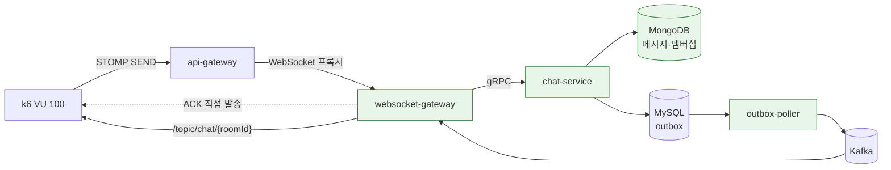

# 채팅 메시지 팬아웃 부하테스트

측정일 **2026-08-30**. 이 문서는 현재 저장된 기준 측정 기록이다.
원본 로그는 [2026-08-30/raw/](2026-08-30/raw/), 대시보드 정의는 [dashboards/](dashboards/)에 있다.

동시 접속 100명 · 방 멤버 302명에서 **메시지 유실 0 · ACK 실패 0** 을 세 회차 연속 재현했다.

> 이 회차는 뱃지 flush 타이머(#281)와 뱃지 `brokerChannel` 우회(#282) 적용 전 결과다.
> 따라서 두 변경의 효과를 입증하는 자료로 쓰지 않는다. 동일 조건의 d-only → direct 인접 회차는
> 별도로 측정해 원본과 서버 지표를 추가한다.



초록색이 이번에 손댄 지점이다 — 코드 둘(#270 #271)과 설정 둘(GC · WiredTiger 캐시).

---

## 1. 측정 조건

| 항목 | 값 |
|---|---|
| 접속 경로 | Native WebSocket `/ws-native` (프론트엔드와 동일) |
| 테스트 계정 | 300개, **VU 당 1개** |
| 방 멤버 | **302명** (테스트 계정 300 + 기존 2) |
| 동시 접속 VU | 100 |
| 전송 | VU 당 60건, 1초 간격 |
| 기대 브로드캐스트 | 총 전송 수 × 접속 VU 수 (VU 당 60건이 아니라 **회차 전체 합**이다) |
| 수집 창 | 전송 종료 후 60초 |
| ACK · 브로드캐스트 타임아웃 | 11초 · 10초(초과 도착은 `late` 로 분리 집계) |
| 호스트 | 16GB RAM 맥 1대, 컨테이너 23개 |

**계정을 VU 마다 나눈 것이 이번 측정의 전제다.** 이전에는 계정 2개를 전 VU 가 공유해
한 계정에 세션이 50개씩 달렸고, `convertAndSendToUser` 로 나가는 ACK·뱃지가 세션 수만큼
증폭됐다. 실제 사용자 100명이면 세션은 계정당 1개다.

방 멤버를 302명으로 둔 것도 의도적이다. 접속자보다 멤버가 많은 것이 현실이고,
그 차이가 **O(멤버) 비용**을 드러냈다([§3-1](#3-1-멤버십-갱신을-bulkwrite-한-번으로-pr-270),
[§3-2](#3-2-브로드캐스트-이벤트에서-멤버-목록-제거-pr-271)).

---

## 2. 결과

| 회차 | 접속 VU | 전송 | ACK 성공 | ACK 실패 | 수신 / 기대 | p90 | swapin |
|---|---:|---:|---:|---:|---|---:|---:|
| 01:04 | 96 | 5,760 | **100%** | **0** | 552,960 / 552,960 | 8.64s | 10.9GB |
| 01:10 | 99 | 5,940 | **100%** | **0** | 588,060 / 588,060 | 14.5s | 14.9GB |
| 01:16 | 98 | 5,880 | **100%** | **0** | 576,240 / 576,240 | 4.95s | 11.7GB |

기대치는 `전송 수 × 접속 VU 수`다. **세 회차 모두 정확히 일치했다 — 유실 0, 중복 0.**
STOMP 거절은 모든 `kind`(broadcast·ack·badge)에서 0, 큐 깊이 최대 0~2,
Hikari 커넥션 대기 0이었다.

> k6 요약의 `missing_total_count` 는 분모를 VU **설정값**으로 잡아 접속하지 못한 VU 몫까지
> 유실로 센다. 실제 유실은 `broadcast(실참여 기준)` 줄을 본다.

**p90 은 4.95초에서 14.5초까지 3배 흔들린다.** 같은 조건인데도 그렇고 swapin 과 함께
움직인다. 지연을 근거로 쓸 수 없는 이유는 [§5](#5-한계)에 있다.

---

## 3. 고친 것

### 3-0. 출발점 — 이전에 적용해 유지 중인 것

**게이트웨이가 더 이상 병목이 아닌 이유가 여기 있다.**

| 적용 | 무엇을 | 왜 |
|---|---|---|
| 뱃지 conflation (#263) | 방 단위로 마지막 상태만 남기고 200ms 주기 발행 | 뱃지는 **상태**라 중간 값이 필요 없다. 메모리가 방 수에 비례해 트래픽과 무관해진다 |
| 메시지 배칭 (#265) | 같은 방 메시지를 100ms 창으로 묶어 봉투 하나로 | 메시지는 **내용**이라 버릴 수 없다. 프레임 수만 줄인다 |
| 거절 태그 (#266) | 거절된 STOMP 태스크에 목적지 종류 태그 | 무엇이 버려졌는지 몰라 병목을 짚지 못했다 |
| ACK 직접 발송 (#267) | `brokerChannel` 을 건너뛰고 `clientOutboundChannel` 로 | `convertAndSendToUser` 가 세션 수만큼 증폭돼 broker 태스크 대부분을 차지했다 |

배칭은 STOMP wire payload 를 봉투(`{roomId, messages[]}`)로 바꾸는 **외부 계약 변경**이었다.
현재 항상 봉투로 나가며 형식은 불변이다. 이번 실측 프레임당 **24~34건**(최대 116).

### 3-0-a. PR 별로 무엇을 얼마나 줄였나

**세로로 비교하면 안 된다.** 각 행은 그 PR 시점의 before/after 쌍이고, 회차마다 조건(접속 수·방 멤버 수·게이트웨이 대수)이 다르다. 조건 칸을 같이 읽는다.

| PR | 무엇을 고쳤나 | 지표 | 전 → 후 | 조건 |
|---|---|---|---|---|
| #255 | 거절 정책을 AbortPolicy → shedding | JFR 락 대기 | **3,637건 → 198건** | VU 80 · 멤버 2 |
| #257 | `LazyConnectionDataSourceProxy` 로 커넥션 점유 단축 | 커넥션 점유 최대 | **5.139초 → 1.289초** | VU 60 · 멤버 2 |
| 〃 | 〃 | 커넥션 타임아웃 | **360건 → 0건** | 〃 |
| 〃 | 〃 | 브로드캐스트 유실 | **10.06% → 0%** | 〃 |
| #258·#259 | broker 스레드 64 → 16 → 32 | 스레드 활용률 | **7.8% → 50%** | VU 80 · 멤버 2 |
| 〃 | 〃 | broker 거절 | **17,250건 → 5,413건** | 〃 |
| #260·#261 | outbound 스레드 96 → 32 → 64 | — | 32 에서 **악화**(p90 45,833ms) → 64 확정 | VU 80 · 멤버 2 |
| #263 | 뱃지를 방 단위로 합침 | brokerChannel 태스크 | **6,400/초 → 400/초** (16배) | VU 80 · 멤버 2 |
| 〃 | 〃 | 뱃지 프레임(회차 합) | **384,000 → 약 15,000** (25배) | 〃 |
| 〃 | 〃 | broker 거절 | **17,250건 → 0건** | 〃 |
| #265 | 메시지를 방 단위 시간창으로 묶음 | outbound 프레임 | **6,400/초 → 800/초** | VU 80 · 멤버 2 |
| 〃 | 〃 | 전달 메시지 | 6,400/초 → 6,400/초 (**그대로**) | 〃 |
| #266 | 거절된 태스크에 목적지 태그 | — | 관측만 추가 — 거절 658건이 **전부 ACK** 로 드러남 | VU 100 · 멤버 2 |
| #267 | ACK 를 brokerChannel 밖으로 | ACK 성공률 | **14.38% → 100%** | VU 100 |
| #270 | 멤버 점수 갱신을 bulkWrite 한 번으로 | Mongo 왕복(6,000건 기준) | **181만 회 → 6,000회** | VU 100 · 멤버 302 |
| #271 | 브로드캐스트 이벤트에서 멤버 목록 제거 | outbox 행 크기 | **약 11KB → 74바이트 수준** | 멤버 302 |
| 인프라 | ParallelGC 명시 | full GC 평균 | **6,566ms → 61ms**(outbox-poller) · 3,462 → 159(게이트웨이) | VU 100 · 멤버 302 |

#281의 뱃지 flush 소요 시간 계측과 #282의 뱃지 직접 발송은 이 표의 2026-08-30 회차 이후에
적용됐다. #282는 과거 사용자 목적지 발송의 **1+2N 채널 작업**(최초 broker 1회 + 세션 N개
재큐잉 + outbound N회)에서 broker 항을 없애고 outbound N회만 남긴다. 수치 효과는 새 인접
회차를 측정하기 전까지 기록하지 않는다.

전 구간을 통틀어 **VU 100 · 게이트웨이 1대 기준 p90 이 51,969ms 에서 3,790ms** 가 됐고(#268 시점), 방 멤버를 302명으로 올린 최종 회차에서 **유실 0 · ACK 실패 0** 이 됐다(#272).

**숫자보다 순서가 중요하다.** 거절 태그(#266)를 먼저 넣지 않았다면 큐를 키우거나 정책을 바꿔 거절을 0으로 만들었을 것이고, 그러면 **무엇이 버려지는지 영영 못 봤다.** 태그가 ACK 를 지목했고 그래서 경로 분리(#267)로 갔다.

### 3-1. 멤버십 갱신을 bulkWrite 한 번으로 (PR #270)

메시지 한 건마다 방 멤버 전원의 활동 점수를 갱신하는데, **멤버마다 `findAndModify` 를 순차로**
돌았다.

```java
memberIds.forEach(memberId -> membershipRepository.upsert(...));   // 302회 왕복
```

접속하지 않은 202명 몫까지 메시지마다 지불한다. 기준선 회차(전송 6,000건)로 치면 왕복 **181만 회**다.
UNORDERED bulkWrite 한 번으로 묶어 6,000회로 줄였다 — 각 멤버 문서에 같은 점수를 독립적으로
쓰므로 순서 보장이 필요 없다.

함께 정리한 것: `findAndModify` 는 갱신된 문서를 돌려주는 명령인데 반환값을 쓰지 않아
`upsert` 로 바꿨고, `setOnInsert("_id")` 는 쿼리가 `_id` 동등 조건이라 중복이었다.

**왕복만 줄었고 문서 쓰기 수는 그대로다.** 복제는 문서 단위라 oplog 항목 수도 그대로이며,
방 크기에 비례하는 구조 자체는 남아 있다.

### 3-2. 브로드캐스트 이벤트에서 멤버 목록 제거 (PR #271)

`ChatMessageBroadcastEvent` 가 `memberIds` 를 통째로 실어 날랐다. 302개 UUID 가 메시지마다
outbox 행에 직렬화된다 — 멤버 2명일 때 74바이트이던 것이 302명에서 약 11KB다.

게이트웨이는 그것을 **판정 한 번에만** 쓰고 버렸다.

```java
memberIds.stream().anyMatch(localSessionCache::hasUser)
```

실제 발송은 `/topic/chat/{roomId}` 하나로 나간다. 필요한 답은 "이 방을 구독한 세션이 여기
있나"이고, **그건 게이트웨이가 이미 아는 정보다** — SUBSCRIBE 프레임을 받은 게 자기 자신이다.

`SUBSCRIBE`/`UNSUBSCRIBE` 시점에 방별 세션을 `LocalSessionCache` 에 기록하고
`hasLocalSubscriber(roomId)` 로 판정한다. outbox 행 크기가 방 크기와 무관해진다.

방별 세션은 Caffeine 이 아니라 `ConcurrentHashMap` 이다. evict 되면 구독자가 있는데 없다고
답해 **로그도 남기지 않고 브로드캐스트를 건너뛴다.**

### 3-3. ParallelGC 명시 (인프라)

**고치기 전, STOMP 큐가 0~2 로 비어 있는데 브로드캐스트 p90 이 54초였다.**
밀린 게 아니라 멈춰 있었다.

JVM 은 부팅 시 server class machine 인지 판정해 GC 를 고른다. 기준이 **CPU 2개 이상이면서
메모리 1,792MB 이상**인데, 배포 스크립트의 `MEM_LIMIT` 이 768m~1024m 이라 전부 기준을 못 넘겨
**SerialGC** 로 떨어져 있었다. 호스트 CPU 가 12개여도 GC 스레드는 하나다.

| 서비스 | SerialGC | ParallelGC | 배수 |
|---|---:|---:|---:|
| outbox-poller | 6,566ms | **61ms** | 108× |
| websocket-gateway | 3,462ms | **159ms** | 22× |
| chat-service | 2,265ms | **461ms** | 5× |
| minor GC 평균 | 55~112ms | **11~27ms** | 4× |

힙이 부족해서가 아니다. 게이트웨이는 힙을 46%만 쓰는데도 full GC 가 초 단위였다.
두 수집기는 **알고리즘이 같고 스레드 수만 다르다** — 단일 스레드가 힙 전체를
mark-sweep-compact 하는 것이 원인이고, 페이지가 스왑에 나가 있으면 더 길어진다.
힙이 500m 남짓이라 region 오버헤드가 있는 G1 대신 ParallelGC 를 골랐다.

**이 판정은 경고를 남기지 않는다.** 컨테이너 메모리를 1,792MB 미만으로 주는 모든 JVM 서비스가
같은 함정에 빠진다. 컨테이너 메모리를 1,792MB 미만으로 주는 서비스는 전부 같은 상태이므로 배포 스크립트에서 GC 를 명시한다.

### 3-4. MongoDB WiredTiger 캐시 상한 (인프라)

캐시 크기를 지정하지 않으면 MongoDB 는 `(컨테이너가 보는 RAM − 1GB) / 2` 를 잡는다.
이 호스트에서 **인스턴스마다 5.34GB**였고, 3-멤버 복제셋 합계가 물리 메모리를 넘겼다.

0.5GB 로 제한한 뒤 mongo 3개 합계 2.24GB → **0.31GB**, 커널 압축기 4.75GB → **2.76GB**.
복제셋 구성은 그대로 뒀다 — 트랜잭션에 과반이 필요해 멤버를 줄이는 것은 선택지가 아니다.

---

## 4. 병목이 아니었던 것

의심했다가 데이터로 배제한 것들이다. **배제 근거를 남기는 편이 "어디가 병목이다"보다 유용하다.**

| 의심 | 배제 근거 |
|---|---|
| websocket-gateway 팬아웃 | STOMP 큐 최대 0~2, 거절 0 |
| outbound 소켓 write 블로킹 | 1차 JFR 에서 278바이트 write 에 209ms 가 잡혀 상한의 원인으로 의심했다. 상한이 소켓 write 라면 큐가 쌓여야 하는데 **큐가 비어 있다.** 당시 지연의 상당 부분은 SerialGC 정지였고(§3-3) 그건 고쳤다 |
| outbox-poller 적체 | outbox PENDING 1초 간격 샘플링 — 최대 1,222건 후 0으로 배출 |
| Kafka 지연 | 게이트웨이 컨슈머 lag 최대 42·평균 18 |
| outbox 테이블 비대(68만 행·1GB) | ULID 기본키라 삽입이 B-tree 오른쪽 끝. 버퍼풀 적중률 **99.96%** |
| MySQL 버퍼풀 부족 | `innodb_buffer_pool_size` 128MB, live allocation 사실상 0 |
| api-gateway GC | 누적 0.884초·최대 150ms |
| Redis 지연 | 건당 150µs, 순간 최대 12ms |

> **스레드 수는 답이 아니었다.** broker 는 64 → 16 으로 **줄이자** 활용률이 7.8% → 50% 로 올랐고(단일 큐 락 경합),
> outbound 는 같은 처방에서 오히려 나빠졌다(활성 17 → 14). **같은 증상(활성 스레드가 낮다)인데 원인이 달랐다.**
> 자릿수를 바꾼 것은 스레드가 아니라 요구량을 깎은 배칭·conflation 이다.

> outbox 는 발행 완료 행에 청소 경로가 없다. 이번 지연의 원인은 아니었지만(ULID 기본키라 삽입이
> B-tree 오른쪽 끝이고 버퍼풀 적중률 99.96%) 디스크·백업·복제는 계속 자란다.

### 계측이 측정을 바꾼 사례

outbox 적체를 보려고 1초마다 `docker exec` + mysql 클라이언트를 띄우는 샘플러를 붙였더니
그 회차만 ACK 100% → **8.0%**, 유실 0% → **40.4%** 로 무너졌다. 샘플러를 빼자 돌아왔다.

**스왑 중인 호스트에서는 초당 프로세스 하나를 띄우는 것도 공짜가 아니다.**
이후 계측은 이미 떠 있는 Prometheus 와 `jcmd` 로만 했다.

---

## 5. 한계

### 말할 수 있는 것 — 서버가 직접 센 값

```
메시지 유실 0            수신 수 = 전송 수 × 접속 VU 수, 세 회차 일치
ACK 실패 0               서버가 실패 ACK 를 반환한 건수
STOMP 거절 0             모든 kind 에서 0
Hikari 커넥션 대기 0     수정 전 기준선에서는 92 대기·풀 고갈 예외 24건
GC 일시정지              6,566ms → 61ms 등
```

### 말할 수 없는 것 — 지연 절대값

회차마다 macOS 압축기·스왑에 페이지가 누적되는데, JVM 은 GC 때 힙 전체를 훑으므로
밀려난 페이지를 통째로 다시 읽는다. **그래서 뒤 회차가 항상 불리하고**, Docker Desktop 을
재시작해야만 초기화된다.

```
호스트 16GB = Docker VM 11.68GB + macOS 약 4GB   →  여유 0
컨테이너 23개 합계 8.7GB
```

**운영 장비가 생기면 같은 시나리오를 그대로 돌려 실제 피크를 잡고, 그 수치 이상의 요청을
입구에서 막는다**(→ TODO 5.14). 이 문서의 지연 수치는 그때 대체된다.

### 미해결 — 접속의 2~4%가 실패한다

WebSocket 업그레이드(HTTP 101)는 100% 성공하는데 그 위로 보낸 STOMP CONNECT 에 CONNECTED
응답이 오지 않는다. 대기를 15초에서 20초로 늘려도 재현되므로 **느린 것이 아니라 프레임이
도달하지 않는 것**이다.

게이트웨이 로그·GC·Redis·api-gateway GC 어디에도 흔적이 없고, 실패 개수도 회차마다
4·1·2개로 부하에 비례하지 않는다. 메시지 경로와는 별개이며 재현 조건을 따로 만들어야 한다(→ TODO 5.4-c).

---

## 재현 방법

이 회차를 돌린 하네스는 [`websocket-gateway/k6/`](../../../../websocket-gateway/k6/README.md) 에 있다(도구·절차·인자 설명은 그쪽).

```bash
tools/mint-test-users.py 300      # 1  테스트 계정 300개 발급
tools/seed-room-members.sh        #    ROOM_ID 방 멤버로 등록
tools/reset-chat-data.sh          # 2  이전 회차 데이터 초기화(메시지·멤버십·Redis 캐시)
./run.sh 20 30 warmup             # 3  warmup 2회 — 1회차는 콜드 스타트라 버린다
./run.sh 100 60 run               # 4  본 측정
```

**회차마다 데이터를 초기화하고, 두 번째 측정부터는 호스트 상태가 달라진 것으로 본다.**
