# SERVICE FLOWS

이 문서는 `crypto-project-backend`의 주요 기능이 실제로 어떻게 실행되는지를 사람이 읽기 위한 흐름 설명이다.
각 흐름은 다음 형식을 따른다.

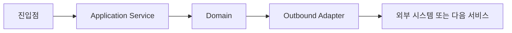

도형 규약: `[사각]` 코드/컴포넌트 · `[(원통)]` 데이터 저장소 · `[[겹사각]]` Kafka 토픽 · `((원))` 외부 시스템/클라이언트 · `{마름모}` 분기. 점선(`-.->`)은 응답·비동기 통보다.

아래 흐름은 모두 진입점부터 아웃바운드까지 현재 코드에서 추적한 결과다. 각 절 끝의 `관련 문서:`는 그 흐름을 더 깊게 다루는 모듈 문서를 가리킨다. 존재하지만 값·의도를 코드만으로 판단할 수 없는 항목은 본문에 `확인 필요`로 표시하고, 임의로 설계나 버그로 판정하지 않는다.

전체 구조는 `docs/ARCHITECTURE.md`를 참고한다.

---

## 1. 로컬 회원가입

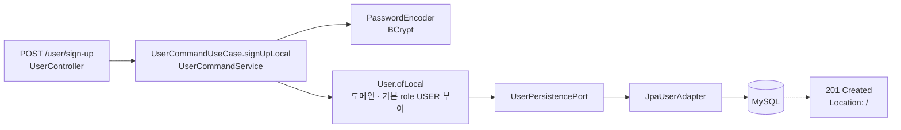

관련 문서: `docs/modules/USER.md`.

---

## 2. OAuth2 소셜 로그인과 내부 토큰 발급

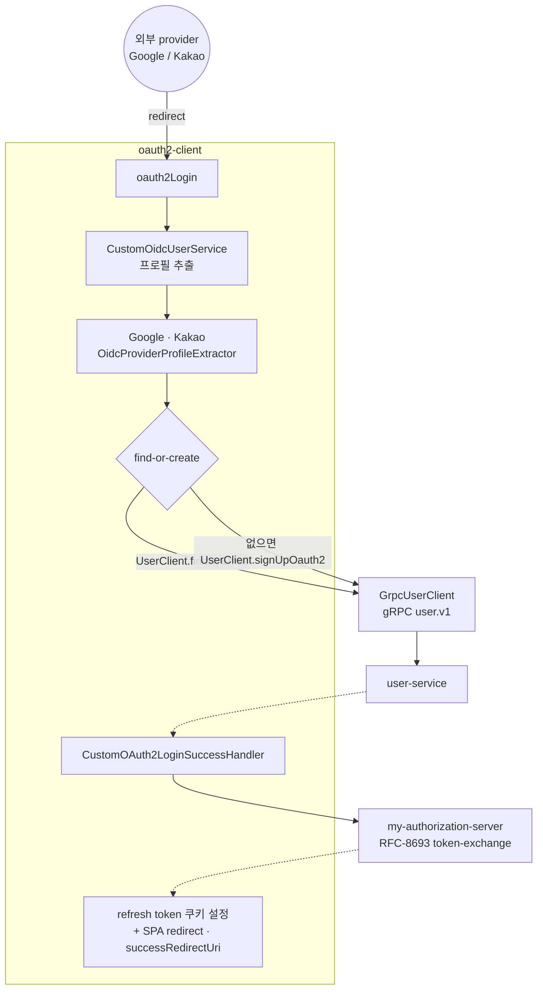

제공자는 Google·Kakao만 확인됨(Naver 등은 미확인).

관련 문서: `docs/modules/OAUTH2_CLIENT.md`(로그인/재발급/로그아웃 흐름·쿠키·확인 필요).

---

## 3. Authorization Server의 Access / Refresh Token 발급

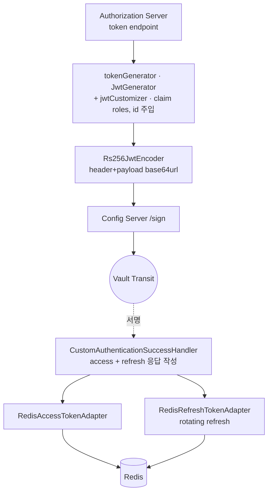

관련 문서: `docs/modules/OAUTH2_AUTHORIZATION_SERVER.md`(Grant·서명·Redis 저장·gRPC 계약·확인 필요).

토큰 claim은 `roles`, `id`가 확인됨. TTL 값은 위 모듈 문서, `aud`/`jti` 검증 부재는 `TODO.md` 1.1.

---

## 4. Refresh Token을 통한 Access Token 갱신

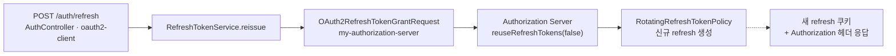

관련 문서: `docs/modules/OAUTH2_CLIENT.md`, `docs/modules/OAUTH2_AUTHORIZATION_SERVER.md`.

---

## 5. 로그아웃과 Access Token 블랙리스트 등록

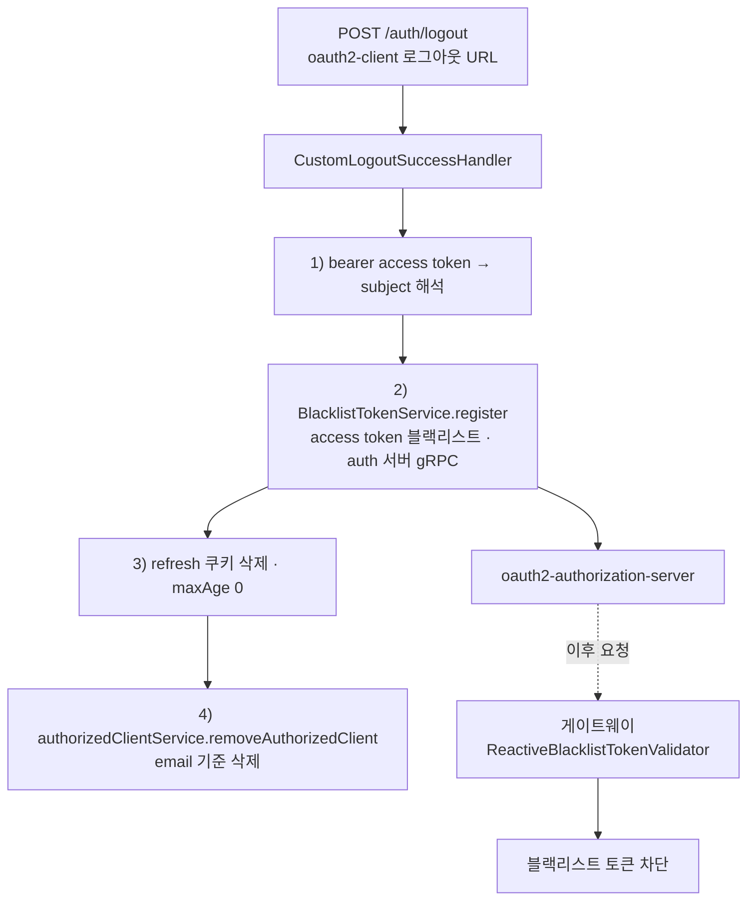

관련 문서: `docs/modules/OAUTH2_CLIENT.md`, `docs/modules/API_GATEWAY.md`.

---

## 6. API Gateway JWT 인증과 X-User-Id 전파

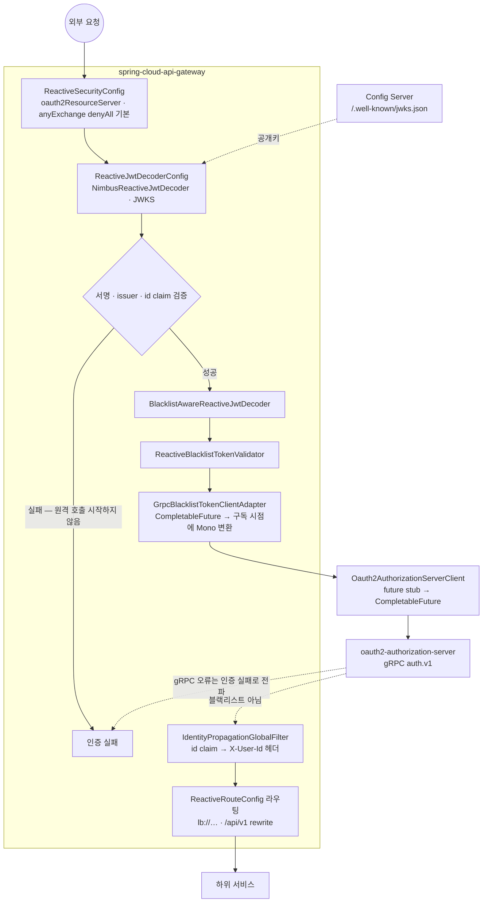

관련 문서: `docs/modules/API_GATEWAY.md`.

형식·서명·issuer·id 검증 실패 시 blacklist 원격 호출은 시작하지 않는다. gRPC 오류는 인증 실패 경로로 전파하며, 구독 취소는 gRPC 호출에도 전달한다. JWKS는 Config Server의 `/.well-known/jwks.json`에서 제공. `aud`/`jti` 검증 부재는 `TODO.md` 1.1.

---

## 7. WebSocket 핸드셰이크 인증과 STOMP Principal 결정

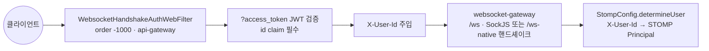

관련 문서: `docs/modules/API_GATEWAY.md`, `docs/modules/WEBSOCKET_GATEWAY.md`.

---

## 8. STOMP 채팅 메시지 전송과 ACK

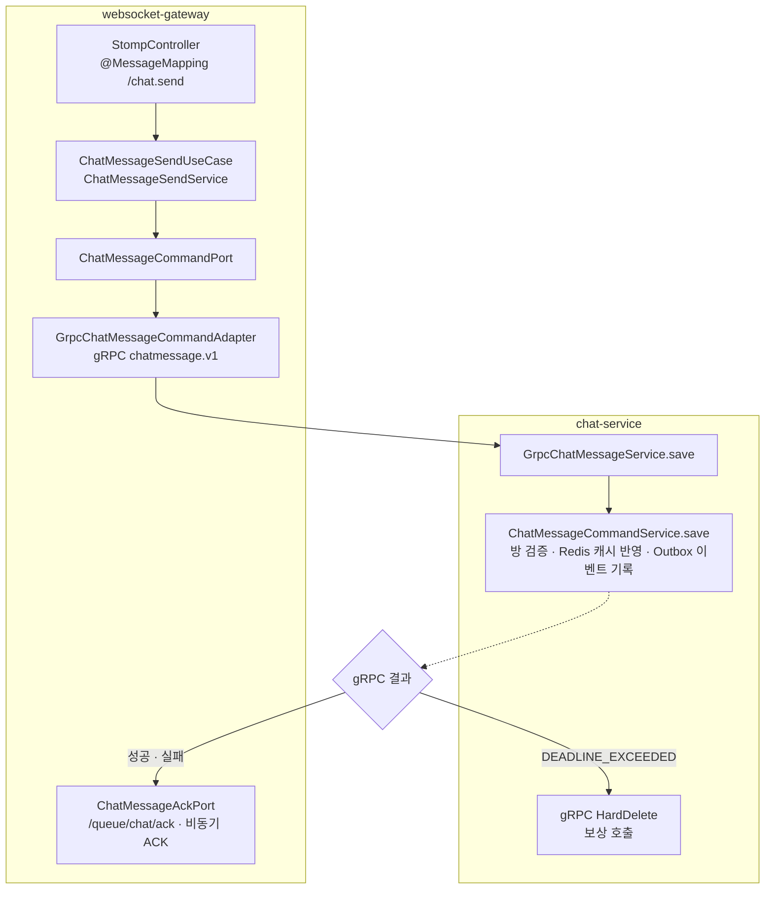

관련 문서: `docs/modules/WEBSOCKET_GATEWAY.md`, `docs/modules/CHAT.md`.

---

## 9. 채팅 메시지 비동기 영속과 캐시 조회

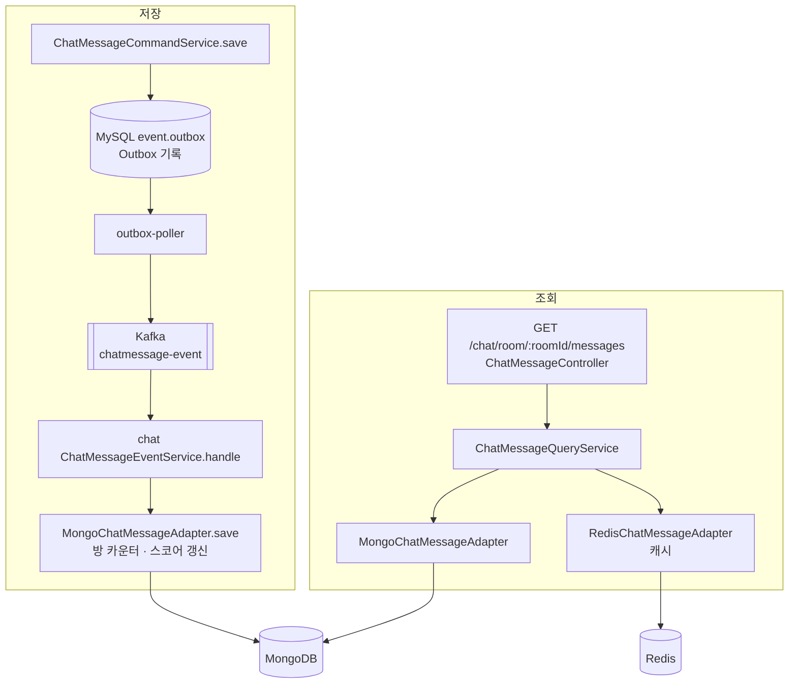

관련 문서: `docs/modules/CHAT.md`(방/메시지 명령·조회·캐시·Kafka·DLQ·확인 필요).

---

## 10. Outbox / DLQ 폴링을 통한 Kafka 발행

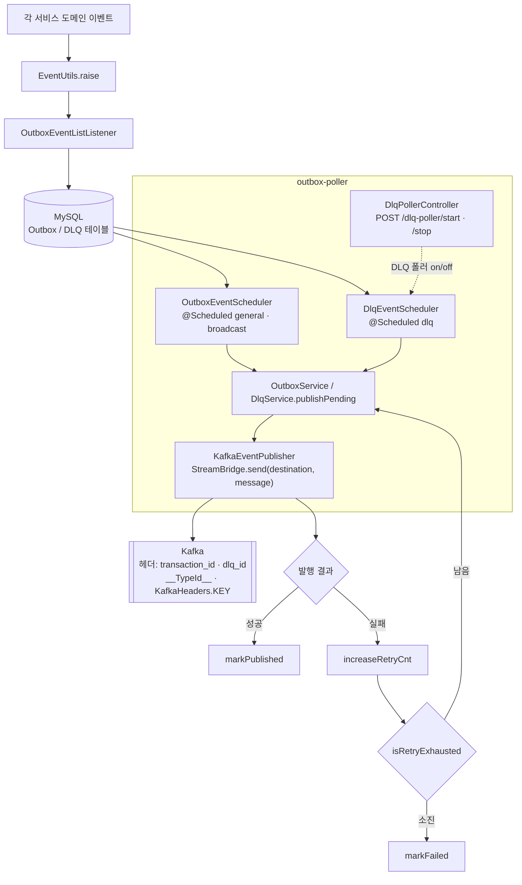

관련 문서: `docs/modules/OUTBOX_POLLER.md`, `docs/modules/COMMON.md`.

---

## 11. Upbit WebSocket 시세 수집과 Kafka 발행

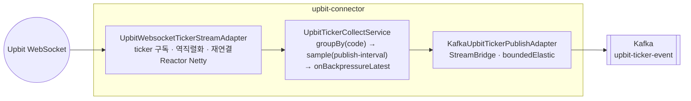

수집 주체는 **upbit-connector**다(market-detection에서 이관). 값 타입은 `upbit-connector-contract`의 `UpbitTickerEvent`이며, 이 바인딩에서는 `__TypeId__` 헤더가 전달되지 않아 소비자가 선언된 타입으로 역직렬화한다(→ `docs/modules/UPBIT_CONNECTOR.md` §6.1).

종목별 첫 ticker로 Flux 그룹이 만들어진 시점부터 7초 구간을 세며, 각 구간의 최신값 최대 1개만 발행한다. Kafka가 느리면 같은 종목의 대기값은 최신 하나로 교체되지만, 실제 Kafka 발행 완료 시점 기준의 정확한 7초 간격을 보장하는 정책은 아니다(→ `docs/modules/UPBIT_CONNECTOR.md` §4.1).

관련 문서: `docs/modules/UPBIT_CONNECTOR.md`.

---

## 12. Kafka Streams를 통한 가격 변동률 계산

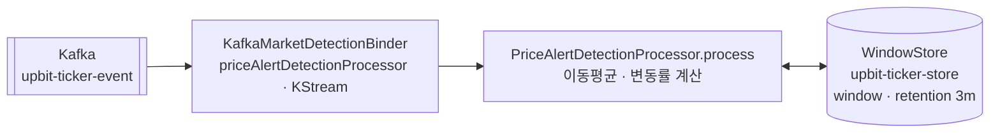

관련 문서: `docs/modules/MARKET_DETECTION.md`.

---

## 13. 임계치 매칭과 가격 알림 이벤트 발행

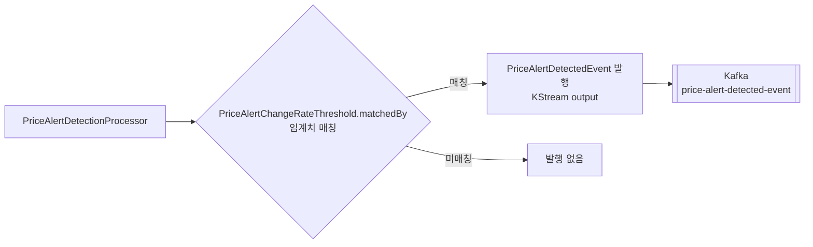

관련 문서: `docs/modules/MARKET_DETECTION.md`.

> 참고: 기존 문서는 이 출력 이벤트를 `UpbitTickerAlertEvent`/`WebNotificationBroadcastEvent`로 기술했으나, 실제 발행 계약은 `PriceAlertDetectedEvent`이며 notification 서비스가 이를 소비해 후속 이벤트를 만든다(§14).

---

## 14. 가격 알림 생성·저장과 STOMP 전달

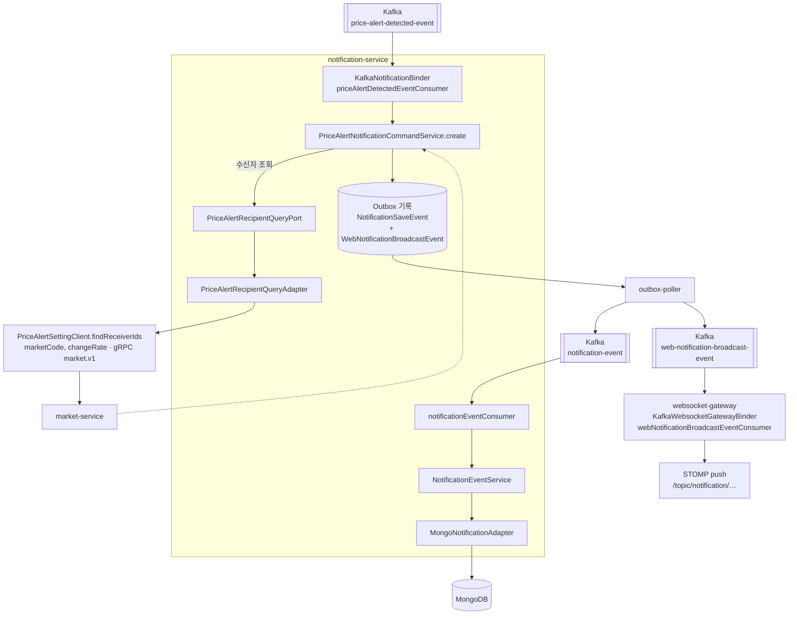

관련 문서: `docs/modules/NOTIFICATION.md`, `docs/modules/MARKET.md`, `docs/modules/WEBSOCKET_GATEWAY.md`.

---

## 15. 채팅 메시지 실패 경로

> **원칙: 발신자가 결과를 모르는 실패를 만들지 않는다.**
>
> 실패해도 된다. 다만 **보낸 사람이 실패했다는 사실과 어느 메시지가 실패했는지**(`clientMessageId`)를 알아야 한다. 모르면 성공으로 오인하거나, 재전송해서 중복을 만든다. 아래 표에서 **발신자가 모르는 칸이 곧 남은 일**이다.

부하 결과를 읽으려면 "무엇이 어디서 사라지는가"가 한곳에 있어야 한다. 실패 처리는 `StompChatMessageExceptionHandler`·`ChatMessageSendService`·`ChatMessageCommandService`·`ChatMessageEventService`·`OutboxService`·`ExecutorConfig`에 흩어져 있다.

경계는 **chat gRPC `save` 성공 지점**이고, 그 전후로 성질이 완전히 다르다.

### 15.1 저장 전 실패 — 데이터가 남지 않는다(재전송으로 해결)

| 실패 | 발신자 통보 | 재시도·보상 | 지금까지 한 것 |
|---|---|---|---|
| **inbound 큐 거절** | **없음(침묵)** | 없음 | **침묵은 그대로** → 5.14 |
| Rate Limit 초과 | `RATE_LIMIT_EXCEEDED` (`clientMessageId` 포함) | — | 측정용으로 꺼 둔 상태 → 1.13 |
| 요청 검증 실패 | `VALIDATION_ERROR` (`clientMessageId` 포함) | — | 원문에서 읽어 채운다 (#267) |
| 그 외 예외 | `SERVER_ERROR` (`clientMessageId` 포함) | — | 〃 |
| chat outbox 기록 일시 실패 | 재시도 소진 후 거절 ACK | `@Retryable(TemporaryOutboxPersistenceException)` → 소진 시 예외가 gRPC로 전파 | — |
| gRPC `DEADLINE_EXCEEDED` | 거절 ACK | `hardDelete` 보상(저장됐을 수 있는 메시지 제거) | 발생 자체가 감소 (#257) |
| gRPC 그 외 코드 | 거절 ACK | 보상 없음 | — |

- `@ControllerAdvice StompChatMessageExceptionHandler`의 `@MessageExceptionHandler(Exception.class)`가 컨트롤러 진입 이후의 예외를 모두 잡아 `/queue/chat/ack`로 알린다. **inbound 큐 거절만 이 그물에 안 걸린다** — 핸들러 진입 전에 executor가 버리기 때문이다(`stomp.executor.rejected{pool="inbound"}`로만 관측된다).
- **모든 실패 ACK가 `clientMessageId`를 담는다.** 검증·서버 오류는 예외 핸들러가 실패한 원본 메시지에서 읽는다 — 변환 전 원문(`byte[]`)일 수 있어 느슨하게 파싱하고, 못 읽으면 `null`로 둔다. 발신자가 어느 메시지를 재전송할지 고를 수 있어야 하기 때문이다.
- `ChatMessageCommandService.save`에는 `@Recover`가 **없다**(이 클래스의 `@Recover`는 `hardDelete`용 `TemporaryChatPersistenceException` 시그니처다). 재시도가 소진되면 예외가 `@GrpcAdvice`를 거쳐 gRPC 오류가 되고, 게이트웨이 `ChatMessageSendService.handleSaveError`가 거절 ACK를 보낸다.
- `save`는 Mongo에 쓰지 않는다. outbox 기록 + Redis 캐시 반영만 하고 Mongo 영속은 consumer 몫이다(§9) — Mongo 저장 실패는 15.2에 속한다.

### 15.2 저장 후 실패 — 데이터는 있고 발신자는 성공 ACK를 받았다

| 실패 | 영향 범위 | 복구 | 지금까지 한 것 |
|---|---|---|---|
| Redis 캐시 반영 실패 | 캐시만 | 조회 시 `*QueryRepairService`가 Mongo에서 재적재 | — |
| **outbox `FAILED`** | **전원** | **없음** | 미해결 → 4.6 |
| Kafka 발행 재시도 중 | 지연 | outbox-poller 재시도 | — |
| **broker 큐 거절 — 브로드캐스트** | **방 전원** | 없음 | 프레임 수 감소 (#263 #265) |
| **뱃지 직접 전송 실패** | 그 사용자 | **다음 창이 최신값을 덮는다** | `chat.badge.direct.failed` 로 관측 |
| **broker 큐 거절 — ACK** | **발신자가 영영 모름** | 없음 | **이 채널을 안 탄다**(#267) |
| **outbound 큐 거절** | **수신자 1명** | 없음 | 프레임 수 감소 (#265) |
| consumer 처리 실패 | 해당 이벤트 | `@Retryable` 소진 → `@Recover`가 DLQ 발행 | — |
| 로컬 세션 없음 | — | 정상(다중 인스턴스 설계) | — |

거절이 무엇이었는지는 `stomp.executor.rejected{pool, kind}` 로 갈라 본다(#266). `kind` 는 `broadcast`·`ack`·`badge`·`notification` 이다.

### 15.3 표에서 읽어야 할 것

**(1) `outbox FAILED`는 종착역이다.** `OutboxStatus.FAILED`를 쓰는 곳은 `JpaOutbox.markFailed()` 하나뿐이고, poller는 `PENDING`만 조회한다(`OutboxService.publishPending`). **쓰기만 하고 아무도 다시 읽지 않는다.** DLQ로도 넘어가지 않는다 — DLQ(`JpaDlq`)는 consumer 실패용이라 별개 경로다.

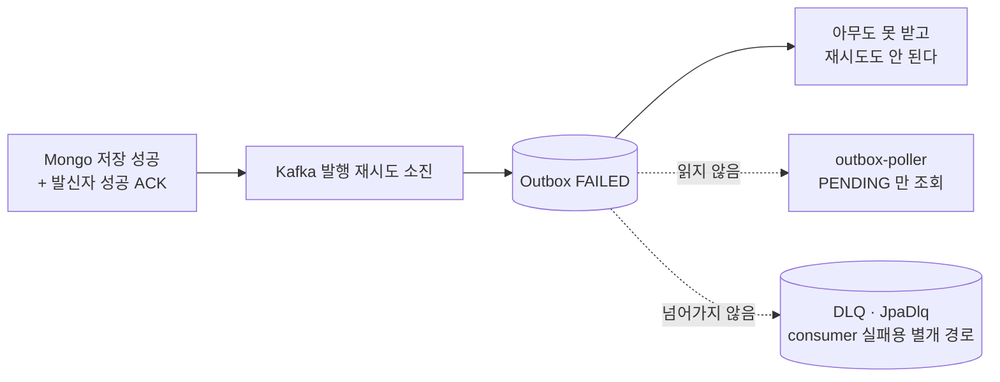

이미 **TODO 4.6**(`FAILED` Outbox 재처리 경로 추가)으로 관리 중이다.

**(2) broker 거절은 outbound 거절보다 방 인원 배 무겁다.** broker 큐는 팬아웃 **이전** 메시지를, outbound 큐는 팬아웃 **이후** 전송을 센다.

```
broker   1건 버림 = 방 전원이 못 받음
outbound 1건 버림 = 1명이 못 받음
```

300명 방이면 300배다. **부하 결과에서 `stomp.executor.rejected`를 합산하면 안 된다.** `pool` 로 나누고 `kind` 로 다시 나눠 읽는다(#266) — 같은 broker 거절이어도 브로드캐스트·뱃지·ACK 의 피해가 전부 다르다.

**ACK 와 뱃지는 이제 이 채널을 지나지 않는다**(#267, 5.9-e). 세션과 목적지별 구독 ID 를 직접 찾아 `clientOutboundChannel` 로 보낸다. 뱃지는 기존 broker 경로로 폴백하지 않는다.

**(3) inbound 거절과 outbound 거절은 의미가 다르다.**

```
inbound  = 저장도 안 됨. 발신자는 ACK 타임아웃으로만 인지
outbound = 저장은 됐고 전달만 실패. 발신자는 성공한 줄 안다
```

k6의 ACK 타임아웃 건수가 부풀면 원인이 둘(inbound에서 잘림 / ACK 지연)이라 `stomp.executor.rejected{pool="inbound"}`로 갈라야 한다. 거절 시 발신자에게 알리지 않는 동작은 기존 `AbortPolicy`와 같아 회귀가 아니다.

**침묵은 아직 남아 있다.** inbound 거절은 핸들러 진입 전이라 `@MessageExceptionHandler` 그물에 안 걸린다. 입구에서 미리 거절하고 이유를 알리는 것(→ `TODO.md` 5.14)이 남은 마지막 조각이며, **임계값이 실측에서 나와야 하므로 운영계 이전 후에 한다.**

### 15.4 이 표가 다루지 않는 것

WebSocket 핸드셰이크 실패, Kafka consumer 리밸런스 중 유실, Inbox 멱등 경로, DLQ consumer 자체 실패는 범위 밖이다.

관련 문서: `docs/modules/WEBSOCKET_GATEWAY.md`, `docs/modules/CHAT.md`. 용량·큐 산정은 [`decisions/ADR-003-chat-capacity-target-and-connection-budget.md`](decisions/ADR-003-chat-capacity-target-and-connection-budget.md).

### 15.5 이 표에서 출발해 고친 것들

실패 경로를 먼저 적어두고, 부하테스트로 **어느 경로가 실제로 터지는지** 확인한 뒤 하나씩 걷어냈다.
발견 과정·수치·판단 근거는 [`chat/load-test-results/chatmessage/websocket-gateway/README.md`](../chat/load-test-results/chatmessage/websocket-gateway/README.md).

| 어느 실패 경로 | 무엇을 했나 | PR |
|---|---|---|
| gRPC deadline · 저장 지연 | 트랜잭션에서 커넥션 획득을 미뤘다 | #257 |
| 전 구간 거절 | 거절 경로의 락을 없앴다 | #255 |
| broker 큐 거절 | executor 크기를 실측으로 잡았다 | #258 #259 |
| outbound 지연 | 〃 | #260 #261 |
| broker 큐 거절 — 뱃지 | 방 단위 conflation | #263 |
| outbound 큐 적체 | 방 단위 배칭 | #265 |
| 거절 내역을 모름 | 거절된 태스크의 목적지를 태그로 | #266 |
| broker 큐 거절 — ACK | ACK 를 이 채널에서 뺐다 | #267 |
| broker 큐 거절 — 뱃지 | 뱃지를 이 채널에서 뺐다 | TODO 5.9-e |
| gRPC deadline · 저장 지연 | 멤버십 갱신을 bulkWrite 한 번으로 (왕복 302회 → 1회) | #270 |
| 〃 | 브로드캐스트 이벤트에서 멤버 목록 제거 (outbox 행 크기를 방 크기와 분리) | #271 |

**앞의 넷은 좌변(처리 능력)을 늘리려 한 것이고 자릿수를 바꾸지 못했다.** 우변(요구량)을
깎은 conflation·배칭이 바꿨다.

**#270 #271 은 다시 다른 축이다.** 팬아웃을 걷어내고 방 멤버를 302명으로 올리자
**접속자 수가 아니라 방 멤버 수에 비례하는 쓰기 비용**이 드러났다. 멤버 2명일 때는
보이지 않던 경로다.

지연을 마지막까지 붙들고 있던 것은 코드가 아니라 **GC 설정**이었다 — 컨테이너 메모리가
1,792MB 미만이면 JVM 이 조용히 SerialGC 를 고르고, full GC 가 초 단위로 멈춘다.

---
