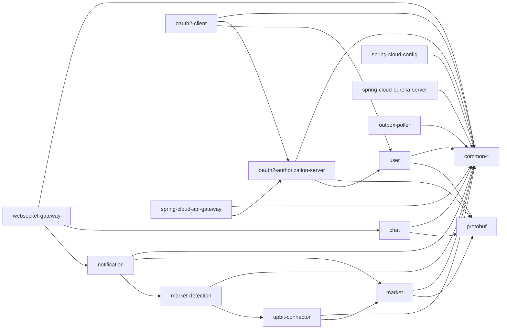

# Gradle 모듈 의존성

GitHub에서 바로 렌더링되는 서비스 단위 의존성 그래프다. 화살표는 각 서비스에 속한 Gradle 모듈들의 직접 `project(...)` 의존성을 서비스 경계로 묶어 요약한 것이다.

## 서비스별 직접 의존성

서비스 내부의 `domain`·`application`·`adapter`·`bootstrap` 계층과 공통 모듈의 상세 의존성은 각 모듈 문서의 모듈 구조 표에서 확인한다. 아래 표는 서비스 간 경계를 빠르게 파악하기 위한 요약이다.

| 서비스 | 직접 의존하는 다른 서비스 산출물 | 역할 |
|---|---|---|
| `chat` | 없음 | 채팅방·메시지 소유 서비스 |
| `market` | 없음 | 마켓·가격 알림 설정 소유 서비스 |
| `market-detection` | `upbit-connector-contract` | 시세 이벤트 소비 |
| `notification` | `market-detection-contract`, `market-client` | 탐지 이벤트 소비·마켓 조회 |
| `upbit-connector` | `market-client` | 구독 종목 조회 |
| `user` | 없음 | 계정·권한 소유 서비스 |
| `oauth2-authorization-server` | `user-contract`, `user-client` | 사용자 조회·인증 서버 |
| `oauth2-client` | `oauth2-authorization-server-client`, `user-client`, `user-contract` | 외부 OAuth 로그인 브리지 |
| `spring-cloud-api-gateway` | `oauth2-authorization-server-client` | JWT blacklist 조회 |
| `websocket-gateway` | `chat-contract`, `chat-client`, `notification-contract` | 채팅·알림 실시간 게이트웨이 |
| `spring-cloud-config` | 없음 | 설정·Vault Transit 허브 |
| `spring-cloud-eureka-server` | 없음 | 서비스 디스커버리 |
| `outbox-poller` | 없음 | Outbox/DLQ Kafka 릴레이 |

## 상세 그래프

노드 단위의 전체 직접 의존성과 서비스 필터·노드 선택 기능이 필요하면 브라우저용 [`dependencies.html`](dependencies.html)을 사용한다. GitHub 파일 화면에서는 HTML이 실행되지 않고 소스로 표시될 수 있다.
