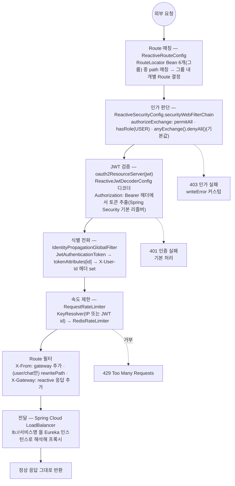
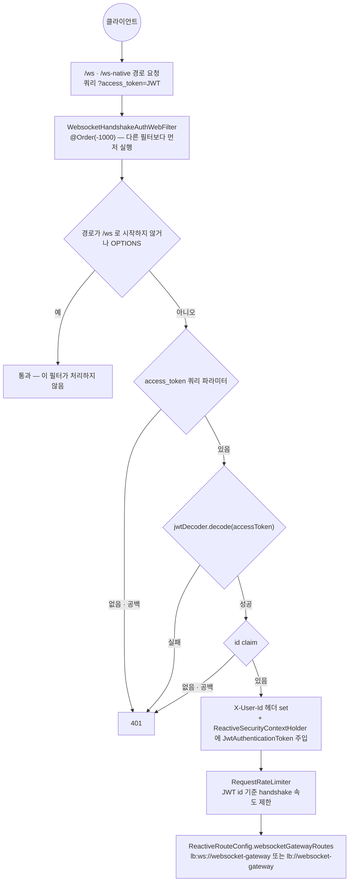
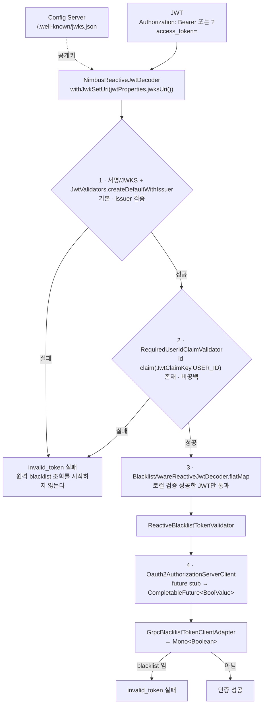

# API_GATEWAY — spring-cloud-api-gateway 상세 기준 문서

> - **문서 상태**: 검증 완료
> - **기준 브랜치**: `feat/api-gateway-redis-rate-limiter`
> - **기준 일자**: 2026-08-21
> - **검증 기준**: 실제 애플리케이션 코드 및 Config Repository(`git-config-repo/`)
> - **재검증 조건**: 아래 중 하나라도 변경되면 이 문서를 다시 검증한다.
>   - Route(`ReactiveRouteConfig`) 변경
>   - Security matcher(`ReactiveSecurityConfig.authorizeExchange`) 변경
>   - JWT 검증 체인(`ReactiveJwtDecoderConfig`) 변경
>   - CORS 설정(`CorsConfig`) 변경
>   - Rate Limit 설정(`RateLimitConfig`, `GatewayRateLimitProperties`) 변경
>   - Config Server의 `api-gateway.yml`, `jwt.yml` 또는 `redis.yml` 변경

## 1. 문서 목적과 기준 시점

이 문서는 `spring-cloud-api-gateway` 모듈의 구조·요청 흐름·계약·근거를 사람과 AI가 필요할 때 찾아 읽기 위한 상세 문서다. 기준 시점과 검증 범위는 위 메타데이터를 따른다. 문서와 코드가 어긋나면 코드가 기준이다(루트 `docs/ARCHITECTURE.md` 원칙과 동일). 짧은 작업 규칙은 [`../../spring-cloud-api-gateway/CLAUDE.md`](../../spring-cloud-api-gateway/CLAUDE.md)에 있으며 여기서는 반복하지 않는다.

## 2. 모듈 역할

Reactive Spring Cloud Gateway 기반 OAuth2 Resource Server. 외부 HTTP·WebSocket 요청의 단일 진입점으로, JWT 검증·Redis 기반 요청 속도 제한·사용자 식별 헤더 전파·라우팅·CORS·공개 경로 제어를 담당한다. 하위 서비스의 비즈니스 로직은 다루지 않는다.

## 3. 실행 구조와 주요 의존성

| 항목 | 내용 |
|---|---|
| Gradle 경로 | `:spring-cloud-api-gateway` — 단일 프로젝트, 서브모듈 분리 없음(`settings.gradle:55`) |
| 실행 클래스 | `org.example.apigateway.Main`(`@SpringBootApplication(scanBasePackages="org.example")`) |
| 배포 대상 | 이미지 `crypto-spring-cloud-api-gateway`(`build.gradle:5`). `Dockerfile` `FROM eclipse-temurin:17-jre`, `EXPOSE 8000` |
| 포트 | `8000` — 원격 `git-config-repo/dynamic/api-gateway.yml`이 결정(`server.port` + HTTP/2·SSL PKCS12 keystore). `Dockerfile`의 `EXPOSE 8000`과 일치 |
| Config Server 연동 | `spring.config.import: configserver:http://crypto-spring-cloud-config:8888`, `label: main`. 조합 프로파일 `api-gateway,eureka-client,jwt,frontend,kafka,monitoring,redis` |
| 원격 설정 파일 | `git-config-repo/dynamic/{api-gateway,jwt}.yml`, `git-config-repo/infrastructure/{eureka-client,frontend,kafka,monitoring,redis}.yml`. 서버 포트·라우팅 패턴 등 실질 동작값은 로컬이 아니라 여기에 있다 |
| 공유 경로 계약 | 외부 REST/WebSocket 경로 문자열의 정본은 Config Repository 루트 `application.yml`의 `api-contract.*`(모든 Config Client 응답에 병합). `api-gateway.yml`이 이를 기존 `api-path.*` 구조로 매핑해 security matcher와 route에서 소비한다 |
| Eureka Client | `git-config-repo/infrastructure/eureka-client.yml` — `defaultZone`은 루트 `application.yml`의 `uri.internal.eureka-server`를 참조, lease renewal 10s / expiration 30s. Route의 `lb://`·`lb:ws://` 뒤 이름은 대상 서비스가 Eureka에 등록하는 `spring.application.name`과 일치해야 라우팅이 성립한다 |
| 프레임워크·클라이언트 | `spring-cloud-gateway`, `spring-cloud-loadbalancer`, `spring-boot-starter-webflux`, `spring-boot-starter-security`, `spring-security-oauth2-resource-server`/`-jose`, `spring-cloud-config-client`, `spring-cloud-eureka-client`, `spring-cloud-starter-bus-kafka` |
| 데이터·RPC | `spring-boot-starter-data-redis-reactive`, `grpc-netty`, `grpc-client-spring-boot-starter` |
| 공통 모듈 | `common:common-core`, `common:common-validation`, `common:common-actuator-webflux` |
| 서비스 모듈 | `oauth2-authorization-server:oauth2-authorization-server-client` |

Config Server 자체(백엔드 구성·Vault Transit 서명 대행·JWKS 제공)는 [`SPRING_CLOUD_CONFIG.md`](SPRING_CLOUD_CONFIG.md)를 본다.

의존성 전체 그래프는 [`docs/dependencies.md`](../dependencies.md)에서 확인할 수 있다.

## 4. 주요 클래스와 책임

| 클래스 | 책임 |
|---|---|
| `ReactiveRouteConfig` | `RouteLocator` Bean 6개 정의(OAuth2 Client / User Service / Market Service / Notification / WebSocket Gateway / Chat Service 그룹). WebSocket 그룹 안에는 개별 Route 4건이 있음(§9) |
| `ReactiveSecurityConfig` | `SecurityWebFilterChain`, 경로별 인가, 403 응답 |
| `ReactiveJwtDecoderConfig` | JWKS 기반 로컬 검증기와 비동기 blacklist 검증기를 조합 |
| `CorsConfig` | CORS 정책 Bean 3종 |
| `RateLimitConfig` | IP/User KeyResolver와 Route별 `RedisRateLimiter` Bucket 등록 |
| `GatewayRateLimitProperties` | `gateway.rate-limit.*` 설정 바인딩·양수/Bucket 용량 검증 |
| `IdentityPropagationGlobalFilter` | 일반 HTTP 요청의 클라이언트 `X-User-Id`·`X-From` 제거 + 검증된 JWT `id`로 `X-User-Id` 전파(`GlobalFilter`, `HIGHEST_PRECEDENCE`) |
| `WebsocketHandshakeAuthWebFilter` | WebSocket 핸드셰이크 전용 쿼리 토큰 인증(`WebFilter`, `@Order(-1000)`) |
| `BlacklistTokenService` | `Mono<Boolean>` 기반 블랙리스트 조회 유스케이스 |
| `GrpcBlacklistTokenClientAdapter` | 공용 client의 `CompletableFuture<BoolValue>` blacklist 조회를 구독 시점에 `Mono<Boolean>`으로 변환 |
| `BlacklistAwareReactiveJwtDecoder` | Nimbus JWT 검증 성공 후 비동기 blacklist 검증을 연결 |
| `ReactiveBlacklistTokenValidator` | 비동기 조회 결과가 blacklist이면 `invalid_token`으로 거부 |
| `RequiredUserIdClaimValidator` | `OAuth2TokenValidator<Jwt>` — `id` claim 필수 검증 |

## 5. 일반 HTTP 요청 처리 흐름

근거: `ReactiveRouteConfig.java`, `ReactiveSecurityConfig.java:44-95`, `ReactiveJwtDecoderConfig.java`, `IdentityPropagationGlobalFilter.java`.

## 6. WebSocket 핸드셰이크 처리 흐름

일반 HTTP Bearer 인증과 **별도의 인증 경로**다.

근거: `WebsocketHandshakeAuthWebFilter.java`, `ReactiveRouteConfig.java:49-79`. 쿼리 파라미터 이름은 `AuthTokenKey.ACCESS_TOKEN_QUERY`(`AuthTokenKey`) = `access_token`.

## 7. JWT 인증·검증 구조

- 디코더: `NimbusReactiveJwtDecoder.withJwkSetUri(jwtProperties.jwksUri())`. JWKS URI는 `git-config-repo/dynamic/jwt.yml`이 공통 `application.yml`의 `uri.internal.config-server`를 참조해 구성한다(Config Server가 JWKS 제공).
- 검증 순서(`ReactiveJwtDecoderConfig`):

  issuer URI는 `git-config-repo/dynamic/jwt.yml`이 공통 `application.yml`의 `uri.internal.oauth2-authorization-server`를 참조한다.
- 형식·서명·issuer·`id` 검증에 실패한 토큰은 원격 blacklist 조회를 시작하지 않는다. gRPC 오류는 인증 실패 경로로 전파하는 fail-closed 동작이며, 요청 취소 시 gRPC future도 취소한다.
- **audience(`aud`) 검증은 확인되지 않음.** 위 검증기 외에 aud를 확인하는 코드는 없다(`ReactiveJwtDecoderConfig.java` 전체 검토 기준).
- 사용 claim: `id`(`JwtClaimKey.USER_ID`), `roles`(`JwtClaimKey.ROLES`) — `JwtClaimKey`.
- Access Token 읽는 위치: 일반 요청은 `Authorization: Bearer` 헤더(Spring Security 기본), WebSocket은 `?access_token=` 쿼리 파라미터(§6).

## 8. 인가 규칙과 공개 경로

`ReactiveSecurityConfig.securityWebFilterChain`의 `authorizeExchange`는 **선언 순서대로 먼저 매칭되는 규칙이 적용**되며, 마지막 `anyExchange().denyAll()`이 기본값이다. 근거: `ReactiveSecurityConfig.java:51-84`.

> **이 문서에서 `permitAll`의 의미**: Gateway의 `SecurityWebFilterChain`이 해당 경로에 JWT 인증을 강제하지 않는다는 뜻일 뿐이다. 시스템 전체에서 무조건 공개 API라는 뜻은 아니다. 하위 서비스가 자체 인증·인가를 적용하거나 별도 필터를 둘 수 있으며, 이는 각 서비스 코드로만 확인 가능하다. 예를 들어 `/internal/deployment/**`는 Gateway JWT 기준으로는 `permitAll`이지만 `DeploymentControlAuthWebFilter`가 별도 `X-Deploy-Token`으로 보호한다(§9, §13).

| 순서 | 대상 | 결과 |
|---|---|---|
| 1 | `OPTIONS /**` | permitAll |
| 2 | `POST /internal/deployment/**` | permitAll(JWT 우회, 별도 보호는 §13 참고) |
| 3 | `/oauth2/**`, `/login/oauth2/code/**` | permitAll |
| 4 | `GET /ws/info/**` | permitAll |
| 5 | `/msg/**` | permitAll |
| 6 | `GET /user/me/profile`, `GET /user/*/profile` | `hasRole(USER)` |
| 7 | `GET /ws/**`, `/ws-native`, `/ws-native/**` | `hasRole(USER)` |
| 8 | `GET /chat/rooms/me`, `GET /chat/room/me/*` | `hasRole(USER)` |
| 9 | `/chat/room/*/members`, `/chat/room/*/activity` | `hasRole(USER)` |
| 10 | `GET /chat/room/*/messages` | `hasRole(USER)` |
| 11 | `GET /markets` | permitAll(마켓 카탈로그 공개) |
| 12 | `/price-alerts/**`(GET·PUT) | `hasRole(USER)` |
| 13 | `/notifications/**`(GET·PATCH) | `hasRole(USER)` |
| 14 | `/actuator/**` | permitAll |
| 15 | `/auth/**` | permitAll |
| 16 | `/user/**`(나머지) | permitAll |
| 17 | `/chat/**`(나머지) | permitAll |
| 기본값 | 그 외 전부 | `denyAll` |

역할 문자열은 `RoleKey.REQUIRED_USER`="USER"(prefix 없이 `JwtGrantedAuthoritiesConverter.setAuthorityPrefix("")`로 `roles` claim 값을 그대로 authority로 사용, `ReactiveSecurityConfig.java:97-106`).

## 9. Route 계약 표

`ReactiveRouteConfig`는 `RouteLocator` Bean 6개(`oauth2ClientRoutes`, `userRoutes`, `marketRoutes`, `notificationRoutes`, `websocketGatewayRoutes`, `chatRoutes`)를 정의한다. 각 Bean은 Rate Limit 대상의 구체적인 Path+Method Route를 먼저 선언하고, 기존 광역 Path Route를 마지막 fallback으로 유지한다.

| 외부 경로 | 대상 서비스 | URI/Service ID | 적용 필터 | 인증 필요 | 근거 |
|---|---|---|---|---|---|
| `/oauth2/**`, `/login/oauth2/code/*`, `/auth/**` | oauth2-client | `lb://oauth2-client` | 대상 Path+Method는 `RequestRateLimiter`, 공통 `X-From`·`X-Gateway` | 아니오 | `ReactiveRouteConfig.oauth2ClientRoutes` |
| `/user/**` | user-service | `lb://user-service` | 대상 Path+Method는 `RequestRateLimiter`, 공통 `X-From`·rewrite·`X-Gateway` | `GET /user/me/profile`,`/user/*/profile`만 `hasRole(USER)` | `ReactiveRouteConfig.userRoutes` |
| `/markets`,`/markets/**`,`/price-alerts`,`/price-alerts/**` | market-service | `lb://market-service` | `X-From` 추가, `rewritePath(/(?<seg>.*) → /api/v1/${seg})`, `X-Gateway` 응답 | `GET /markets`는 permitAll, `/price-alerts/**`는 `hasRole(USER)` | `ReactiveRouteConfig.marketRoutes` |
| `/notifications`,`/notifications/**` | notification-service | `lb://notification-service` | `X-From` 추가, `rewritePath(/(?<seg>.*) → /api/v1/${seg})`, `X-Gateway` 응답 | `hasRole(USER)` | `ReactiveRouteConfig.notificationRoutes` |
| `/ws-native`, `/ws-native/**`(upgrade) | websocket-gateway | `lb:ws://websocket-gateway` | `RequestRateLimiter` | `GET`만 `hasRole(USER)` + 핸드셰이크 인증 | `websocketGatewayRoutes("ws-native-upgrade")` |
| `/ws/**` + `Upgrade: websocket` 헤더 | websocket-gateway | `lb:ws://websocket-gateway` | `RequestRateLimiter` | 동일 | `websocketGatewayRoutes("ws-upgrade")` |
| `/ws/**`,`/ws-native`,`/ws-native/**`(HTTP) | websocket-gateway | `lb://websocket-gateway` | `dedupeResponseHeader`(CORS 3종) | `GET /ws/info/**`는 permitAll, 나머지 `GET`은 `hasRole(USER)` | `websocketGatewayRoutes("ws-http")` |
| `/msg/**` | websocket-gateway | `lb://websocket-gateway` | 없음 | 아니오 | `websocketGatewayRoutes("sockjs-route")` |
| `/chat/**` | chat-service | `lb://chat-service` | `X-From` 추가, `rewritePath(/chat(?<seg>/.*)?$ → /api/v1/chat${seg})`, `X-Gateway` 응답 | 일부 `GET`만 `hasRole(USER)`(§8 참고), 나머지 permitAll | `ReactiveRouteConfig.chatRoutes` |
| `POST /internal/deployment/**` | Gateway 자신 | N/A(Route 아님, 로컬 컨트롤러) | `DeploymentControlAuthWebFilter`(`X-Deploy-Token`) | JWT는 permitAll, Deploy Token 별도 필요 | `ReactiveSecurityConfig.java:56`, `DeploymentControlAuthWebFilter` |
| `/actuator/**` | Gateway 자신 | N/A | 없음 | 아니오 | `ReactiveSecurityConfig.java:78` |

### 9.1 Redis Rate Limit 적용 표

설정 수치는 `허용 속도 / 순간 허용량`으로 읽는다. 분 단위 정책은 Spring Cloud Gateway 권장 방식대로 `requestedTokens=60`을 사용한다. 예를 들어 회원가입의 `replenish=5, requested=60, burst=120`은 평균 `5회/분`, 순간 `2회`다.

| 우선순위 | 실제 적용 대상 | Gateway Route | Key | 초기 제한 | 판단/상태 |
|---|---|---|---|---|---|
| 1 | `POST /user/sign-up` | `user-sign-up-route` | 직접 연결 IP | 5회/분, 순간 2회 | 적용 |
| 1 | `GET /oauth2/authorization/**` | `oauth2-authorization-route` | 직접 연결 IP | 10회/분, 순간 3회 | 적용 |
| 1 | `GET /login/oauth2/code/*` | `oauth2-callback-route` | 직접 연결 IP | 20회/분, 순간 5회 | 적용. Provider callback 재시도를 고려해 진입보다 느슨함 |
| 1 | `POST /auth/refresh` | `token-refresh-route` | 직접 연결 IP | 10회/분, 순간 3회 | 적용. Refresh Token 원문은 Key로 저장하지 않음 |
| 1 | `POST /auth/logout` | `logout-route` | JWT `id`, 없으면 IP | 1회/초, 순간 5회 | 적용 |
| 1 | `/ws-native`, `/ws/** + Upgrade:websocket` | `ws-native-upgrade`, `ws-upgrade` | JWT `id` | 2회/초, 순간 5회 | handshake에 적용. SockJS HTTP transport는 제외 |
| 1 | 채팅방 생성·수정·삭제·멤버·활동 Command REST | `chat-command-route` | JWT `id` | 2회/초, 순간 5회 | 적용 |
| 1 | STOMP `/msg/chat.send` | 연결 수립 후 websocket-gateway 내부 처리 | JWT `id` 후보 | 미설정 | HTTP Gateway 필터 대상이 아님. STOMP ChannelInterceptor/애플리케이션 limiter 별도 설계 필요 |
| 2 | `GET /chat/rooms/me`, 방/메시지 조회 | `chat-query-route` | JWT `id` | 10회/초, 순간 20회 | 적용 |
| 2 | `PATCH /user/me/profile` | `user-command-route` | JWT `id` | 2회/초, 순간 5회 | 적용 |
| 2 | `GET /user/me/profile`, `GET /user/{publicId}/profile` | `user-query-route` | JWT `id` | 10회/초, 순간 20회 | 적용 |
| 2 | `PUT /price-alerts/me` | `market-command-route` | JWT `id` | 2회/초, 순간 5회 | 적용 |
| 2 | `GET /price-alerts/me` | `market-query-route` | JWT `id` | 10회/초, 순간 20회 | 적용 |
| 2 | `GET /notifications/me`, 알림 조회 | `notification-query-route` | JWT `id` | 10회/초, 순간 20회 | 적용 |
| 2 | `PATCH /notifications/{id}/read` | `notification-command-route` | JWT `id` | 2회/초, 순간 5회 | 적용 |
| 3 | `GET /markets`, `GET /markets/**`, `GET /chat/rooms/popular` | `*-public-query-route` | 직접 연결 IP | 20회/초, 순간 40회 | 공개 조회 공통 초기 정책 |
| - | Kafka, 서비스 간 gRPC, Upbit 수집, Outbox Poller | Gateway를 통과하지 않음 | - | - | 대상 아님 |
| - | `/actuator/**` | Gateway 로컬 관리 API | - | - | Rate Limit보다 네트워크 접근 제어 대상 |

KeyResolver 정책은 다음과 같다.

- `user`: 검증된 `JwtAuthenticationToken`의 principal name이 아니라 `id` claim을 사용하고 `user:` prefix를 붙인다.
- `ip`: 현재 Gateway 앞에 신뢰 Proxy/LB가 없으므로 TCP remote address를 사용하고 `ip:` prefix를 붙인다. 임의의 `X-Forwarded-For`는 신뢰하지 않는다. 추후 고정된 Proxy가 추가되면 `XForwardedRemoteAddressResolver.maxTrustedIndex(n)`으로 전환하며 `trustAll()`은 사용하지 않는다.
- `userOrIp`: JWT `id`가 있으면 user, 없으면 IP로 fallback한다.
- Spring 구현의 Redis key에는 Route ID도 포함되므로 같은 사용자라도 회원가입·조회·Command Bucket은 서로 분리된다.

운영 특성:

- 제한 초과는 body 없는 `429 Too Many Requests`이며 `X-RateLimit-Remaining`, `X-RateLimit-Replenish-Rate`, `X-RateLimit-Burst-Capacity`, `X-RateLimit-Requested-Tokens`를 반환한다.
- Redis 조회 오류는 Spring Cloud Gateway `RedisRateLimiter` 구현상 fail-open이다. 요청 가용성은 유지되지만 보호가 사라지므로 Redis 오류 로그와 429 비율을 모니터링해야 한다.
- `gateway.rate-limit.*`는 Bean 생성 시 Route별 설정 Map으로 복사된다. Config Server 값만 갱신해서는 기존 인스턴스에 반영되지 않으므로 초기 구현에서는 Gateway 재시작이 필요하다.
- Redis Cluster 연결은 Config 조합의 `redis` 프로파일(`git-config-repo/infrastructure/redis.yml`)을 사용한다.

**oauth2-authorization-server로 향하는 HTTP Route는 없다.** 연결은 공용 `Oauth2AuthorizationServerClient.existsBlacklist`가 수행하는 `auth.v1.BlacklistTokenService/Exists` gRPC 호출뿐이며, `grpc.client.oauth2-authorization-server-client.address`는 공통 `application.yml`의 `uri.discovery.oauth2-authorization-server`를 참조한다.

## 10. Header 및 Path Rewrite 계약

Gateway가 생성·추가하는 헤더는 다음과 같다. Route·인증·Rate Limit 필터에서 생성된다.

| 헤더 | 방향 | 추가 위치 | 값의 근거 |
|---|---|---|---|
| `X-From: gateway` | 요청 | `ReactiveRouteConfig`(`addRequestHeader`) | 고정 문자열. REST 하위 서비스 route에서 추가, websocket-gateway route에는 없음 |
| `X-Gateway: reactive` | 응답 | `ReactiveRouteConfig`(`addResponseHeader`) | 고정 문자열. REST 하위 서비스 route에서 추가 |
| `X-User-Id`(`HttpHeaderKey.USER_ID`) | 요청 | 일반 HTTP: `IdentityPropagationGlobalFilter`. WebSocket: `WebsocketHandshakeAuthWebFilter` | 검증된 JWT의 `id` claim에서만 생성(§5, §6) |
| `X-RateLimit-*` 4종 | 응답 | `RequestRateLimiterGatewayFilterFactory` | 남은 token과 Route Bucket의 replenish/burst/requested token 값(§9.1) |

`X-User-Id`는 일반 HTTP와 WebSocket에서 서로 다른 필터 체인(`GlobalFilter` vs `WebFilter`)이 독립적으로 주입한다는 점이 차이다. 두 경로 모두 값의 출처는 검증된 JWT의 `id` claim으로 동일하다.

**클라이언트가 같은 이름으로 헤더를 직접 보낸 경우**: `IdentityPropagationGlobalFilter`(`Ordered.HIGHEST_PRECEDENCE`)가 **모든 요청 입구에서 클라이언트가 보낸 `X-User-Id`·`X-From`을 먼저 제거**하고, 인증된 경우에만 JWT `id`로 `X-User-Id`를 다시 `set`한다. 따라서 `permitAll`·미인증 경로로 위조 헤더를 보내도 하위 서비스로 새지 않는다(게이트웨이 **경유** 스푸핑 차단). 게이트웨이를 **우회**한 서비스 직접 접근 차단은 별개 방어(인프라: 서비스 포트 host-local 바인딩 + 방화벽) — infra `TODO.md` "보안 · 네트워크 노출".

- Path Rewrite: `user`, `chat`, `market`, `notification` route는 `/api/{serviceApiVersion}/...`로 rewrite한다. `oauth2-client`, `websocket-gateway` route는 rewrite 없이 그대로 전달.
- Query Parameter Token: WebSocket 핸드셰이크 전용 `?access_token=`(§6). 일반 REST에는 쿼리 토큰 사용 없음.
- Cookie: Gateway 코드에서 쿠키를 직접 다루는 로직 없음(그대로 프록시). Refresh 쿠키 속성 자체는 oauth2-client 책임 범위(이 문서 범위 밖).

## 11. 연관 서비스 연결

| 대상 | Route | 전달 인증 정보 | 공유 계약 |
|---|---|---|---|
| user-service | `/user/**` → `lb://user-service`, rewrite `→ /api/v1/user${seg}` | `X-User-Id`(인증된 경우만), `X-From: gateway` | `X-User-Id` 헤더, path rewrite 버전(`v1`), `GET /user/me/profile`·`/user/*/profile`의 gateway 레벨 `hasRole(USER)` 강제 |
| oauth2-client | `/oauth2/**`, `/login/oauth2/code/*`, `/auth/**` → `lb://oauth2-client`(인가 permitAll, Bearer JWT가 제공된 요청은 Resource Server 인증 필터가 처리 가능) | 로그인·callback·refresh는 없음. 로그아웃은 유효한 Bearer JWT가 있으면 Rate Limit user key에 `id`를 쓰고 없으면 IP fallback | 로그인/콜백/로그아웃 경로 이름 |
| oauth2-authorization-server | 없음(HTTP 미연결) | 없음. 비동기 gRPC로 blacklist 존재 여부만 조회(`GrpcBlacklistTokenClientAdapter`) | JWKS(issuer가 발급한 키), issuer 문자열, gRPC blacklist 조회 메서드 |
| websocket-gateway | `/ws-native`, `/ws-native/**`, `/ws/**`, `/msg/**` — `websocketGatewayRoutes` Bean 그룹의 개별 Route 4건(§9) | `X-User-Id`(핸드셰이크 시 `WebsocketHandshakeAuthWebFilter`가 주입) | `access_token` 쿼리 파라미터, `X-User-Id` 헤더, `/ws`·`/ws-native`·`/msg` prefix |
| chat-service | `/chat/**` → `lb://chat-service`, rewrite `→ /api/v1/chat${seg}` | `X-User-Id`(인증된 경우만), `X-From: gateway` | `X-User-Id` 헤더, path rewrite 버전(`v1`), 채팅방 관련 GET 경로들의 gateway 레벨 `hasRole(USER)` 강제(§8) |
| market-service | `/markets`,`/markets/**`,`/price-alerts`,`/price-alerts/**` → `lb://market-service`, rewrite `/(?<seg>.*) → /api/v1/${seg}` | `X-User-Id`(`/price-alerts/**` 인증 경로), `X-From: gateway` | `GET /markets`는 permitAll(카탈로그), `/price-alerts/**`는 `hasRole(USER)` → `PriceAlertSettingController`가 `X-User-Id`(publicId)로 본인 스코프 |
| notification-service | `/notifications`,`/notifications/**` → `lb://notification-service`, rewrite `/(?<seg>.*) → /api/v1/${seg}` | `X-User-Id`(인증 경로), `X-From: gateway` | `/notifications/**` `hasRole(USER)` → `NotificationController`가 `X-User-Id`(receiverId)로 본인 스코프. 실시간 push는 별도(websocket-gateway STOMP) |

## 12. CORS 정책

`CorsConfig` 기준.

| 항목 | 값 |
|---|---|
| Origin | `frontend.origin` — 공통 `application.yml`의 `uri.public.frontend-origin` 참조. 설정값 1개만 허용 |
| Methods | `OPTIONS, GET, POST, PUT, PATCH, DELETE` (**DELETE 포함**) |
| Headers | `*`(모두 허용) |
| `allowCredentials` | `true` |
| Exposed headers | `Authorization`, `Set-Cookie`, `X-RateLimit-Remaining`, `X-RateLimit-Replenish-Rate`, `X-RateLimit-Burst-Capacity`, `X-RateLimit-Requested-Tokens` |
| `maxAge` | `3600` |
| 적용 대상 | `/**`(`UrlBasedCorsConfigurationSource`) |

## 13. 오류 응답 처리

| 상황 | 처리 | 근거 |
|---|---|---|
| 일반 HTTP 인증 실패(401) | Spring Security `oauth2ResourceServer` 기본 처리(커스텀 `AuthenticationEntryPoint` 미설정) | `ReactiveSecurityConfig.java` 전체(커스텀 코드 없음) |
| blacklist gRPC 조회 실패(500) | 원격 오류를 그대로 전파해 요청을 차단하고 downstream을 호출하지 않음(fail-closed) | `GrpcBlacklistDeadlineE2ETest` |
| 일반 HTTP 인가 실패(403) | 커스텀 `accessDeniedHandler` — CORS 헤더 재설정 + JSON body(`timestamp`,`status`,`error:"FORBIDDEN"`,`message`,`path`) | `ReactiveSecurityConfig.java:91-92,108-148` |
| WebSocket 핸드셰이크 인증 실패(401) | `WebsocketHandshakeAuthWebFilter.unauthorized` — 상태코드만 설정, JSON body 없음 | `WebsocketHandshakeAuthWebFilter.java:97-100` |
| Rate Limit 초과(429) | `RequestRateLimiterGatewayFilterFactory` — 상태코드와 Rate Limit 헤더 설정, body 없음 | `ReactiveRouteConfig`, `RateLimitConfig` |
| 배포 제어 인증 실패(401) | `DeploymentControlAuthWebFilter` — `{"message":"Unauthorized deployment control request"}` | `DeploymentControlAuthWebFilter` |

세 인증 실패 처리(일반 401 / WebSocket 401 / 배포 제어 401)는 서로 다른 필터·바디 형식을 사용하며 통일되어 있지 않다.

## 14. 테스트 현황

| 클래스 | 검증 항목 |
|---|---|
| `endpoint/ReactiveSecurityE2ETest` | 토큰 없음 401, role 없음 403(JSON body), `/auth/logout` permitAll 라우팅, `/price-alerts/me`·`/notifications/me` 401/403 |
| `endpoint/ReactiveRouteE2ETest` | `/user/me` rewrite+라우팅, `/chat/rooms/me` rewrite+라우팅, `/auth/logout` 라우팅 |
| `endpoint/ProductionRateLimitE2ETest` | production Route + 실제 Redis에서 허용 응답의 Rate Limit 헤더와 burst 초과 429 |
| `endpoint/RateLimitFailOpenE2ETest` | Redis 연결 예외 시 fail-open 응답 헤더와 user-service downstream 전달 |
| `endpoint/IdentityPropagationE2ETest` | id claim 있음/없음 전파, permitAll 경로 클라이언트 `X-User-Id` strip, 인증 요청 위조 `X-User-Id` override |
| `endpoint/GrpcBlacklistDeadlineE2ETest` | 실제 지연 gRPC 서버의 deadline 경과 시 보호 경로 500과 downstream 미호출(fail-closed) |
| `endpoint/GatewayCorsConfigTest` | CORS Origin 허용(테스트 전용 wildcard `TestGatewayCorsConfig`로 실제 `CorsConfig` 대체) |
| `filter/IdentityPropagationGlobalFilterTest` | 필터 단위 동작 |
| `filter/WebsocketHandshakeAuthWebFilterTest` | non-ws 경로 통과, OPTIONS 통과, 토큰 없음/빈값 401, JWT 디코드 실패 401, id claim 없음 401, 정상 시 헤더+SecurityContext 설정, roles claim 없어도 정상 처리 |
| `validator/BlacklistAwareReactiveJwtDecoderUnitTest` | delegate 검증 성공 후 blacklist 검증 연결, delegate 실패 시 원격 조회 생략 |
| `validator/ReactiveBlacklistTokenValidatorUnitTest` | 블랙리스트 없음→성공, 있음→`invalid_token` 실패, gRPC 오류 전파 |
| `oauth2/adapter/out/grpc/GrpcBlacklistTokenClientAdapterUnitTest` | 구독 전 공용 client 호출 없음, 성공·오류·구독 취소 전파 |
| `validator/RequiredUserIdClaimValidatorTest` | id claim 있음/없음/빈문자열/null |
| `ratelimit/GatewayKeyResolversUnitTest` | 직접 연결 IP, JWT `id`, user→IP fallback Key 해석 |
| `ratelimit/RateLimitConfigUnitTest` | Rate Limit 대상 Route ID와 Bucket 설정 등록 |
| `ratelimit/RedisRateLimiterIntegrationTest` | 실제 Redis에서 회원가입 순간 2건 허용·3번째 거부 |
| `config/CorsConfigUnitTest` | 브라우저에 `X-RateLimit-*` 4종 노출 |
| `config/ReactiveJwtDecoderConfigUnitTest` | 설정된 issuer와 다른 JWT를 `invalid_token`으로 거부 |
| `config/ProductionApiPathConfigBindingUnitTest` | 운영 API path 및 `gateway.rate-limit.*` 설정 바인딩 |

**테스트 공백** — 항목은 [`../../TODO.md`](../../TODO.md) 6.2와 6.4에서 관리한다(`/internal/deployment/**` gateway 레벨 통합, §9 Route 계약 표 전체를 덮는 계약 테스트).

## 15. 컴파일·테스트·CI 명령

- 컴파일: `./gradlew :spring-cloud-api-gateway:compileJava`
- 테스트: `./gradlew :spring-cloud-api-gateway:test`
- 서비스 CI: `./gradlew apiGatewayCi`(루트 `build.gradle` — `:spring-cloud-api-gateway:build` 포함, 전체 집계 `serviceCi`에도 포함)

전체 build, 전체 test, `bootRun`, 애플리케이션 실행, 배포는 이 문서 작성 과정에서 실행하지 않았다.

## 16. 변경 위험도가 높은 파일

| 파일 | 위험 사유 |
|---|---|
| `ReactiveSecurityConfig` | `authorizeExchange` 순서/패턴 변경이 `anyExchange().denyAll()` 기본값과 맞물려 전체 서비스 접근 불가 또는 과다 노출로 직결 |
| `ReactiveJwtDecoderConfig` | JWT 검증 체인(issuer/blacklist/id) 변경은 전체 인증 우회/차단 위험 |
| `BlacklistAwareReactiveJwtDecoder`/`ReactiveBlacklistTokenValidator` | 로컬 검증과 원격 blacklist 조회 순서·오류 의미 변경 시 인증 우회/전체 차단 위험 |
| `GrpcBlacklistTokenClientAdapter` | `CompletableFuture`를 Reactor 구독·오류·취소에 연결하는 방식 변경 시 Gateway 요청 처리 자원에 영향 |
| `ReactiveRouteConfig` | Route path/RewritePath 변경은 프론트·하위 서비스에 동시 영향(외부 계약) |
| `IdentityPropagationGlobalFilter` | `X-User-Id` 헤더 계약 변경 시 모든 하위 서비스 영향 |
| `WebsocketHandshakeAuthWebFilter` | websocket-gateway 및 부하 테스트가 의존 |
| `CorsConfig` | origin/method/credential 변경은 프론트 E2E 직접 영향 |
| `git-config-repo/dynamic/{api-gateway,jwt}.yml` | 원격 config이지만 포트/JWKS/issuer/TTL 등 동작을 실질적으로 결정 |

## 17. 관련 문서와 rules

- [`../../spring-cloud-api-gateway/CLAUDE.md`](../../spring-cloud-api-gateway/CLAUDE.md) — 이 모듈 작업 시 지켜야 할 짧은 규칙
- [`../../CLAUDE.md`](../../CLAUDE.md) — 루트 공통 규칙
- [`../../.claude/rules/external-contracts.md`](../../.claude/rules/external-contracts.md) — Route/JWT/CORS 등 외부 계약 변경 절차
- [`../../.claude/rules/security.md`](../../.claude/rules/security.md) — OAuth2/JWT 핵심 규칙
- [`../../.claude/rules/testing.md`](../../.claude/rules/testing.md) — 테스트·CI 명령 전체 목록
- [`../ARCHITECTURE.md`](../ARCHITECTURE.md) — 전체 시스템 구조
- [`../SERVICE_FLOWS.md`](../SERVICE_FLOWS.md) — 서비스 간 흐름(§6~§7이 이 모듈과 직접 관련)
