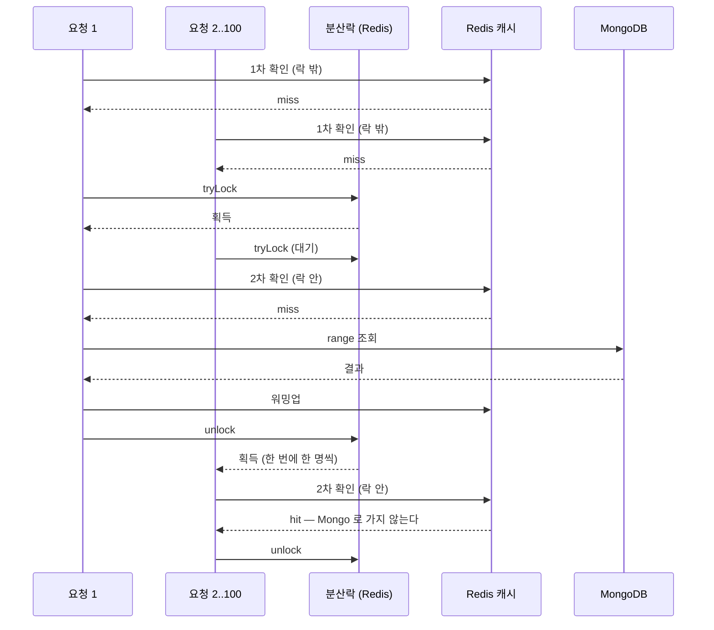

# CHAT — chat 서비스 상세 기준 문서

> - **문서 상태**: 검증 완료
> - **기준 브랜치**: `main`
> - **기준 일자**: 2026-07-24
> - **검증 기준**: 실제 애플리케이션 코드 및 Config Repository(`git-config-repo/`)
> - **재검증 조건**: 아래 중 하나라도 변경되면 이 문서를 다시 검증한다.
>   - REST 경로(`git-config-repo/dynamic/chat-service.yml`의 `api-path.chat.*`) 또는 `ChatRoomController`/`ChatMessageController` 변경
>   - gRPC 계약(`protobuf/src/main/proto/chatmessage/v1/chatmessage-service.proto`) 변경
>   - Kafka 바인딩(`chat-service.yml`의 `spring.cloud.stream.*`) 또는 토픽 카탈로그(`common-core/KafkaTopic`)의 chat 항목 변경
>   - Redis 키(`common-core/RedisKey`의 `CHAT_*`) 또는 캐시 인덱스 구조 변경
>   - 도메인 모델(`ChatRoom`, `ChatMessage`, `ChatRoomCategory`, `MyChatRoomScoreCalculator`) 변경
>   - Mongo 문서/인덱스(`MongoChatRoom`, `MongoChatMessage`, `MongoChatRoomMembership`) 변경
>   - 비동기/보상 흐름(`ChatRoomEventService`, `ChatMessageEventService`, `*DlqService`, `ChatMessageScheduler`) 변경
>   - 방 activity projection(`ChatRoomActivityProjectionService`, `chat.room-activity-projection.*`) 변경

## 1. 문서 목적과 기준 시점

이 문서는 `chat` 서비스의 구조·요청 흐름·계약·근거를 사람과 AI가 필요할 때 찾아 읽기 위한 상세 문서다. 문서와 코드가 어긋나면 코드가 기준이다(루트 `docs/ARCHITECTURE.md` 원칙과 동일). 짧은 작업 규칙은 [`../../chat/CLAUDE.md`](../../chat/CLAUDE.md)에 있으며 여기서는 반복하지 않는다.

## 2. 모듈 역할

실시간 채팅의 소유 서비스. **채팅방(chatroom)** 과 **채팅 메시지(chatmessage)** 두 서브도메인을 담당한다. 방 생성/수정/삭제, 입장/퇴장, 읽음 활동(activity) 갱신, 인기방/내 방/방 상세/메시지 목록 조회, 그리고 메시지 저장·하드삭제를 처리한다.

외부에는 두 인터페이스를 노출한다.
- **REST**(게이트웨이 경유): 방 목록·상세·멤버십·활동 및 메시지 목록 조회. `ChatRoomController`/`ChatMessageController`.
- **gRPC**(`chatmessage.v1`, 내부 서비스용): 메시지 저장/하드삭제. `websocket-gateway`가 STOMP로 받은 메시지를 이 gRPC로 전달한다.

실시간 브로드캐스트(프론트로 STOMP push)는 chat이 아니라 `websocket-gateway`의 책임이다 — chat은 저장/카운팅/캐시 후 Outbox로 `chatmessage-broadcast-event`/`chatroom-broadcast-event`를 발행하고, websocket-gateway가 이를 소비해 push한다. 실시간 송신·실패·저장 흐름 전체는 [`../SERVICE_FLOWS.md` §8–10](../SERVICE_FLOWS.md)를 참조한다.

## 3. 실행 구조와 주요 의존성

- Gradle 경로: `:chat:*` (헥사고날 멀티모듈). 실행 모듈은 `:chat:chat-bootstrap`(`ext.dockerImageName = "crypto-chat-service"`).
- 실행 클래스: `org.example.chat.Main`(`@SpringBootApplication(scanBasePackages="org.example")`, `@ConfigurationPropertiesScan`).
- app name: `chat-service`. 포트: REST `8080`, gRPC `18080`. 컨텍스트 경로 `/api/v1`(`server.servlet.context-path: /api/${server.version}`).
- 저장소: **MongoDB**(주 저장소, 방·메시지·멤버십), **Redis Cluster**(조회 캐시/인덱스, `{chat}` hash tag), **MySQL**(Outbox/DLQ 이벤트 저장 — `common-outbox` 경유, `mysql.event.*` DB).
- Config Server 연동: `application.yml`의 `spring.config.import: configserver:...`, `spring.cloud.config.name: chat-service,eureka-client,mysql,mongo,redis,kafka,monitoring`. 공유 `api-contract.*`는 Config Repository 루트 `application.yml`에서 자동 병합된다.
- 부트스트랩 의존성: `common-actuator-webmvc`, Config Client, Eureka Client, `spring-cloud-starter-bus-kafka`, Micrometer/Prometheus.

## 4. 모듈 구조 (헥사고날)

두 서브도메인 `chatroom`·`chatmessage`가 계층별로 나뉜다.

| Gradle 모듈 | 계층 | 핵심 내용 | 주요 의존 |
|---|---|---|---|
| `chat-domain` | domain | `ChatRoom`, `ChatMessage`, `ChatRoomCategory`, `MyChatRoomScoreCalculator`(프레임워크 비의존) | `common-core` |
| `chat-application` | application | UseCase/Service, Port(in/out), Command/Query/Result, 이벤트·DLQ 이벤트, 매퍼, 검증, 예외 | `chat-domain`(api), `chat-contract`, `common-outbox`, `common-redis`, `common-redisson`, data-jpa/data-mongodb, stream-kafka, caffeine |
| `chat-adapter-in` | adapter-in | REST(`ChatRoom/ChatMessageController`), gRPC(`GrpcChatMessageService`), Kafka 바인더(`KafkaChatRoom/ChatMessageBinder`) | `common-web`, `common-grpc-server`, `common-outbox`, `protobuf`, `chat-application` |
| `chat-adapter-out` | adapter-out | Mongo/Redis 어댑터, ObjectId 생성기, 스케줄러, infra config(Mongo/Redis/Retry/Schedule/Datasource) | `common-id`, `common-web`, `common-redis`, `common-mongo`, `chat-application`, aop, caffeine |
| `chat-bootstrap` | 실행 | `Main`, `application.yml` | 위 4개 + actuator/config/eureka/bus/prometheus |
| `chat-client` | 클라이언트 | future stub으로 `CompletableFuture<GrpcResponse>`를 제공하는 gRPC 클라이언트(`ChatMessageClient`/`GrpcChatMessageClient`) | `protobuf`, `common-grpc-client`, grpc-client-starter |
| `chat-contract` | 계약 | Outbox 브로드캐스트 이벤트/페이로드(`ChatMessageBroadcastEvent`, `MyChatRoomBadgeBroadcastEvent` 등) | `common-outbox` |

의존 방향: adapter-in/out → application → domain. `chat-client`/`chat-contract`는 **소비자용 산출물**로, chat 자신이 아니라 `websocket-gateway`가 의존한다(gRPC 호출 및 broadcast 이벤트 역직렬화).

## 5. 아키텍처 핵심 — 쓰기는 캐시-우선 + Outbox, 영속은 비동기

chat의 쓰기 경로는 **Outbox를 먼저 기록하고 Redis 캐시에 반영하며, 영속(MongoDB)은 Kafka를 통해 비동기로 수행**하는 구조다. 이 원칙을 먼저 이해해야 나머지 절이 읽힌다.

1. **명령(Command)**: `ChatRoomCommandService`/`ChatMessageCommandService`가 Outbox 이벤트를 발행한다(`OutboxEventListPublishPort.publish` → MySQL Outbox 테이블 기록). 방 명령은 이어서 Redis 캐시를 동기 반영하고, 메시지 `save`는 MySQL 트랜잭션 커밋 뒤 `AfterCommitExecutor`로 캐시를 반영한다.
2. **폴링/발행**: `outbox-poller`가 Outbox 레코드를 폴링해 Kafka 토픽으로 발행한다(chat 밖 공용 서비스).
3. **비동기 영속**: chat의 Kafka consumer(`chatRoomEventConsumer`/`chatMessageEventConsumer`)가 이벤트를 받아 `ChatRoomEventService`/`ChatMessageEventService`가 **MongoDB에 실제 write**를 수행한다(`@Transactional("chatMongoTransactionManager")`).
4. **보상**: 각 EventService는 `@Retryable`(3회, backoff 100ms×2) 후 `@Recover`로 DLQ 이벤트를 발행한다. DLQ는 `chatRoomDlqEventConsumer`/`chatMessageDlqEventConsumer`가 소비해 `*DlqService`로 처리하고 `DlqService.complete/fail`로 상태를 남긴다. 메시지 DLQ는 정상 메시지 영속 처리기를 재사용해 메시지 insert와 방 `msgCnt`·멤버십 스코어 갱신을 함께 재수행한다.
5. **캐시 폴백**: 방 명령의 캐시 동기 반영이 실패하면(§7 `cache*Safely`) 로그 후 별도 캐시-복구 Outbox 이벤트(`ChatRoomCacheSaveEvent`/`...InvalidateEvent` 등)를 발행해 비동기로 캐시를 재구성/무효화한다. 메시지 `save`의 커밋 후 캐시 반영 실패는 로그만 남기며 조회 repair가 복구한다.

### 내 방 정렬 projection — 방 단위 conflation

내 방 목록 정렬(`{chat}:active-room:{memberId}` ZSET)을 방 단위로 합쳐 반영하는 projector를
도입했다(PR #287). 활동이 있었던 방을 dirty로 표시하고, 같은 방의 연속 메시지를 한 flush에서
한 번만 계산하는 경로다.

**이번 PR은 dual-write 검증 단계다.** 기존 Redis·Mongo membership fan-out을 그대로 두고
projector를 함께 실행해 결과를 비교한다. 따라서 이 단계에서는 쓰기량이 줄지 않고 projector
비용이 추가된다. 조회 전환과 기존 fan-out 제거는 다음 PR에서 수행한다.

fan-out 제거 뒤에도 flush 한 번의 Redis 비용은 `O(members)`다. 줄어드는 것은 fan-out 한 번의
비용이 아니라 **실행 횟수**다. 같은 방의 메시지 수를 `M`, 멤버 수를 `N`, 실제로 처리된 flush
횟수를 `F`라 하면 active-room score 쓰기는 `M×N → F×N`으로 바뀐다.

```
PR1 전환기       기존 M×N + projector F×N
fan-out 제거 뒤  projector F×N
같은 창에 100건 · 멤버 302명 · flush 1회라면  30,200 → 302 ZADD
```

따라서 이득은 **한 flush 창에 같은 방 메시지가 몇 건 몰리느냐**에 비례한다. 창당 1건뿐인 한산한 방은 이득이 없고 dirty 표시 몫만큼 오히려 조금 늘어난다. 병목은 뜨거운 방에서 나므로 방향은 맞지만, 이 구조가 모든 방에 이득을 준다고 읽지 않는다.

계층을 셋으로 나눠 읽는다.

| 계층 | 무엇 | 유실되면 |
|---|---|---|
| durable source of truth | Mongo `chat_room.latestMsgSeq` + `chat_room_membership.lastMsgReadSeq` | 복구 불가 — 사실 기준 |
| 실시간 projector 입력 | Redis `{chat}:room:{roomId}:last_read` hash | Mongo membership 에서 재생성 |
| 조회용 결과 | Redis `{chat}:active-room:{memberId}` ZSET | 위 둘로 재생성 |

**`last_read` hash 는 사실 원본이 아니다.** projector 가 멤버별 unread 를 빠르게 판정하려고 읽는 입력일 뿐이고, 비면 Mongo membership 의 `lastMsgReadSeq` 로 다시 만든다.

패턴별 흐름:

1. **Dirty Set + Conflation**: `storeChatMessage.lua`가 메시지 상태를 갱신하는 **같은 원자 단위**에서 `{chat}:room:activity:recent` ZSET에 `roomId`를 올린다. 같은 방이 여러 번 들어와도 원소는 하나이고 score만 최신 활동 시각으로 올라간다.
2. **Competing Consumers + Lease**: `claimDirtyChatRooms.lua`가 방을 recent에서 **빼내고** `{chat}:room:activity:inflight`에 **claim 시각과 함께 넣는** 것을 한 원자 단위로 한다. 여러 chat 인스턴스 중 먼저 claim한 하나만 처리하며, claim 시각은 임시 소유권인 lease가 된다.
3. **Idempotent Projection**: `projectChatRoomActivity.lua`는 변화량을 누적하지 않고 반영 시점의 방 hash·`last_read` hash·최신 메시지 캐시를 다시 읽어 멤버별 score를 절대값으로 덮어쓴다. claim 뒤 새 메시지가 들어와도 현재 상태를 반영하며, 메시지 캐시가 예외적으로 비었을 때만 dirty 표시에 기록했던 시각을 쓴다. `lastReadSeq`는 MAX 조건으로만 갱신해 과거로 돌아가지 않으며, active-room score의 일시적인 경합 차이는 후속 flush가 다시 계산한다.
4. **Visibility Timeout + Repair**: 방 캐시가 비어 계산 근거가 없으면(`cacheMiss`) Mongo 기준으로 재생성한다. claim한 인스턴스가 죽어 `claim-timeout-ms`를 넘긴 방은 `reclaimStalled`가 lease를 원자적으로 갱신해 회수하고, Mongo room watermark와 membership 읽음 위치로 projection을 재생성한다.

#### 방 하나가 지나는 상태

두 ZSET 이 **대기**와 **처리중**을 나눠 든다. 어느 쪽에도 없으면 반영이 끝난 것이다.

```
저장     ZADD recent <활동시각> room        recent=[room]   inflight=[]
claim    recent 에서 빼고 inflight 로       recent=[]       inflight=[room@claim시각]
project  멤버별 score 계산 → active ZSET
성공     ZREM inflight room                 recent=[]       inflight=[]        ← 완료
```

`recent` 는 claim 시점에 이미 비워진다 — 완료 시 지우는 것은 `inflight` 하나다(`projectChatRoomActivity.lua` 마지막 줄).

score 의 의미도 둘이 다르다.

| ZSET | score | 쓰임 |
|---|---|---|
| `{chat}:room:activity:recent` | 활동 시각 | 오래된 활동부터 처리(`ZRANGE` 오름차순) |
| `{chat}:room:activity:inflight` | claim 시각 | lease — 타임아웃 판정 |

**lease는 시한부 소유권이다.** 여기서는 `inflight`의 score가 claim 시각이고 기한은
`claim-timeout-ms`(기본 30초)다. 기한이 지나도 Redis 항목이 자동으로 사라지지는 않으며,
다른 인스턴스의 `reclaimStalled`가 회수할 수 있는 상태가 된다. 회수한 인스턴스는 score를 현재
시각으로 갱신해 새 lease를 잡고, 다른 인스턴스가 같은 방을 겹쳐 회수하지 못하게 한다.

기한이 짧으면 아직 일하는 중인데 남이 뺏어가고(중복 처리), 길면 죽었는데 회수가 늦다. **이쪽은 짧은 편이 덜 위험하다** — projector 는 현재 Redis 상태로 매번 새로 계산하는 멱등 연산이라 중복 실행돼도 결과가 같고 쓰기만 낭비된다. 같은 개념의 대가를 반대편에서 무는 사례가 §8 의 `CACHE_WARM_UP`(`leaseTimeMs` 3초)이다 — 거기서는 lease 가 먼저 풀리면 전역 1회 보장이 깨진다.

**`recent` 는 큐가 아니라 합쳐지는 집합이다.** 원소 key 가 `roomId` 라 같은 방이 몇 번 들어와도 원소는 하나고 score 만 최신으로 덮인다.

```
진짜 큐        메시지 100건 → 항목 100개 → 100번 처리
recent(ZSET)   메시지 100건 → 원소 1개   → flush 1번 처리
```

멤버 302명 방에 메시지 100건이 몰려도 멤버 갱신이 100번이 아니라 한 번인 이유가 이것이다.

실패는 둘로 갈린다.

| 상황 | 처리 |
|---|---|
| projection 중 예외 | `requeueDirty` 가 `recent` 로 되돌리고 `inflight` 에서 뺀다(원래 활동 시각 유지) → 다음 주기 재시도 |
| 인스턴스 종료 | 아무도 지우지 않아 `inflight` 에 남는다 → `claim-timeout-ms` 초과 시 `reclaimStalled` 가 회수 |

**`inflight` 에 남아 있다는 것 자체가 실패 신호다.** 별도 상태 필드 없이 시각만으로 판별한다.

**두 ZSET 은 내구성 큐가 아니라 "처리할 방을 모아 두는 coalescing 작업 목록"이다.** 유실될 수 있고, 그래서 Mongo 기준 재생성 경로가 항상 함께 있다.

**멤버별 fan-out 은 남아 있지 않다.** 메시지 저장이 건드리는 멤버 상태는 **작성자 하나**뿐이다(자기 메시지는 읽은 것으로 보고 `last_read` 를 방 watermark 까지 올린다). 나머지 멤버는 flush 때 한 번에 반영된다. Mongo membership 은 `lastMsgReadSeq` 같은 사용자 고유 상태만 갖고 정렬 점수를 저장하지 않는다.

메시지 hard delete 도 멤버별 점수를 되돌리지 않는다. 방을 dirty 로 올려 두면 projector 가 남은 최신 메시지를 기준으로 다시 계산한다. watermark 는 hard delete 로 줄지 않는다.

| 경로 | 이전 | 지금 |
|---|---|---|
| 메시지 저장(Redis) | 멤버 N 명 ZADD | 작성자 1건 + dirty 표시 |
| 메시지 영속(Mongo) | 방별 membership bulkWrite(N 문서) | 메시지 insert + 방 watermark |
| hard delete | 멤버 N 명 점수 재계산 | dirty 표시 |
| 내 방 목록 정렬 | Mongo membership `score` 인덱스 | Redis projection, 미스 시 Mongo 재생성 |

**표의 「지금」은 메시지 저장 경로만 본 것이다.** 두 저장소의 성질이 다르다.

| | 쓰기 연산 수 | 성질 |
|---|---|---|
| Mongo membership | 302 → **0** | 정렬 점수를 저장하지 않기로 했으므로 **제거**다. 배치가 아니다 |
| Redis active ZSET | 메시지당 302 → **flush당 302** | 연산 수는 그대로고 **빈도만** 옮겼다. flush 안에서 멤버마다 `ZADD` 를 그대로 돈다 |

**"멤버 수 비례 쓰기를 없앴다"는 Mongo 에만 참이다.** Redis 는 여전히 `O(members)` 이며, 이득은 한 flush 창에 같은 방 메시지가 몇 건 몰리느냐에 비례한다(§5 앞부분).

읽기 경로는 **캐시-우선, 미스 시 Mongo 로드 + 워밍업**이다(§8). 정상 흐름에서 REST 조회는 Redis만 조회하며, 캐시가 비었거나 인덱스가 없으면 `*QueryRepairService`가 Mongo에서 로드해 캐시를 채운 뒤 반환한다. **미스 폭주 방어 도구는 서브도메인 특성에 따라 다르다: 방 = `SingleFlight`, 메시지 = 분산락.**

### 미스 폭주 방어 — 방은 `SingleFlight`, 메시지는 분산락

| | 방 (`SingleFlight`) | 메시지 (분산락) |
|---|---|---|
| 구현 | `common-redisson/SingleFlight`(in-process `ConcurrentHashMap`) | `common-redisson/DistributedLockExecutor`(Redisson `RLock`, `CACHE_WARM_UP`) |
| 보장 범위 | 인스턴스 내 1회 (서버 N대면 최악 N회 로드) | 클러스터 전역 1회 |
| miss reload 비용 | 싸다(방 상세 단건 `findByIdWithLatestMessage`) | 무겁다(range 쿼리) |
| 동시 miss 빈도 | 드묾 | 더 드묾(최신 페이지는 write-through 로 상주) |
| 코디네이션 비용 | 없음(맵 연산) | Redis 왕복 + 대기 |
| 대기자의 회수 방식 | `CompletableFuture` 결과 공유 → **전원 동시 반환** | 락을 하나씩 재획득 → **직렬 통과**(§8) |
| 획득 실패 | 없음 | 예산 소진 시 예외, 캐시 폴백 없음(§8) |

**갈린 기준은 「miss reload 가 얼마나 비싼가」 하나다.** chat 은 방·메시지 둘 다 cache-first(쓰기가 캐시 먼저, Mongo 는 async consumer)라 캐시에 값이 있으면 그게 최신이고, miss(evict/TTL/cold)에서만 Mongo 로드가 필요하다. 그 드문 miss 에 요청이 몰릴 때 중복 로드를 막는 것이 두 도구의 공통 목적이고, 둘 다 **동기 대기**다(SWR 처럼 즉답이 아니다 — 아래).

- **방 → `SingleFlight`**(구 분산락에서 전환): reload 가 싸고 miss 도 드물어 전역 1회 보장의 이득이 작다. 락 획득·대기·타임아웃·복구 왕복을 치를 값어치가 없어, 같은 key 동시 로드만 1회로 합치는 **경량 동기 dedup** 으로 충분하다. 대기는 짧은 로드 시간뿐이고 획득 실패라는 개념 자체가 없다.
- **메시지 → 분산락 유지**: 메시지 캐시는 TTL 없이 **접근시간 + 시간지역성 스케줄러**로 축출하고 **최신순 접근**이라 최신 페이지는 상주하고 과거 페이지는 소수 서버만 본다 → 동시 miss 자체가 드물다. 그 드문 miss 의 reload 가 **range 쿼리**라 전역 1회 보장이 중복 range 를 막아 이득이고, 대기·획득 실패 비용은 드물게만 발생해 실질 부담이 없다.

표의 마지막 두 행이 대가다. 분산락은 캐시로 회수되는 요청까지 **직렬로** 통과시키고, 예산을 넘기면 **실패**시킨다. 그 대가를 치를 만큼 reload 가 비쌀 때만 쓴다.

**SWR(만료값 즉시 반환 + 비동기 갱신)은 쓰지 않는다.** chat 은 cache-first 라 캐시가 Mongo 보다 **앞서** 있어(DB = 진실 아님), SWR 로 Mongo 를 재조회해 덮으면 아직 반영 안 된 최신 캐시를 뒤처진 값으로 되돌릴 위험이 있다. 그래서 miss 는 로드 완료까지 동기 대기한다. 데이터 특성별 캐시 전략 대비는 [`NOTIFICATION.md §7.1`](NOTIFICATION.md).

## 6. 주요 클래스와 책임

| 클래스 | 책임 |
|---|---|
| `ChatRoomController` | 방 REST 10개 엔드포인트(§9) |
| `ChatMessageController` | 메시지 목록 조회 1개(§9) |
| `GrpcChatMessageService` | gRPC `save`/`HardDelete`(§10), 취소/데드라인 감지 |
| `KafkaChatRoomBinder` / `KafkaChatMessageBinder` | Kafka consumer 함수 빈(이벤트/DLQ) |
| `ChatRoomCommandService` | 방 create/update/join/leave/activity/delete — Outbox 발행 + 캐시 동기 반영(§7) |
| `ChatRoomQueryService` | 인기방/내 방/방 상세 조회(캐시-우선), lastRead·unread 계산 |
| `ChatRoomQueryRepairService` | 캐시 미스 복구(`SingleFlight` 하에 Mongo 로드 + 워밍업) |
| `ChatRoomActivityProjectionService` | dirty 방을 claim 해 내 방 정렬 projection 반영, 실패·유실 시 Mongo 기준 재생성(§5) |
| `RedisChatRoomActivityProjectionAdapter` | `ChatRoomActivityProjectionPort` 구현(dirty/inflight ZSET + projection Lua) |
| `ChatRoomActivityProjectionScheduler` | projector flush·reclaim 트리거(§15) |
| `ChatRoomEventService` | 방 이벤트 비동기 영속 + 캐시 복구, `@Retryable`/`@Recover`→DLQ |
| `ChatRoomDlqService` | 방 DLQ 이벤트 재처리 |
| `ChatMessageCommandService` | 메시지 save/hardDelete(§10), Outbox 3종 발행 + 캐시 |
| `ChatMessageQueryService` | 메시지 목록 조회(캐시-우선, 미스 시 repair) |
| `ChatMessageQueryRepairService` | 메시지 캐시 미스 복구(분산락 하에 range 로드 + 워밍업) |
| `ChatMessageEventService` | 메시지 이벤트 비동기 영속(멱등) + 방 카운터/스코어 갱신(멤버 전원 스코어는 `upsertUnreadActivity` 의 UNORDERED bulkWrite 한 번, PR #270 — 멤버당 왕복으로 되돌리지 않는다), →DLQ |
| `MyChatRoomScoreCalculator` | 내 방 정렬 스코어(안읽음 가중치) |
| `MongoChatMessageAdapter` / `MongoChatRoomAdapter` | `*PersistencePort` 구현(MongoDB) |
| `RedisChatMessageAdapter` / `RedisChatRoomAdapter` | `*CachePort` 구현(Redis Cluster) |
| `RedisCollectionRegistry` | master/replica `RedisSet`/`RedisZSet` 캐싱 획득 |
| `ChatMessageScheduler` | 매일 03:00 캐시에서 7일 초과 메시지 제거(§13) |
| `ObjectIdChatRoomIdGeneratorAdapter` | 방 id = Mongo `ObjectId`(hex) 생성 |

## 7. 방 명령 흐름 (ChatRoomCommandService)

각 명령은 **Outbox 이벤트 발행 → 캐시 동기 반영**의 2단계다. `chatroom` 명령 서비스는 `@Transactional`을 쓰지 않는다(영속은 비동기 이벤트가 담당).

| 명령 | Outbox 이벤트(→`chatroom-event`) | 캐시 동기 반영 | 비고 |
|---|---|---|---|
| `create(cmd)` | `ChatRoomPersistedEvent` | `cache.save` | id는 `idGenerator.generate()`(ObjectId). 이어서 `activity(id, hostId, 0, 0)` 호출로 호스트 활동 시딩 |
| `save(domain)` | `ChatRoomPersistedEvent` | `cache.save` | create가 내부적으로 사용 |
| `update(cmd)` | `ChatRoomUpdatedEvent` | `cache.updateRoom` | 캐시 갱신 위해 Mongo에서 `oldTitle` 조회(제목 유니크 인덱스 갱신용) |
| `join(id, memberId)` | `ChatRoomJoinedEvent` | `cache.joinMembership` | Mongo에서 방 로드 후 `addMember`. 이미 멤버면 false 반환(no-op) |
| `leave(id, memberId)` | `ChatRoomLeavedEvent` | `cache.leaveMembership` | **마지막 멤버면 `delete`로 전환** |
| `activity(cmd)` | `ChatRoomActiveEvent` | `updateLastReadSeq` + `updateActivityScore` | 읽음 seq/시각 반영 |
| `delete(id)` | `ChatRoomDeletedEvent` | `cache.deleteRoom` | 방 로드 후 category/title/memberIds 확보 |

- 이벤트 발행 실패는 `TemporaryOutboxPersistenceException`은 그대로 전파(재시도 대상), 그 외는 `ChatRoomEventPublishException`으로 감싼다.
- **캐시 폴백**: `cache*Safely(...)`가 `RuntimeException`을 잡아 로그 후 캐시-복구 Outbox 이벤트를 추가 발행한다.
  - save 실패 → `ChatRoomCacheSaveEvent`(Mongo에서 최신 반영해 warmUp)
  - update 실패 → `ChatRoomCacheUpdateEvent`(oldTitle 포함, `recoverRoomUpdate`)
  - join/leave 실패 → `ChatRoomCacheInfoInvalidateEvent`(방 정보 무효화)
  - activity 실패 → `ChatRoomCacheActivityInvalidateEvent`(멤버 활동 무효화)
  - delete 실패 → `ChatRoomCacheDeleteEvent`
- 방을 찾지 못하면 `ChatRoomNotFoundException`(`update`/`join`/`leave`/`delete`).

## 8. 조회 흐름 (Query — 캐시-우선 + repair)

| 조회 | 캐시에서 보는 것 | 미스 시 |
|---|---|---|
| 방 상세 `getRoom` | `cache.findById(roomId)` | `repairRoom`(`SingleFlight`) — Mongo `findByIdWithLatestMessage` + 워밍업. Mongo 에도 없으면 `ChatRoomNotFoundException` |
| 내 방 상세 `getMyRoom` | 방 + `lastReadSeq` | 방 미스면 `repairRoom` 후 영속 lastRead 로 조립. lastRead 만 미스면 `refreshActiveCacheSafely` 로 재적재(unread 여부로 스코어 계산) |
| 인기방 목록 `listPopularRooms` | 카테고리별 zset 인덱스(커서 유무로 first/next 분기) | 인덱스 자체 없음 → `repairPopularRooms`/`repairPopularRoomsAfter`. 부분 미스 → `repairRoomsByIds` 후 원래 순서로 merge |
| 내 방 목록 `listMyRooms` | 내 활성 방 zset(커서 유무로 분기, 커서 스코어 계산) | 인덱스 자체 없음 → Mongo 재생성(아래). 부분 미스 → `repairRoomsByIds` 후 merge |
| 메시지 목록 `listMessages` | 방별 메시지 zset(커서 유무로 latest/prev) | `repairLatest`/`repairPrev` — 분산락 → 캐시 재확인 → Mongo range + 워밍업 (아래 절) |
| 제목 중복 `existsByTitle` | `cache.existsByTitle` | `persistence.existsByTitle` 로 폴백 |

**내 방 정렬 인덱스가 통째로 비면 Mongo 로 다시 만든다.** 정렬 키 `(unread, lastMsgCreatedAt, roomId)` 는 방 쪽 사실과 사용자 읽음 위치가 섞여 있어 Mongo 인덱스 하나로 정렬할 수 없다. 그래서 `ChatRoomQueryRepairService` 가 사용자의 membership 과 방을 `chat.my-room.rebuild-limit`(기본 300)까지 읽어 `MyChatRoomScoreCalculator` 로 계산·정렬하고, 그 결과로 ZSET 을 통째로 심은 뒤 요청한 페이지만 잘라 돌려준다. **이 상한을 넘는 방을 가진 사용자는 오래된 방이 목록에서 빠질 수 있다.**

- 목록 계열의 캐시 결과는 `ChatRoomCacheLookupResult` 가 세 갈래로 구분한다: `hasNoIndex()`(인덱스 자체 없음 → 전체 repair) / `isAllHit()` / 부분 히트(miss id 만 개별 repair 후 원래 순서로 merge).
- 조회는 커서 페이지네이션이며, 컨트롤러가 `limit+1`로 조회한 뒤 `CursorPages.from(result, limit, mapper)`로 다음 커서 유무를 판정한다.

### 미스 시 실제 동작 — 캐시를 두 번 본다

동시 미스 100건이 메시지 목록에 몰렸을 때:



**repair 에 들어갔다고 항상 Mongo 를 타는 것이 아니다.** 캐시 조회가 두 번 있다.

1. **1차 (락/합류 밖)**: `ChatMessageQueryService.listMessages`·`ChatRoomQueryService.getRoom` 이 캐시를 먼저 본다. 히트면 repair 를 호출하지도 않는다.
2. **2차 (락/합류 안)**: `*QueryRepairService` 가 락(또는 `SingleFlight`) 안에서 캐시를 **다시** 본다. 선행 요청이 워밍업을 끝냈으면 여기서 히트해 Mongo 를 타지 않는다.

그래서 위 그림에서 **Mongo range 는 1회이고 나머지 99건은 캐시로 회수된다.** 다만 캐시 히트여도 락은 잡아야 하므로 **통과는 직렬**이다(각자 Redis 조회 1회 분량). 방(`SingleFlight`)은 이 부분이 다르다 — 대기자가 `CompletableFuture` 결과를 그대로 받아 재획득·재조회 없이 **전원 동시에** 반환한다.

코드에서 2차는 `distributedLockExecutor.execute(key, () -> repairCachedMessages(cache.listLatestMessages(...), loader), CACHE_WARM_UP)` 형태다. 캐시 조회가 인자 자리에 있어 먼저 실행되는 것처럼 보이지만 **람다 몸통이라 락 획득 뒤에 실행된다.**

### 락 정책과 실패 동작 (메시지 경로)

`DistributedLockPolicy.CACHE_WARM_UP` 하나만 쓴다.

| 파라미터 | 값 | 의미 |
|---|---:|---|
| `waitTimeMs` | 100 | `tryLock` 1회 대기 한도 |
| `leaseTimeMs` | 3,000 | 보유 한도. 넘으면 자동 해제 |
| `retryAttempts` | 3 | 획득 실패 시 추가 시도 |
| `retryDelayMs` | 30 | 재시도 간격 |
| (합계) | 약 490ms | 총 4회 시도 소진까지 |

- **예산을 소진하면 `DistributedLockAcquireFailedException` 을 던진다.** 캐시로 폴백하거나 락 없이 로드하는 경로는 **없다** — 캐시에 값이 이미 있어도 조회 실패로 끝난다. 미스 폭주에 대해 DB 를 보호하는 대신 요청 일부를 실패시키는 선택이다.
- 로드가 `leaseTimeMs`(3초)를 넘기면 보유자가 작업 중인 상태에서 락이 먼저 풀려 **전역 1회 보장이 깨질 수 있다**. 현재 range 크기에서 이 상황이 발생하는지는 측정하지 않았다(확인 필요).

## 9. REST API 계약

베이스 `${api-path.chat.base:/chat}`, 전체 경로에 컨텍스트 `/api/v1`가 붙는다. 경로 문자열은 `git-config-repo/dynamic/chat-service.yml`의 `api-path.chat.*`에서 주입.

| 메서드 | 전체 경로 | 헤더/파라미터 | 응답 |
|---|---|---|---|
| GET | `/api/v1/chat/rooms/popular` | `category`(enum, 필수), `limit`(기본 10), 커서(`ChatRoomCursor`) | 200 `CursorPage<ChatRoomResponse>` |
| GET | `/api/v1/chat/rooms/me` | `X-User-Id`, `limit`(기본 10), 커서(`MyChatRoomCursor`) | 200 `CursorPage<MyChatRoomResponse>` |
| GET | `/api/v1/chat/room/{roomId}` | path `roomId` | 200 `ChatRoomResponse` |
| GET | `/api/v1/chat/room/{roomId}/me` | `X-User-Id`, path `roomId` | 200 `MyChatRoomResponse` |
| POST | `/api/v1/chat/room/{roomId}/members` | `X-User-Id` | 신규 멤버 201(`Location`) / 기존 204 |
| DELETE | `/api/v1/chat/room/{roomId}/members` | `X-User-Id` | 204 No Content |
| PUT | `/api/v1/chat/room/{roomId}/activity` | `X-User-Id`, `lastMsgReadSeq`, `lastMsgCreatedAtMs` | 204 No Content |
| POST | `/api/v1/chat/room` | `X-User-Id`(host), `ChatRoomCreateRequest` | 201(`Location: /home`) |
| PATCH | `/api/v1/chat/room/{roomId}` | path `roomId`, `ChatRoomUpdateRequest` | 빈 body → 400, 아니면 204 |
| DELETE | `/api/v1/chat/room/{roomId}` | path `roomId` | 204 No Content |
| GET | `/api/v1/chat/room/{roomId}/messages` | path `roomId`, `limit`(기본 20), 커서(`ChatMessageCursor`) | 200 `CursorPage<ChatMessageResponse>` |

- `X-User-Id`는 게이트웨이가 검증된 JWT의 `id` claim에서 주입(`common-core/HttpHeaderKey.USER_ID_VALUE`). 컨트롤러는 이 값을 그대로 신뢰한다.
- **인가**: `create`는 인증된 사용자를 host로 방 생성(게이트웨이 `hasRole(USER)`), `update`/`delete`는 `X-User-Id` → `ChatRoom.validateHost`(소유자만), 메시지 목록 조회는 `ChatRoom.validateMember`(멤버만). **방 상세**(`GET /room/{roomId}`, `ChatRoomResponse`)는 방 레벨 공개 메타데이터(per-user 데이터 없음)라 멤버십 검사 없이 공개 열람이다 — 유저별 데이터는 `GET /room/{roomId}/me`(`MyChatRoomResponse`, `X-User-Id` 필수)로 분리돼 있다.
- 검증 규칙(`ChatRoomCreateRequest`): `title` `@UniqueChatRoomTitle`+`@NotBlank`+`@Size(max=100)`, `description` `@NotBlank`+`@Size(max=2000)`, `category` `@NotNull`. 메시지는 `chat-bootstrap`이 아니라 `chat-service.yml`의 `spring.messages.basename: messages,common-validation-messages`.
- `@UniqueChatRoomTitle` → `UniqueChatRoomTitleValidator`가 `ChatRoomQueryUseCase.existsByTitle`로 확인(캐시 `existsByTitle` → 미스 시 Mongo). null/blank는 통과.

## 10. gRPC 계약 (`chatmessage.v1`)

proto: `protobuf/src/main/proto/chatmessage/v1/chatmessage-service.proto`. 서버 구현 `GrpcChatMessageService`(adapter-in). 소비자: `websocket-gateway`(`ChatMessageClient`/`GrpcChatMessageClient` 경유).

| RPC | 요청 | 응답 | 용도 |
|---|---|---|---|
| `save` | `GrpcChatMessageRequest{clientMessageId, messageId, roomId, writerId, content}` | `GrpcChatMessageResponse{success, id, ts}` | 메시지 저장(방 검증→Outbox 발행→캐시) |
| `HardDelete` | `GrpcChatMessageHardDeleteRequest{messageId, roomId, reason}` | `GrpcChatMessageHardDeleteResponse{success, messageId, deleted, alreadyDeleted, notFound}` | 메시지 물리 삭제 + 방 카운터/스코어 보정 |

- **`save`**(`ChatMessageCommandService.save`, MySQL `@Transactional("transactionManager")` + `@Retryable(TemporaryOutboxPersistenceException, 3회)`):
  1. Mongo에서 방 로드(`findById`) → 없으면 `ChatRoomNotFoundException`.
  2. `chatRoom.validateWritable(writerId)` — writerId가 멤버가 아니면 `ChatRoomMembershipNotFoundException`.
  3. `ChatMessage.create(messageId, roomId, writerId, content)`(messageId는 클라이언트/게이트웨이가 부여한 ObjectId).
  4. Outbox 3종 발행: `ChatMessagePersistEvent`(→`chatmessage-event`, 영속용), `ChatMessageBroadcastEvent`(→`chatmessage-broadcast-event`, websocket-gateway push용), `MyChatRoomBadgeBroadcastEvent`(→`chatroom-broadcast-event`, 뱃지용).
  5. MySQL Outbox 트랜잭션 커밋 후 `AfterCommitExecutor`가 Redis 캐시를 저장한다(`chatMessageCachePort.save`). 실패는 로그만 남기고 조회 repair에 맡긴다.
  - **메시지 자체의 Mongo 저장은 여기서 하지 않는다.** `chatmessage-event`를 받은 `ChatMessageEventService.handle`이 비동기로 Mongo에 저장하고 방 `msgCnt` 증가·멤버십 스코어를 갱신한다(`DuplicateChatMessageException`은 `noRetryFor`로 멱등 처리).
- **`HardDelete`**(`hardDelete`, `@Transactional("chatMongoTransactionManager")` + `@Retryable(TemporaryChatPersistenceException, 3회)`): Mongo `hardDeleteById` → 없으면 skip. 삭제되면 `decrementMessageCount`, `findLatestMessageExcluding`로 fallback 시각 산출, `refreshMembershipScores` 후 캐시 하드삭제(`hardDeleteCacheSafely`, 실패는 로그만).
- 취소/데드라인: `save`/`hardDelete` 진입·완료 시 `Context.current().isCancelled()`를 검사해 `ChatMessageGrpcCancelledException`을 던진다. gRPC 예외 변환은 `GrpcChatMessageExceptionAdvice`.
- **계약 주의**: 이 proto는 외부 계약이다(→ `websocket-gateway`). field number 재사용 금지, 변경 시 server(chat)·client(websocket-gateway) 재빌드. 상세 절차는 `../../.claude/rules/external-contracts.md`.

## 11. Kafka 계약 (토픽·바인딩)

토픽 카탈로그: `common-core/KafkaTopic`. chat 바인딩: `chat-service.yml`의 `spring.cloud.function.definition` + `spring.cloud.stream.bindings`.

### 컨슈머 멱등 전략

| 컨슈머 이벤트 | 하는 일 | 사용한 전략 |
|---|---|---|
| `ChatRoomPersistedEvent` | 채팅방 Mongo 저장 | `chatRoomId` 자연 키로 동일 문서를 저장 |
| `ChatRoomUpdatedEvent` | 방 정보 갱신 | `chatRoomId` 기준 절대값 update |
| `ChatRoomJoinedEvent` | 멤버십 추가 | `(roomId, memberId)` unique와 중복 추가 무시 |
| `ChatRoomLeavedEvent` | 멤버십 제거 | 동일 대상 반복 제거를 성공으로 취급 |
| `ChatRoomDeletedEvent` | 방·멤버십 삭제 | ID 기준 반복 삭제 허용 |
| `ChatRoomActiveEvent` | 마지막 메시지·활동 점수 갱신 | 동일 멤버십 키에 최신 활동 값을 반영 |
| `ChatRoomCacheSave/UpdateEvent` | 방 캐시 저장·복구 | 동일 Redis key 덮어쓰기 |
| `ChatRoomCacheDelete/InvalidateEvent` | 방 캐시 삭제·무효화 | 반복 삭제 허용 |
| `ChatMessagePersistEvent` | 메시지 저장 후 방 `msgCnt`·`latestMsgSeq` 증가와 기존 멤버 점수 projection 갱신 | `messageId`로 Mongo `insert`; 중복 키면 `DuplicateChatMessageException`으로 성공 종료해 후속 연산을 실행하지 않음 |
| ChatRoom DLQ 이벤트 | 원본 방 영속/캐시 처리를 재수행한 뒤 DLQ 완료 상태 반영 | 원본 도메인 자연 키 + 안정적인 `dlq_id`/`event_id` |
| `ChatMessagePersistDlqEvent` | `ChatMessageDlqService`가 정상 메시지 영속 흐름을 재수행 | 메시지 insert·신규 메시지 기준 방 watermark 증가를 동일하게 재수행 |

Kafka `event_id`는 추적 계약으로 함께 전달하지만, chat은 서로 다른 이벤트 ID로 같은 도메인 대상이 들어오는 경우까지 막을 수 있도록 자연 키를 멱등 기준으로 삼는다. 특히 `ChatMessagePersistEvent`는 `MongoRepository.save`가 기존 `_id`를 replace할 수 있으므로 신규 삽입 전용 `insert`를 사용한다. 같은 `messageId`의 동시 소비에서는 Mongo unique `_id`가 하나만 성공시키고, 같은 Mongo 트랜잭션의 `msgCnt`·`latestMsgSeq` 증가도 중복 소비에서 실행되지 않는다.

| 토픽 | 방향 | 이벤트 | 처리 |
|---|---|---|---|
| `chatroom-event` (`.dlq`) | chat 소비(group `chat`) | `ChatRoom*Event`(persist/update/join/leave/deleted/active) + 캐시-복구 이벤트 | `ChatRoomEventService` → Mongo/캐시. 실패→DLQ |
| `chatmessage-event` (`.dlq`) | chat 소비(group `chat`) | `ChatMessagePersistEvent` | `ChatMessageEventService` → Mongo 저장 + 방 watermark + 기존 membership score projection. 실패→DLQ |
| `chatmessage-broadcast-event` | chat 생산(Outbox) | `ChatMessageBroadcastEvent{payload, clientMessageId}` | **websocket-gateway** 소비 → STOMP push |
| `chatroom-broadcast-event` | chat 생산(Outbox) | `MyChatRoomBadgeBroadcastEvent{payload}` | **websocket-gateway** 소비 → 뱃지 push |

- consumer 함수: `chatRoomEventConsumer`, `chatRoomDlqEventConsumer`, `chatMessageDlqEventConsumer`는 group `chat`, `ack-mode: record`, `start-offset: latest`; `chatMessageEventConsumer`는 group `chat`, `batch-mode: true`, `ack-mode: batch`, `start-offset: latest`로 batch 소비한다.
- 이벤트 payload는 `@JsonCreator`/`@JsonProperty` record·클래스로 직렬화 계약이다. `ChatMessageBroadcastEvent`(nested `payload`)는 websocket-gateway가 프론트로 보내는 봉투 `StompChatMessageBatchPayload{ roomId, messages[] }`와 **다르다** — 변환과 배칭은 gateway 책임(→ `docs/ARCHITECTURE.md §7.4`).
- 직접 발행이 아니라 Outbox 흐름(도메인 명령 → Outbox → outbox-poller → Kafka)을 보존한다.
- DLQ 헤더 계약: `transaction_id`, `dlq_id`(`common-core/KafkaHeaderKey`). DLQ consumer는 `event.handle(handler)` 후 `DlqService.complete/fail`.

## 12. 도메인 모델

### `ChatRoom` (`ChatRoom`)
- 필드: `id`(ObjectId hex), `hostId`, `title`, `description`, `category`, `memberIds:Set<String>`, `msgCnt`(현재 보관 메시지 수), `latestMsgSeq`(방별 단조 증가 watermark), `lastMsgId`/`lastMsgContent`/`lastMsgCreatedAt`(최신 메시지 조인 결과), `createdAt`.
- 팩토리: `create(...)`(호스트를 멤버로 시딩, `msgCnt=0`), `rehydrate(...)`(영속 복원), `rehydrateWithLatest(...)`(최신 메시지 포함 복원).
- 행위: `validateWritable(writerId)`(멤버 아니면 `ChatRoomMembershipNotFoundException`), `addMember`/`removeMember`(멱등 boolean), `isLastMember`(마지막 멤버 → 퇴장 시 삭제 전환), `hasUnread(lastReadSeq)`(`lastReadSeq < latestMsgSeq`), `popularity()`.
- **인기도 산식은 `ChatRoomPopularityCalculator.calculate(ChatRoom)`(chatroom domain service) 한 곳에만 있다** — 현재 `msgCnt` 단일 항(가중치 1.0). 인기방 zset은 실시간 증분이 아니라 **주기 재계산**으로 유지한다:
  - `ChatRoomPopularityScheduler`(3시간마다, `@Scheduled`) → `PopularChatRoomRefreshService.refresh()`가 category별 Mongo 상위 후보(top-100)를 로드해 `ChatRoomCachePort.rebuildPopularIndex`(`rebuildPopularRoomIndex.lua`: DEL 후 `calculate()` 스코어로 zset 재구축).
  - 메시지 저장(`storeChatMessage.lua`)은 popular zset을 건드리지 않는다(`msgCnt` HINCRBY만). `ChatMessageCachePort.save`는 `category` 파라미터를 받지 않는다.
  - on-read 캐시 미스 복구(`ChatRoomQueryRepairService` → `warmUpList`)도 `calculate()`로 zset을 채운다(cold start·TTL 만료 대비).
  - 스케줄러는 category별 **전 방을 스캔**해 `calculate`로 Mongo `popularity` 필드를 bulk 갱신한 뒤 상위 100개로 Redis zset을 재구축한다(정확한 top-N 위해 풀스캔). Mongo 인기방 정렬/커서는 저장된 `popularity` 필드(`idx_category_popularity`) 기준.
  - `popularity`는 `round(calculate)`(Long)로 저장 — Redis zset score(double)와 소수 산식 시 경계에서 미세 오차 가능(정밀 불필요 전제). 커서(`ChatRoomCursor.lastPopularity`)는 Long 유지(프론트 API 계약 무변경).
  실행 간 zset은 다소 stale(수용). 항 추가(멤버 수·최근성 등)는 `calculate`에 가중치만 더하면 되며 §16 참고.

### `ChatMessage` (`ChatMessage`)
- 필드: `id`(ObjectId hex), `roomId`, `writerId`, `content`, `createdAt`.
- 시간 변환은 `ServiceZoneUtils.ZONE_ID` 기준(`createdAtInstant`, `toEpochMillis`).

### `ChatRoomCategory`
- `FREE`, `STUDY`, `CRYPTO_CURRENCY`.

### `MyChatRoomScoreCalculator` (내 방 정렬 스코어)
- `unread(ms) = ms + 100_000_000_000_000L`(안읽음 가중치), `read(ms) = ms`. → 안읽은 방이 항상 상단 정렬.
- **설계 의도**: 이 스코어 산정은 엄밀히는 `ChatRoom`(및 멤버십)의 도메인 로직이라 `ChatRoom`에 두는 것이 원칙에 맞다. 다만 unread 가중치 상수·재산정 규칙을 한곳에 모아 **가독성을 높이려고 상태 없는(`private` 생성자 + `static` 메서드) 도메인 서비스로 의도적으로 분리**했다. 여전히 `chat-domain` 소속 도메인 로직이며 `ChatRoom.hasUnread`와 짝을 이룬다 — 스코어 규칙을 바꾸면 두 곳(도메인 서비스 + Redis/Mongo 스코어 기록 경로)을 함께 본다.

## 13. 영속성 · 스키마 (MongoDB)

DB `chat`(authSource `chat`). `MongoConfig`가 커넥션 풀(min 20/max 200), `WriteConcern.ACKNOWLEDGED`, primary read, 스네이크케이스 필드 네이밍, `chatMongoTransactionManager`(replica-set 트랜잭션)를 구성한다. `autoIndexCreation=true`.

| 컬렉션 | 인덱스 | 비고 |
|---|---|---|
| `chat_room` | `idx_category_popularity` `{category:1, popularity:-1, _id:-1}` partial `{deleted:false}`; `title` unique partial `{deleted:false}` | soft-delete(`deleted`/`deletedAt`). 인기방 정렬/커서(저장된 `popularity` 필드)·후보 풀스캔 지원. `latestMsgSeq`는 메시지 저장 때 원자 증가 |
| `chat_message` | `idx_room_created_id` `{room_id:1, created_at:-1, _id:-1}` partial `{deleted:false}` | 방별 최신/이전 커서 조회 |
| `chat_room_membership` | unique `{room_id, member_id}`; `my_rooms` `{member_id, _id:-1}` | `id = "roomId\|memberId"`, `lastMsgReadSeq`(방 watermark 기준 읽음 위치). **정렬 점수는 저장하지 않는다** — 정렬은 Redis projection 이 담당하고 이 컬렉션은 재생성 source 다 |

- 도메인 ↔ Mongo 매핑은 각 `Mongo*.fromDomain`/`toDomain`(+`toDomainWithLatest`)에서 수행.
- `latestMsgSeq`가 없는 기존 방 문서는 최초 갱신 시 현재 `msgCnt`를 시작점으로 사용한다.
- REST `ChatRoomResponse`는 보관 메시지 수인 `msgCnt`와 읽음 위치 watermark인 `latestMsgSeq`를 별도 필드로 반환한다. 클라이언트는 activity의 `lastMsgReadSeq`에 `latestMsgSeq`를 전달한다.
- `unreadMsgCnt`는 `latestMsgSeq - lastMsgReadSeq`인 watermark 거리다. hard delete된 메시지의 순번도 재사용하지 않으므로, 삭제가 섞인 구간에서는 현재 화면에 남은 미열람 메시지 개수와 다를 수 있다.
- 메시지 조회: `listLatestMessages`(정렬 desc + limit), `listMessagesBefore`(커스텀 repo `listMessagesBefore`), `findLatestMessageExcluding`(하드삭제 후 방 최신 시각 보정).
- `hardDeleteById`는 커스텀 repo가 처리하고 boolean(삭제 여부)을 반환한다. 잘못된 ObjectId 문자열은 `InvalidResourceRequestException`, 그 외 Mongo 예외는 `MongoChatPersistenceExceptionTranslator`가 chat 예외(`Temporary*`/`Duplicate*` 등)로 변환한다.
- 방 id는 애플리케이션이 생성한 `ObjectId`(`ObjectIdChatRoomIdGeneratorAdapter` → `common-id/ObjectIdGenerator`).

## 14. 캐시 · 인덱스 (Redis Cluster)

키는 `common-core/RedisKey` enum으로만 생성(`keyFor(...)`가 인자 수 검증). 모든 키는 hash tag `{chat}`로 슬롯을 고정한다. `RedisCollectionRegistry`가 master/replica `RedisTemplate` 기반 `RedisSet`/`RedisZSet`을 Caffeine 캐시로 재사용한다(쓰기=master, 조회=replica zset 사용 가능).

| RedisKey | 패턴 | 자료구조 | 용도 |
|---|---|---|---|
| `CHAT_ROOM_INFO` | `{chat}:room:%s` | hash | 방 정보 캐시. `msg_cnt`와 단조 증가 `latest_msg_seq`를 함께 보관 |
| `CHAT_ROOM_LAST_READ_SEQ` | `{chat}:room:%s:last_read` | hash/value | 멤버별 마지막 읽음 seq |
| `CHAT_ROOM_TITLE_UNIQUE_INDEX` | `{chat}:room:title:idx` | set | 제목 유니크 인덱스(`existsByTitle`) |
| `CHAT_ROOM_POPULAR_BY_CATEGORY_INDEX` | `{chat}:popular-room:%s` | zset | 카테고리별 인기방(score=popularity) |
| `CHAT_ROOM_ACTIVE_BY_MEMBER_INDEX` | `{chat}:active-room:%s` | zset | 멤버별 내 방(score=활동 스코어, unread 가중치) |
| `CHAT_ROOM_ACTIVITY_RECENT_INDEX` | `{chat}:room:activity:recent` | zset | projector 가 처리할 방(score=활동 시각). 내구성 큐가 아닌 작업 목록 |
| `CHAT_ROOM_ACTIVITY_INFLIGHT_INDEX` | `{chat}:room:activity:inflight` | zset | claim 한 방(score=claim 시각). timeout 초과분은 Mongo 기준 재생성으로 회수 |
| `CHAT_MESSAGE_INFO` | `{chat}:message:%s` | zset | 방별 메시지(값=직렬화 메시지) |
| `CHAT_MESSAGE_ACCESS_BY_ROOM_INDEX` | `{chat}:room:%s:message-access` | zset | 방별 메시지 접근시각 인덱스(TTL 제거용) |

- `%s` 인자: room/message는 roomId, popular은 category, active는 memberId.
- 캐시 조회 실패의 fail-open 정책·코덱은 `common-redis`(`RedisValueCodec`, `redisChatMessageCodec` 등)에 있다.

## 15. 스케줄러 · 트랜잭션 · 재시도

- **스케줄러**(`ChatMessageScheduler`, `@Scheduled(cron="0 0 3 * * *")`): 매일 03:00, `CHAT_MESSAGE_ACCESS_BY_ROOM_INDEX`를 `SCAN`하며 접근시각이 7일(`Duration.ofDays(7)`) 초과인 메시지를 방별 message zset과 access zset에서 제거한다. 실패 시 `ChatCacheException`. `@EnableScheduling`은 `ScheduleConfig`.
- **projector**(`ChatRoomActivityProjectionScheduler`, `@Scheduled(fixedDelay)`): 각 chat 인스턴스가 `flush`와 `reclaimStalled`를 함께 실행한다. `flush-delay-ms`(기본 500ms)마다 dirty 방을 claim해 정렬 projection을 반영하고, `reclaim-delay-ms`(기본 10초)마다 `claim-timeout-ms`(기본 30초)를 넘긴 방을 최대 `reclaim-batch-size`(기본 200개)까지 Mongo 기준으로 회수한다(§5). 여러 인스턴스의 경쟁은 Redis Lua의 원자 claim·lease 갱신으로 조정한다. 장애 난 방의 실제 회수 시점은 약 30~40초이며, flush 간격은 정상 상태에서 **내 방 목록이 최신으로 올라오기까지 허용하는 지연**이다.
- **커넥션 점유**: `DatasourceConfig` 가 `LazyConnectionDataSourceProxy` 로 write DataSource 를 감싼다. `ChatMessageCommandService.save` 는 트랜잭션 안에서 Mongo(방 조회)를 왕복하는데, 프록시가 없으면 트랜잭션 시작 시점에 MySQL 커넥션을 잡고 그 왕복 내내 붙들어 풀이 고갈된다(실측 점유 5.139초 · 타임아웃 360건 → 브로드캐스트 유실 10.06%, PR #257). **이 프록시를 걷어내지 않는다**(→ `docs/decisions/ADR-003-...md`).
- **트랜잭션 경계**: `ChatMessageCommandService.save`는 MySQL Outbox 원자성을 위해 `@Transactional("transactionManager")`를 사용한다. Mongo write를 묶는 `ChatMessageCommandService.hardDelete`, `ChatMessageEventService.handle`, `ChatRoomEventService`의 leave/delete 핸들러는 `@Transactional("chatMongoTransactionManager")`를 사용한다. cache-warm 핸들러는 같은 Mongo 매니저의 read-only 트랜잭션이다. `chatroom` 명령 서비스(create/update/join/activity)는 트랜잭션 없이 Outbox+캐시로만 동작한다.
- **재시도/보상**: `@Retryable`(`TemporaryChatPersistenceException`/`TemporaryChatCacheException`/`TemporaryOutboxPersistenceException`, maxAttempts 3, backoff 100ms×2) + `@Recover`. Recover는 각 이벤트별 DLQ 이벤트를 발행하며, DLQ 발행조차 실패하면 `[RECOVER-FALLBACK]` 로그만 남긴다(`RetryConfig`).

### 15.1 메시지 Mongo 영속 지표

application의 outbound port `ChatMessageMetricsPort`가 계측 의도를 정의하고, adapter-out의
`MicrometerChatMessageMetricsAdapter`가 `MeterRegistry`로 구현한다. handler 타이머는
`KafkaChatMessageBinder` 바깥 경계에서 재시도·Mongo 트랜잭션 커밋·recover까지 포함하고, stage
타이머는 각 Mongo 작업 시간을 분리한다. Timer는 Prometheus histogram을 발행한다. 모든 태그는 아래의
고정된 저카디널리티 값만 사용하며 `roomId`·`messageId`·`txId`는 태그로 넣지 않는다.

| 논리 지표 | Micrometer 이름 | 타입 | 태그·의미 |
|---|---|---|---|
| consumer handler 전체 | `chat.message.persistence.handler` | `Timer` | `result=success\|failure`; 재시도와 transaction 종료를 포함한 event 1건의 전체 처리 시간 |
| Mongo 단계 | `chat.message.persistence.stage` | `Timer` | `stage=message_insert\|room_counter`; 메시지 insert 와 방 watermark 갱신 시간을 분리 |
| 처리 단위 메시지 수 | `chat.message.persistence.batch.messages` | `DistributionSummary` | 커밋된 batch의 신규 메시지 수 |
| 처리 단위 방 수 | `chat.message.persistence.batch.rooms` | `DistributionSummary` | 커밋된 batch의 고유 방 수 |
| 신규·중복 메시지 수 | `chat.message.persistence.messages` | `Counter` | `result=new\|duplicate`; Mongo transaction `afterCommit`에서만 증가 |
| 재시도 가능 실패 | `chat.message.persistence.retry.failures` | `Counter` | `TemporaryChatPersistenceException`이 발생한 attempt 수. retry exhausted 직전의 마지막 실패도 포함 |
| DLQ 전이 | `chat.message.persistence.dlq.transitions` | `Counter` | `result=published\|publish_failed`; recover의 DLQ 발행 결과 |
| Kafka consumer lag | Kafka binder/consumer 기본 metric | 기존 Kafka metric | 앱 custom metric을 중복 추가하지 않고 `chatmessage-event` consumer lag을 함께 본다 |

신규 수·batch/방/멤버십 수는 Mongo transaction의 `afterCommit`에서 기록하므로 rollback된 쓰기는 성공
수치에 포함되지 않는다. 반면 stage Timer와 retry failure는 실패한 attempt도 의도적으로 포함한다. 이
차이로 “어느 단계에서 시간을 썼는가”와 “실제로 커밋된 쓰기량”을 분리한다.

### 15.2 방 activity projection 지표

application 의 `ChatRoomActivityProjectionMetricsPort` 가 계측 의도를 정의하고 adapter-out 의
`MicrometerChatRoomActivityProjectionMetricsAdapter` 가 구현한다. 태그는 고정된 저카디널리티 값만
쓰며 `roomId`·`memberId` 는 태그로 넣지 않는다.

| 논리 지표 | Micrometer 이름 | 타입 | 태그·의미 |
|---|---|---|---|
| flush 사이클 | `chat.room.activity.projection.flush` | `Timer` | claim 부터 방별 반영까지 한 주기 전체 |
| 방 처리 결과 | `chat.room.activity.projection.rooms` | `Counter` | `result=claimed\|projected\|rebuilt\|reclaimed\|discarded\|failed` |
| 방당 멤버 수 | `chat.room.activity.projection.members` | `DistributionSummary` | `source=projection\|rebuild`; 한 방을 반영할 때 갱신한 멤버 수 |
| 기존 fan-out 과의 차이 | `chat.room.activity.projection.score.mismatches` | `Counter` | projector 계산이 기존 fan-out 이 써 둔 score 와 다른 멤버 수 |
| dirty 적체 | `chat.room.activity.projection.dirty.backlog` | `Gauge` | flush 시점에 남아 있는 dirty 방 수 |

`score.mismatches` 는 projector 가 계산한 값이 ZSET 에 이미 있던 값과 다른 멤버 수다. 정상 갱신에서도
올라가므로 0 이 목표값이 아니라 **변화량의 추이**를 본다. `dirty.backlog` 가 계속 늘면 flush 주기나
`claim-batch-size` 가 활동량을 못 따라가는 것이다.

## 16. 확인 필요 항목

미해결 확인/결정 항목은 [`../../TODO.md`](../../TODO.md)에서 통합 관리한다. chat 관련 항목:

- **TODO 5.3-b** — 방별 순번 부재. `msgCnt` 는 비동기 핸들러에서 `$inc` 로 올라가 순번으로 쓸 수 없다(브로드캐스트 갭 감지의 선행 조건)
- **TODO 4.7** — `LazyConnectionDataSourceProxy` 미적용 서비스 점검(chat 은 적용 완료, §15)


## 17. 테스트 현황

계층별 테스트가 존재한다(세부 내용은 이 문서 검증 범위 밖, 필요 시 파일 직접 확인).
- domain: `ChatRoomTest`
- application: `ChatRoomCommandServiceTest`, `ChatRoomQueryServiceTest`, `ChatRoomQueryRepairServiceTest`, `ChatRoomEventServiceTest`, `ChatRoomDlqServiceTest`, `ChatMessageCommandServiceTest`, `ChatMessageQueryServiceTest`, `ChatMessageQueryRepairServiceTest`, `ChatMessageEventServiceTest`, `UniqueChatRoomTitleValidatorTest`
- adapter-in: `ChatRoomControllerMvcTest`, `ChatMessageControllerMvcTest`, `GrpcChatMessageServiceTest`, `GrpcChatMessageExceptionAdviceTest`, `KafkaChatMessageBinderTest`, `KafkaChatRoomBinderTest`, `GlobalExceptionHandlerTest`
- adapter-out: `Mongo*RepositoryImplTest`/`Mongo*AdapterTest`(room·message·membership), `RedisChatRoomAdapterTest`, `RedisChatMessageAdapterTest`, `ChatMessageSchedulerTest`, `MongoChatPersistenceExceptionTranslatorTest`

## 18. 컴파일 · 테스트 · CI 명령

- 컴파일(가장 좁게): `./gradlew :chat:chat-application:compileJava` 등 서브모듈 단위.
- 서브모듈 테스트: `./gradlew :chat:chat-application:test`, `:chat:chat-adapter-in:test`, `:chat:chat-adapter-out:test`, `:chat:chat-domain:test`.
- 서비스 CI(빌드+테스트+ArchUnit): `./gradlew chatCi`(루트 `build.gradle`). ArchUnit(`:common:common-arch-test:test`) 포함.
- 전체 build/test, `bootRun`, 애플리케이션 실행, 배포는 명시적 요청 없이 수행하지 않는다.

## 19. 변경 위험도가 높은 파일

| 파일 | 이유 |
|---|---|
| `protobuf/.../chatmessage/v1/chatmessage-service.proto` | gRPC 외부 계약. 변경 시 websocket-gateway 재빌드 |
| `common-core/KafkaTopic`(chat 항목) · `chat-service.yml` stream 바인딩 | 토픽·바인딩 계약. producer/consumer 타입·DLQ 함께 |
| `common-core/RedisKey`(`CHAT_*`) | 캐시 키·hash tag 계약. 인덱스 구조와 함께 |
| `chat-contract/.../ChatMessageBroadcastEvent`·`MyChatRoomBadgeBroadcastEvent` | Kafka broadcast payload 계약(→ websocket-gateway 역직렬화) |
| `Mongo*`(room/message/membership) 인덱스·partial filter | 커서 조회 성능·유니크 제약 |
| `ChatRoom`/`MyChatRoomScoreCalculator` | 도메인 불변식·정렬 스코어 규칙 |
| `git-config-repo/dynamic/chat-service.yml` | REST 경로·포트·Kafka/DB. 게이트웨이 route와 함께 봐야 함 |

## 20. 관련 문서와 rules

- 루트 구조/흐름: [`../ARCHITECTURE.md`](../ARCHITECTURE.md), [`../SERVICE_FLOWS.md`](../SERVICE_FLOWS.md)(§8–10 채팅 흐름), 코드 스타일 [`../CODE_STYLE.md`](../CODE_STYLE.md)
- 실시간 push 상대편: [`API_GATEWAY.md`](API_GATEWAY.md)(경로·헤더 전파), websocket-gateway는 별도 모듈 문서 미작성(코드: `websocket-gateway/.../adapter/in/websocket/`, `.../adapter/out/.../stomp/`)
- 계약/보안/아키텍처/테스트 rules: `../../.claude/rules/{external-contracts,security,architecture,testing}.md`
