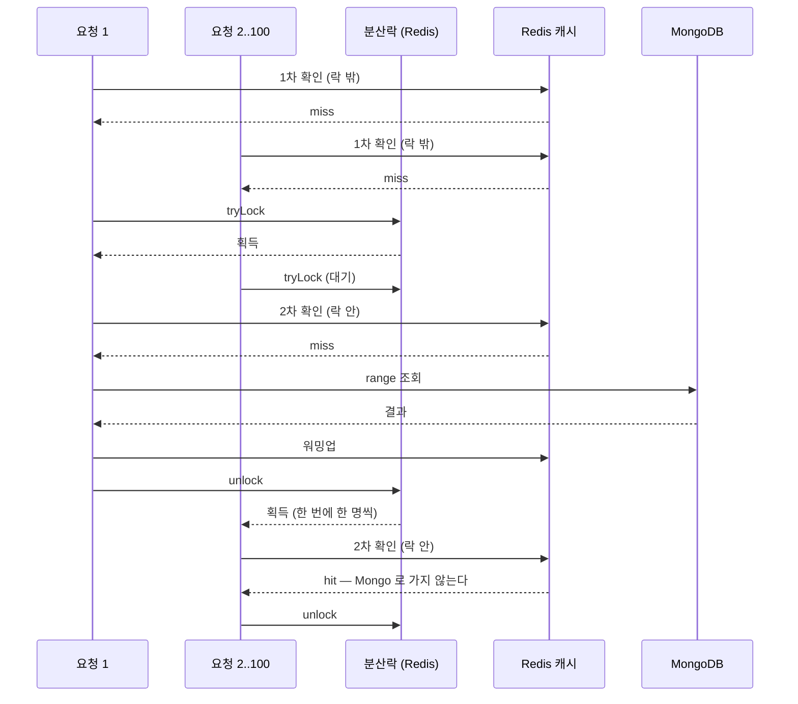

# CHAT — chat 서비스 상세 기준 문서

> - **문서 상태**: 검증 완료
> - **기준 브랜치**: `main`
> - **기준 일자**: 2026-07-24
> - **검증 기준**: 실제 애플리케이션 코드 및 Config Repository(`git-config-repo/`)
> - **재검증 조건**: 아래 중 하나라도 변경되면 이 문서를 다시 검증한다.
>   - REST 경로(`git-config-repo/dynamic/chat-service.yml`의 `api-path.chat.*`) 또는 `ChatRoomController`/`ChatMessageController` 변경
>   - gRPC 계약(`protobuf/src/main/proto/chatmessage/v1/chatmessage-service.proto`) 변경
>   - Kafka 바인딩(`chat-service.yml`의 `spring.cloud.stream.*`) 또는 토픽 카탈로그(`common-core/KafkaTopic`)의 chat 항목 변경
>   - Redis 키(`common-core/RedisKey`의 `CHAT_*`) 또는 캐시 인덱스 구조 변경
>   - 도메인 모델(`ChatRoom`, `ChatMessage`, `ChatRoomCategory`, `MyChatRoomScoreCalculator`) 변경
>   - Mongo 문서/인덱스(`MongoChatRoom`, `MongoChatMessage`, `MongoChatRoomMembership`) 변경
>   - 비동기/보상 흐름(`ChatRoomEventService`, `ChatMessageEventService`, `*DlqService`, `ChatMessageScheduler`) 변경
>   - 방 activity projection(`ChatRoomActivityProjectionService`, `chat.room-activity-projection.*`) 변경

## 1. 문서 목적과 기준 시점

이 문서는 `chat` 서비스의 구조·요청 흐름·계약·근거를 사람과 AI가 필요할 때 찾아 읽기 위한 상세 문서다. 문서와 코드가 어긋나면 코드가 기준이다(루트 `docs/ARCHITECTURE.md` 원칙과 동일). 짧은 작업 규칙은 [`../../chat/CLAUDE.md`](../../chat/CLAUDE.md)에 있으며 여기서는 반복하지 않는다.

## 2. 모듈 역할

실시간 채팅의 소유 서비스. **채팅방(chatroom)** 과 **채팅 메시지(chatmessage)** 두 서브도메인을 담당한다. 방 생성/수정/삭제, 입장/퇴장, 읽음 활동(activity) 갱신, 인기방/내 방/방 상세/메시지 목록 조회, 그리고 메시지 저장·하드삭제를 처리한다.

외부에는 두 인터페이스를 노출한다.
- **REST**(게이트웨이 경유): 방 목록·상세·멤버십·활동 및 메시지 목록 조회. `ChatRoomController`/`ChatMessageController`.
- **gRPC**(`chatmessage.v1`, 내부 서비스용): 메시지 저장/하드삭제. `websocket-gateway`가 STOMP로 받은 메시지를 이 gRPC로 전달한다.

실시간 브로드캐스트(프론트로 STOMP push)는 chat이 아니라 `websocket-gateway`의 책임이다 — chat은 저장/카운팅/캐시 후 Outbox로 `chatmessage-broadcast-event`/`chatroom-broadcast-event`를 발행하고, websocket-gateway가 이를 소비해 push한다. 실시간 송신·실패·저장 흐름 전체는 [`../SERVICE_FLOWS.md` §8–10](../SERVICE_FLOWS.md)를 참조한다.

## 3. 실행 구조와 주요 의존성

| 구분 | 내용 |
|---|---|
| Gradle·실행 | `:chat:*` 헥사고날 멀티모듈, `:chat:chat-bootstrap`(`crypto-chat-service`) |
| 진입점·네트워크 | `org.example.chat.Main`, REST `8080`, gRPC `18080`, 컨텍스트 `/api/v1` |
| 저장소·인프라 | MongoDB(방·메시지·멤버십), Redis Cluster(조회 캐시·인덱스, `{chat}`), MySQL(Outbox/DLQ, `mysql.event.*`) |
| 공통·플랫폼 | `common-actuator-webmvc`, Config Client, Eureka Client, `spring-cloud-starter-bus-kafka`, Micrometer/Prometheus |
| 원격 설정 | `chat-service,eureka-client,mysql,mongo,redis,kafka,monitoring`; 공유 `api-contract.*`는 Config Repository 루트에서 병합 |

의존성 전체 그래프는 [`docs/dependencies.md`](../dependencies.md)에서 확인할 수 있다.

## 4. 모듈 구조 (헥사고날)

두 서브도메인 `chatroom`·`chatmessage`가 계층별로 나뉜다.

| Gradle 모듈 | 계층 | 핵심 내용 | 주요 의존 |
|---|---|---|---|
| `chat-domain` | domain | `ChatRoom`, `ChatMessage`, `ChatRoomCategory`, `MyChatRoomScoreCalculator`(프레임워크 비의존) | `common-core` |
| `chat-application` | application | UseCase/Service, Port(in/out), Command/Query/Result, 이벤트·DLQ 이벤트, 매퍼, 검증, 예외 | `chat-domain`(api), `chat-contract`, `common-outbox`, `common-redis`, `common-redisson`, data-jpa/data-mongodb, stream-kafka, caffeine |
| `chat-adapter-in` | adapter-in | REST(`ChatRoom/ChatMessageController`), gRPC(`GrpcChatMessageService`), Kafka 바인더(`KafkaChatRoom/ChatMessageBinder`) | `common-web`, `common-grpc-server`, `common-outbox`, `protobuf`, `chat-application` |
| `chat-adapter-out` | adapter-out | Mongo/Redis 어댑터, ObjectId 생성기, 스케줄러, infra config(Mongo/Redis/Retry/Schedule/Datasource) | `common-id`, `common-web`, `common-redis`, `common-mongo`, `chat-application`, aop, caffeine |
| `chat-bootstrap` | 실행 | `Main`, `application.yml` | 위 4개 + actuator/config/eureka/bus/prometheus |
| `chat-client` | 클라이언트 | future stub으로 `CompletableFuture<GrpcResponse>`를 제공하는 gRPC 클라이언트(`ChatMessageClient`/`GrpcChatMessageClient`) | `protobuf`, `common-grpc-client`, grpc-client-starter |
| `chat-contract` | 계약 | Outbox 브로드캐스트 이벤트/페이로드(`ChatMessageBroadcastEvent`, `MyChatRoomBadgeBroadcastEvent` 등) | `common-outbox` |

의존 방향: adapter-in/out → application → domain. `chat-client`/`chat-contract`는 **소비자용 산출물**로, chat 자신이 아니라 `websocket-gateway`가 의존한다(gRPC 호출 및 broadcast 이벤트 역직렬화).

## 5. 아키텍처 핵심 — 캐시 우선 쓰기·비동기 영속·조회 projection

chat의 쓰기 경로는 **Outbox를 먼저 기록하고 Redis 캐시에 반영하며, 영속(MongoDB)은 Kafka를 통해 비동기로 수행**하는 구조다. 이 원칙을 먼저 이해해야 나머지 절이 읽힌다.

| 원칙 | 정상 경로 | 실패·복구 |
|---|---|---|
| Outbox 우선 명령 | `ChatRoomCommandService`/`ChatMessageCommandService`가 MySQL Outbox를 먼저 기록한다. 방 명령은 Redis를 동기 반영하고, 메시지 `save`는 커밋 뒤 `AfterCommitExecutor`로 Redis를 반영한다 | 방 캐시 반영 실패는 캐시-복구 Outbox 이벤트로 재구성·무효화한다. 메시지 캐시 반영 실패는 조회 repair가 복구한다 |
| Kafka 비동기 영속 | `outbox-poller`가 이벤트를 Kafka로 발행하고, `ChatRoomEventService`/`ChatMessageEventService`가 MongoDB에 실제 write한다 | EventService가 재시도한 뒤 `@Recover`에서 DLQ 이벤트를 발행한다 |
| DLQ 재처리 | `chatRoomDlqEventConsumer`/`chatMessageDlqEventConsumer`가 원래 영속 처리를 다시 수행한다 | 메시지 DLQ는 정상 처리기를 재사용해 메시지 insert와 방 `msgCnt`·`latestMsgSeq` watermark 갱신을 함께 재수행하고, `DlqService.complete/fail`로 결과를 남긴다 |
| 재생성 가능한 조회 projection | Mongo의 방 watermark와 membership 읽음 위치를 사실 기준으로 두고 Redis active-room을 조회용 결과로 사용한다 | 방 캐시 miss·stalled claim·active-room 인덱스 miss가 발생하면 Mongo 기준으로 다시 만든다 |

### 내 방 정렬 projection — 문제와 설계 원칙

내 방 목록은 방의 최신 활동과 사용자의 읽음 위치를 함께 반영해 정렬한다. 이 값들은 서로 다른
Mongo 컬렉션에 있다.

- 방의 사실: `chat_room.latestMsgSeq`, 최신 메시지 시각
- 사용자의 사실: `chat_room_membership.lastMsgReadSeq`
- 정렬 결과: `unread` 여부와 최신 메시지 시각을 반영한 사용자별 score

두 컬렉션의 값을 결합한 score를 Mongo 인덱스 하나만으로 직접 정렬하기는 어렵다. 기존 구조는
메시지가 저장될 때마다 방의 모든 멤버 점수를 미리 계산해 Mongo membership에 기록했다. 따라서
메시지 한 건의 처리 비용이 멤버 수에 비례하는 fan-out 비용이 됐다.

#### 문제와 초기 최적화의 한계

멤버별 갱신을 각각 수행하면 멤버 302명인 방에서 메시지 6,000건을 처리할 때 논리적으로
`302 × 6,000 = 1,812,000`건의 membership 갱신이 필요하다. 초기에는 이 갱신을 메시지별로
개별 요청해 Mongo 네트워크 왕복도 메시지당 302회, 전체 1,812,000회 발생했다.

이를 `bulkWrite` 한 번으로 묶어 네트워크 왕복을 메시지당 302회에서 1회, 전체 1,812,000회에서
6,000회로 줄였다. 하지만 bulkWrite 안의 update model 302건은 Mongo 서버에서 각각의 update
연산으로 집계된다. 즉, 네트워크 왕복은 줄었지만 논리적 갱신 대상과 Mongo 서버의 update 부하는
거의 줄지 않았다.

또 다른 문제는 `msgCnt`가 두 의미를 동시에 맡고 있었다는 점이다. `msgCnt`는 현재 보관 중인
메시지 수이면서 읽음 여부를 판단하는 기준이기도 했다. 메시지를 hard delete하면 `msgCnt`는
감소하지만, 이미 저장된 멤버별 `lastMsgReadSeq`는 그대로 남는다. 그 결과 삭제 전에는 모두
읽었던 방이 삭제 후에는 읽지 않은 방처럼 판단될 수 있었다.

#### 한 일: 방 단위 dirty projection

멤버별 점수를 메시지 저장 시점마다 갱신하지 않고, 활동이 발생한 방을 dirty로 표시한 뒤
projector가 방 단위로 정렬 결과를 계산하도록 바꿨다. 같은 방의 여러 메시지를 한 번의 flush로
합치므로, 멤버 수에 비례하는 갱신의 실행 횟수를 메시지 수에서 flush 수로 옮긴다.

Redis active-room에 멤버별 score를 쓰는 한 번의 flush 비용은 여전히 `O(members)`다. 줄어드는
것은 한 번의 flush가 멤버별로 수행하는 작업 수가 아니라, 같은 방에 대해 그 작업을 반복하는
횟수다.

```text
기존          메시지 M건 × 멤버 N명       → M × N회 갱신
변경          방별 flush F회 × 멤버 N명    → F × N회 갱신
예시          메시지 100건 · 멤버 302명 · flush 1회
              30,200회 갱신              → 302회 갱신
```

따라서 이득은 한 flush 창에 같은 방의 메시지가 얼마나 몰리는지에 비례한다. 창마다 메시지가
한 건뿐인 한산한 방은 이득이 작고 dirty 표시 비용이 추가될 수 있다. 이 구조가 모든 방의 비용을
줄이는 것이 아니라, 메시지가 집중되는 hot room의 반복 fan-out을 줄이는 구조라는 점이 중요하다.

| 설계 원칙 | 해결하는 문제 | 핵심 동작 | 보장 범위 |
|---|---|---|---|
| Dirty Set + Conflation | 메시지마다 멤버 전원의 score를 갱신하는 fan-out | 방을 dirty로 표시하고 같은 방의 연속 활동을 `roomId` 하나로 합친다 | 메시지 수가 아니라 실제 flush 횟수에 비례해 projection 실행 |
| Competing Consumers + Lease | 여러 chat 인스턴스가 같은 방을 중복 처리 | `recent → inflight` 원자 이동으로 한 인스턴스만 방을 claim한다 | lease가 유효한 동안 단일 처리자 |
| Idempotent Projection | 재처리 때 score가 중복 누적되거나 과거 상태로 회귀 | 현재 상태로 최종 score를 계산해 절대값으로 덮어쓴다 | 중복 실행을 허용하면서 결과 정합성 유지 |
| Visibility Timeout + Repair | 처리 인스턴스 종료로 방이 `inflight`에 고립 | timeout 뒤 lease를 회수하고 Mongo 사실 기준으로 projection을 재생성한다 | 장애 시 eventual repair |

#### Dirty Set + Conflation

`storeChatMessage.lua`가 메시지 캐시와 작성자의 읽음 위치를 갱신하는 같은 Redis 원자 연산에서
방을 dirty 목록에도 등록한다. projector가 처리할 방 목록은
`{chat}:room:activity:recent` ZSET이다.

이 ZSET은 메시지 큐가 아니라 방 단위로 합쳐지는 작업 목록이다. 원소의 key가 `roomId`이므로
같은 방의 메시지가 여러 번 들어와도 원소는 하나이고, score인 활동 시각만 최신 값으로 갱신된다.

```text
일반 큐       메시지 100건 → 항목 100개 → 100번 처리
recent ZSET   메시지 100건 → 방 항목 1개 → flush 1번 처리
```

메시지 저장 시 모든 멤버를 갱신하지 않는다. 작성자의 `last_read`만 방 watermark까지 올리고,
나머지 멤버의 active-room score는 projector가 flush 시점의 현재 상태를 읽어 한 번에 반영한다.

#### Competing Consumers + Lease

여러 chat 인스턴스가 공유하는 dirty 목록에서 같은 방을 여러 인스턴스가 중복 처리하지 않도록
claim 경쟁을 둔다.

`claimDirtyChatRooms.lua`는 `recent`에서 방을 원자적으로 제거하고
`{chat}:room:activity:inflight`에 claim 시각과 함께 넣는다. claim에 성공한 인스턴스만 그 방을
처리하며, `inflight`의 score가 임시 소유권의 시작 시각이 된다.

방 하나의 상태 전이는 다음과 같다.

```text
저장     ZADD recent <활동시각> room        recent=[room]   inflight=[]
claim    recent → inflight 원자 이동       recent=[]       inflight=[room@claim시각]
project  멤버별 score 계산 → active-room
성공     ZREM inflight room                 recent=[]       inflight=[]
```

`recent`는 claim 시점에 이미 비워진다. 정상 완료 시 제거하는 것은 `inflight`의 방 항목 하나다.
두 ZSET의 score 의미는 다르다.

| ZSET | score | 의미 |
|---|---|---|
| `{chat}:room:activity:recent` | 활동 시각 | 오래된 dirty 방부터 처리하는 순서 |
| `{chat}:room:activity:inflight` | claim 시각 | lease 만료 여부를 판단하는 기준 |

#### Idempotent Projection

`projectChatRoomActivity.lua`는 이전 score에 변화량을 누적하지 않는다. 처리 시점의 Redis 방 정보,
최신 메시지, 멤버별 `last_read`를 다시 읽어 각 멤버의 최종 score를 계산하고
`{chat}:active-room:{memberId}`에 절대값으로 덮어쓴다.

따라서 정상 처리, lease 만료 후 재처리, 장애 복구처럼 같은 방이 여러 번 처리돼도 score가
중복 증가하지 않는다. 같은 현재 상태를 입력으로 사용하면 항상 같은 결과가 나오므로, 중복 실행은
쓰기 낭비를 만들 수는 있어도 projection의 정합성을 깨뜨리지는 않는다.

projector가 claim한 뒤 새 메시지가 들어와도 처리 시점의 최신 Redis 상태를 기준으로 계산한다.
메시지 캐시가 예외적으로 비어 계산 근거가 없을 때만 dirty 표시 시각을 보조값으로 사용한다.
`lastReadSeq`는 MAX 조건으로만 갱신해 읽음 위치가 과거로 되돌아가지 않도록 한다.

#### Visibility Timeout + Repair

`inflight`에 들어간 방은 일반 dirty 목록에서 빠져 있으므로 다른 인스턴스가 즉시 다시 claim하지
않는다. 처리 인스턴스가 비정상 종료되면 방은 `inflight`에 남는다.

lease timeout(기본 30초)을 넘긴 방은 reclaim 스케줄러가 stalled 작업으로 판단한다.
`reclaimStalledChatRooms.lua`가 해당 방의 lease를 원자적으로 회수하고, MongoDB의 방 정보·멤버십·
읽음 위치를 기준으로 projection을 재생성한다. Redis의 불완전한 중간 상태를 그대로 이어서 쓰지
않기 때문에 장애 뒤에도 `{chat}:active-room:{memberId}`를 다시 구성할 수 있다.

projection 중 예외가 발생하면 `requeueDirty`가 방을 원래 활동 시각과 함께 `recent`로 되돌리고
`inflight`에서 제거한다. 인스턴스가 종료된 경우에는 `inflight`에 남겨 두었다가 timeout 이후
`reclaimStalled`가 회수한다.

두 ZSET은 내구성 큐가 아니라 방을 모아 두는 coalescing 작업 목록이다. 목록이 유실되거나
처리 인스턴스가 죽을 수 있으므로, Mongo 기준의 projection 재생성 경로가 함께 있어야 한다.

#### `msgCnt`와 `latestMsgSeq`의 분리

보관 메시지 개수와 읽음 판정 기준을 하나의 필드로 처리하지 않도록 역할을 분리했다.

| 필드 | 의미 | hard delete 시 |
|---|---|---|
| `msgCnt` | 현재 보관 중인 메시지 수 | 감소 가능 |
| `latestMsgSeq` | 방에서 발급된 메시지 순번의 watermark | 감소하지 않음 |

읽음 여부는 `msgCnt`가 아니라 `latestMsgSeq`와 멤버십의 `lastMsgReadSeq`를 비교해 판단한다.
메시지가 hard delete되어 `msgCnt`가 감소해도 watermark는 과거로 돌아가지 않으므로, 이미 읽은
사용자의 읽음 상태가 다시 unread로 바뀌지 않는다. 삭제된 메시지의 순번도 재사용하지 않기 때문에
`latestMsgSeq - lastMsgReadSeq`는 현재 보관 중인 메시지 수와 항상 같지는 않지만, 읽음 위치를
판단하는 기준으로는 일관성을 유지한다.

hard delete는 멤버별 점수를 되돌리지 않는다. 메시지 캐시를 제거하고 방을 dirty로 표시하면
projector가 남아 있는 최신 메시지와 watermark를 기준으로 active-room projection을 다시 계산한다.

#### 메시지 영속 이벤트의 batch 처리

메시지 영속 이벤트는 Kafka batch consumer로 전환했다. 여러 이벤트를 하나의 `handleBatch` 호출과
Mongo transaction 안에서 처리한다.

- 배치 내부에서 메시지 ID를 일괄 확인해 신규 메시지만 구분한다.
- 신규 메시지를 목록 단위로 insert한다.
- 방별 `msgCnt`, `latestMsgSeq`, `lastMsgCreatedAt` 갱신을 묶어서 처리한다.
- 중복 메시지는 insert와 방 상태 갱신에서 제외한다.

이로써 메시지마다 transaction을 열고 Mongo 저장을 호출하던 비용을 줄였다. 단, Kafka batch는
고정된 메시지 수를 보장하는 것이 아니라 소비 시점의 이벤트 묶음을 처리하는 방식이다. 실제
배치 크기는 부하와 consumer drain 속도에 따라 달라진다.

#### 읽기와 projection 복구

내 방 목록은 `{chat}:active-room:{memberId}` Redis ZSET을 먼저 조회한다. 인덱스가 없거나
캐시가 비어 있으면 `ChatRoomQueryRepairService`가 Mongo membership 전체를 읽고, 해당 방과
최신 메시지를 primary에서 batch 조회해 score를 다시 계산한다.

점수는 `(unread, lastMsgCreatedAt, roomId)` 기준으로 계산·정렬하고, 정렬이 끝난 뒤 상위
`chat.my-room.rebuild-limit`개(기본 300개)만 Redis에 재생성한다. 조회 전에 상한을 적용하면
오래된 방이 많을 때 최근 활동방이 복구 대상에서 빠질 수 있기 때문이다.

방 상세 miss는 `SingleFlight`로 같은 인스턴스 안의 중복 로드를 합치고, 메시지 목록 miss는
range query 비용이 커 `CACHE_WARM_UP` 분산락으로 클러스터 전역의 중복 복구를 줄인다. 두 경로
모두 cache-first이며, Mongo는 miss 복구 시에만 사용한다.

#### 측정 결과

테스트 방 1개, 멤버 302명, 초당 100건, 총 6,000건을 같은 조건에서 before/after 비교했다.
Mongo `serverStatus.opcounters`의 `insert + update`를 메시지 영속 경로의 write operation으로
집계했다.

| 지표 | Before | After | 변화 |
|---|---:|---:|---:|
| Mongo write operation | 1,824,039회 | 6,000회 | 99.67% 감소 |
| 메시지당 write operation | 304.007회 | 1.000회 | 99.67% 감소 |
| Mongo transaction commit | 6,000건 | 4,652건 | 22.5% 감소 |
| Kafka drain 완료 시간 | 389초 | 68초 | 82.5% 단축 |
| host swap-in | 46,946MB | 4,589MB | 90.2% 감소 |

After의 평균 persistence batch 크기는 `1.29건`이었다. write operation 감소는 단순히
bulkWrite로 네트워크 왕복만 줄인 결과가 아니라, 멤버별 Mongo score 저장을 제거하고 메시지
insert와 방 watermark 갱신을 batch 영속 경계로 재구성한 결과다.

`host swap-in`은 개발 호스트의 공유 자원 영향을 받는 보조 지표로만 사용했다. 응답 시간은
호스트 swap에 흔들려 이 비교의 주요 근거로 삼지 않았다. 최종 판정은 Mongo write operation,
transaction commit, Kafka drain 시간과 메시지 저장 정합성을 함께 기준으로 했다.

이 전환 뒤에도 Redis active-room projection을 한 번 flush할 때의 비용은 멤버 수에 비례한다.
변경의 효과는 이 비용을 없앤 것이 아니라, 같은 방의 여러 메시지를 한 번의 flush로 합쳐 반복
실행 횟수를 줄인 데 있다.

## 6. 주요 클래스와 책임

| 클래스 | 책임 |
|---|---|
| `ChatRoomController` | 방 REST 10개 엔드포인트(§9) |
| `ChatMessageController` | 메시지 목록 조회 1개(§9) |
| `GrpcChatMessageService` | gRPC `save`/`HardDelete`(§10), 취소/데드라인 감지 |
| `KafkaChatRoomBinder` / `KafkaChatMessageBinder` | Kafka consumer 함수 빈(이벤트/DLQ) |
| `ChatRoomCommandService` | 방 create/update/join/leave/activity/delete — Outbox 발행 + 캐시 동기 반영(§7) |
| `ChatRoomQueryService` | 인기방/내 방/방 상세 조회(캐시-우선), lastRead·unread 계산 |
| `ChatRoomQueryRepairService` | 캐시 미스 복구(`SingleFlight` 하에 Mongo 로드 + 워밍업) |
| `ChatRoomActivityProjectionService` | dirty 방을 claim 해 내 방 정렬 projection 반영, 실패·유실 시 Mongo 기준 재생성(§5) |
| `RedisChatRoomActivityProjectionAdapter` | `ChatRoomActivityProjectionPort` 구현(dirty/inflight ZSET + projection Lua) |
| `ChatRoomActivityProjectionScheduler` | projector flush·reclaim 트리거(§15) |
| `ChatRoomEventService` | 방 이벤트 비동기 영속 + 캐시 복구, `@Retryable`/`@Recover`→DLQ |
| `ChatRoomDlqService` | 방 DLQ 이벤트 재처리 |
| `ChatMessageCommandService` | 메시지 save/hardDelete(§10), Outbox 3종 발행 + 캐시 |
| `ChatMessageQueryService` | 메시지 목록 조회(캐시-우선, 미스 시 repair) |
| `ChatMessageQueryRepairService` | 메시지 캐시 미스 복구(분산락 하에 range 로드 + 워밍업) |
| `ChatMessageEventService` | 메시지 이벤트 비동기 영속(멱등) + 방 카운터/스코어 갱신(멤버 전원 스코어는 `upsertUnreadActivity` 의 UNORDERED bulkWrite 한 번, PR #270 — 멤버당 왕복으로 되돌리지 않는다), →DLQ |
| `MyChatRoomScoreCalculator` | 내 방 정렬 스코어(안읽음 가중치) |
| `MongoChatMessageAdapter` / `MongoChatRoomAdapter` | `*PersistencePort` 구현(MongoDB) |
| `RedisChatMessageAdapter` / `RedisChatRoomAdapter` | `*CachePort` 구현(Redis Cluster) |
| `RedisCollectionRegistry` | master/replica `RedisSet`/`RedisZSet` 캐싱 획득 |
| `ChatMessageScheduler` | 매일 03:00 캐시에서 7일 초과 메시지 제거(§13) |
| `ObjectIdChatRoomIdGeneratorAdapter` | 방 id = Mongo `ObjectId`(hex) 생성 |

## 7. 방 명령 흐름 (ChatRoomCommandService)

각 명령은 **Outbox 이벤트 발행 → 캐시 동기 반영**의 2단계다. `chatroom` 명령 서비스는 `@Transactional`을 쓰지 않는다(영속은 비동기 이벤트가 담당).

| 명령 | Outbox 이벤트(→`chatroom-event`) | 캐시 동기 반영 | 비고 |
|---|---|---|---|
| `create(cmd)` | `ChatRoomPersistedEvent` | `cache.save` | id는 `idGenerator.generate()`(ObjectId). 이어서 `activity(id, hostId, 0, 0)` 호출로 호스트 활동 시딩 |
| `save(domain)` | `ChatRoomPersistedEvent` | `cache.save` | create가 내부적으로 사용 |
| `update(cmd)` | `ChatRoomUpdatedEvent` | `cache.updateRoom` | 캐시 갱신 위해 Mongo에서 `oldTitle` 조회(제목 유니크 인덱스 갱신용) |
| `join(id, memberId)` | `ChatRoomJoinedEvent` | `cache.joinMembership` | Mongo에서 방 로드 후 `addMember`. 이미 멤버면 false 반환(no-op) |
| `leave(id, memberId)` | `ChatRoomLeavedEvent` | `cache.leaveMembership` | **마지막 멤버면 `delete`로 전환** |
| `activity(cmd)` | `ChatRoomActiveEvent` | `updateLastReadSeq` + `updateActivityScore` | 읽음 seq/시각 반영 |
| `delete(id)` | `ChatRoomDeletedEvent` | `cache.deleteRoom` | 방 로드 후 category/title/memberIds 확보 |

- 이벤트 발행 실패는 `TemporaryOutboxPersistenceException`은 그대로 전파(재시도 대상), 그 외는 `ChatRoomEventPublishException`으로 감싼다.
- **캐시 폴백**: `cache*Safely(...)`가 `RuntimeException`을 잡아 로그 후 캐시-복구 Outbox 이벤트를 추가 발행한다.
  - save 실패 → `ChatRoomCacheSaveEvent`(Mongo에서 최신 반영해 warmUp)
  - update 실패 → `ChatRoomCacheUpdateEvent`(oldTitle 포함, `recoverRoomUpdate`)
  - join/leave 실패 → `ChatRoomCacheInfoInvalidateEvent`(방 정보 무효화)
  - activity 실패 → `ChatRoomCacheActivityInvalidateEvent`(멤버 활동 무효화)
  - delete 실패 → `ChatRoomCacheDeleteEvent`
- 방을 찾지 못하면 `ChatRoomNotFoundException`(`update`/`join`/`leave`/`delete`).

## 8. 조회 흐름 (Query — 캐시-우선 + repair)

| 조회 | 캐시에서 보는 것 | 미스 시 |
|---|---|---|
| 방 상세 `getRoom` | `cache.findById(roomId)` | `repairRoom`(`SingleFlight`) — Mongo `findByIdWithLatestMessage` + 워밍업. Mongo 에도 없으면 `ChatRoomNotFoundException` |
| 내 방 상세 `getMyRoom` | 방 + `lastReadSeq` | 방 미스면 `repairRoom` 후 영속 lastRead 로 조립. lastRead 만 미스면 `refreshActiveCacheSafely` 로 재적재(unread 여부로 스코어 계산) |
| 인기방 목록 `listPopularRooms` | 카테고리별 zset 인덱스(커서 유무로 first/next 분기) | 인덱스 자체 없음 → `repairPopularRooms`/`repairPopularRoomsAfter`. 부분 미스 → `repairRoomsByIds` 후 원래 순서로 merge |
| 내 방 목록 `listMyRooms` | 내 활성 방 zset(커서 유무로 분기, 커서 스코어 계산) | 인덱스 자체 없음 → Mongo 재생성(아래). 부분 미스 → `repairRoomsByIds` 후 merge |
| 메시지 목록 `listMessages` | 방별 메시지 zset(커서 유무로 latest/prev) | `repairLatest`/`repairPrev` — 분산락 → 캐시 재확인 → Mongo range + 워밍업 (아래 절) |
| 제목 중복 `existsByTitle` | `cache.existsByTitle` | `persistence.existsByTitle` 로 폴백 |

**내 방 정렬 인덱스가 통째로 비면 Mongo 로 다시 만든다.** 정렬 키 `(unread, lastMsgCreatedAt, roomId)` 는 방 쪽 사실과 사용자 읽음 위치가 섞여 있어 Mongo 인덱스 하나로 정렬할 수 없다. 그래서 `ChatRoomQueryRepairService` 가 사용자의 membership 전체와 해당 방·최신 메시지를 primary에서 batch 조회하고, `MyChatRoomScoreCalculator` 로 계산·정렬한 **뒤** `chat.my-room.rebuild-limit`(기본 300)을 적용한다. 그 결과로 ZSET 을 통째로 심은 뒤 요청한 페이지만 잘라 돌려준다. 상한 밖의 낮은 점수 방은 cold miss 복구 인덱스에서 제외한다.

- 목록 계열의 캐시 결과는 `ChatRoomCacheLookupResult` 가 세 갈래로 구분한다: `hasNoIndex()`(인덱스 자체 없음 → 전체 repair) / `isAllHit()` / 부분 히트(miss id 만 개별 repair 후 원래 순서로 merge).
- 조회는 커서 페이지네이션이며, 컨트롤러가 `limit+1`로 조회한 뒤 `CursorPages.from(result, limit, mapper)`로 다음 커서 유무를 판정한다.

### 미스 시 실제 동작 — 캐시를 두 번 본다

동시 미스 100건이 메시지 목록에 몰렸을 때:



**repair 에 들어갔다고 항상 Mongo 를 타는 것이 아니다.** 캐시 조회가 두 번 있다.

1. **1차 (락/합류 밖)**: `ChatMessageQueryService.listMessages`·`ChatRoomQueryService.getRoom` 이 캐시를 먼저 본다. 히트면 repair 를 호출하지도 않는다.
2. **2차 (락/합류 안)**: `*QueryRepairService` 가 락(또는 `SingleFlight`) 안에서 캐시를 **다시** 본다. 선행 요청이 워밍업을 끝냈으면 여기서 히트해 Mongo 를 타지 않는다.

그래서 위 그림에서 **Mongo range 는 1회이고 나머지 99건은 캐시로 회수된다.** 다만 캐시 히트여도 락은 잡아야 하므로 **통과는 직렬**이다(각자 Redis 조회 1회 분량). 방(`SingleFlight`)은 이 부분이 다르다 — 대기자가 `CompletableFuture` 결과를 그대로 받아 재획득·재조회 없이 **전원 동시에** 반환한다.

코드에서 2차는 `distributedLockExecutor.execute(key, () -> repairCachedMessages(cache.listLatestMessages(...), loader), CACHE_WARM_UP)` 형태다. 캐시 조회가 인자 자리에 있어 먼저 실행되는 것처럼 보이지만 **람다 몸통이라 락 획득 뒤에 실행된다.**

### 락 정책과 실패 동작 (메시지 경로)

`DistributedLockPolicy.CACHE_WARM_UP` 하나만 쓴다.

| 파라미터 | 값 | 의미 |
|---|---:|---|
| `waitTimeMs` | 100 | `tryLock` 1회 대기 한도 |
| `leaseTimeMs` | 3,000 | 보유 한도. 넘으면 자동 해제 |
| `retryAttempts` | 3 | 획득 실패 시 추가 시도 |
| `retryDelayMs` | 30 | 재시도 간격 |
| (합계) | 약 490ms | 총 4회 시도 소진까지 |

- **예산을 소진하면 `DistributedLockAcquireFailedException` 을 던진다.** 캐시로 폴백하거나 락 없이 로드하는 경로는 **없다** — 캐시에 값이 이미 있어도 조회 실패로 끝난다. 미스 폭주에 대해 DB 를 보호하는 대신 요청 일부를 실패시키는 선택이다.
- 로드가 `leaseTimeMs`(3초)를 넘기면 보유자가 작업 중인 상태에서 락이 먼저 풀려 **전역 1회 보장이 깨질 수 있다**. 현재 range 크기에서 이 상황이 발생하는지는 측정하지 않았다(확인 필요).

## 9. REST API 계약

베이스 `${api-path.chat.base:/chat}`, 전체 경로에 컨텍스트 `/api/v1`가 붙는다. 경로 문자열은 `git-config-repo/dynamic/chat-service.yml`의 `api-path.chat.*`에서 주입.

| 메서드 | 전체 경로 | 헤더/파라미터 | 응답 |
|---|---|---|---|
| GET | `/api/v1/chat/rooms/popular` | `category`(enum, 필수), `limit`(기본 10), 커서(`ChatRoomCursor`) | 200 `CursorPage<ChatRoomResponse>` |
| GET | `/api/v1/chat/rooms/me` | `X-User-Id`, `limit`(기본 10), 커서(`MyChatRoomCursor`) | 200 `CursorPage<MyChatRoomResponse>` |
| GET | `/api/v1/chat/room/{roomId}` | path `roomId` | 200 `ChatRoomResponse` |
| GET | `/api/v1/chat/room/{roomId}/me` | `X-User-Id`, path `roomId` | 200 `MyChatRoomResponse` |
| POST | `/api/v1/chat/room/{roomId}/members` | `X-User-Id` | 신규 멤버 201(`Location`) / 기존 204 |
| DELETE | `/api/v1/chat/room/{roomId}/members` | `X-User-Id` | 204 No Content |
| PUT | `/api/v1/chat/room/{roomId}/activity` | `X-User-Id`, `lastMsgReadSeq`, `lastMsgCreatedAtMs` | 204 No Content |
| POST | `/api/v1/chat/room` | `X-User-Id`(host), `ChatRoomCreateRequest` | 201(`Location: /home`) |
| PATCH | `/api/v1/chat/room/{roomId}` | path `roomId`, `ChatRoomUpdateRequest` | 빈 body → 400, 아니면 204 |
| DELETE | `/api/v1/chat/room/{roomId}` | path `roomId` | 204 No Content |
| GET | `/api/v1/chat/room/{roomId}/messages` | path `roomId`, `limit`(기본 20), 커서(`ChatMessageCursor`) | 200 `CursorPage<ChatMessageResponse>` |

- `X-User-Id`는 게이트웨이가 검증된 JWT의 `id` claim에서 주입(`common-core/HttpHeaderKey.USER_ID_VALUE`). 컨트롤러는 이 값을 그대로 신뢰한다.
- **인가**: `create`는 인증된 사용자를 host로 방 생성(게이트웨이 `hasRole(USER)`), `update`/`delete`는 `X-User-Id` → `ChatRoom.validateHost`(소유자만), 메시지 목록 조회는 `ChatRoom.validateMember`(멤버만). **방 상세**(`GET /room/{roomId}`, `ChatRoomResponse`)는 방 레벨 공개 메타데이터(per-user 데이터 없음)라 멤버십 검사 없이 공개 열람이다 — 유저별 데이터는 `GET /room/{roomId}/me`(`MyChatRoomResponse`, `X-User-Id` 필수)로 분리돼 있다.
- 검증 규칙(`ChatRoomCreateRequest`): `title` `@UniqueChatRoomTitle`+`@NotBlank`+`@Size(max=100)`, `description` `@NotBlank`+`@Size(max=2000)`, `category` `@NotNull`. 메시지는 `chat-bootstrap`이 아니라 `chat-service.yml`의 `spring.messages.basename: messages,common-validation-messages`.
- `@UniqueChatRoomTitle` → `UniqueChatRoomTitleValidator`가 `ChatRoomQueryUseCase.existsByTitle`로 확인(캐시 `existsByTitle` → 미스 시 Mongo). null/blank는 통과.

## 10. gRPC 계약 (`chatmessage.v1`)

proto: `protobuf/src/main/proto/chatmessage/v1/chatmessage-service.proto`. 서버 구현 `GrpcChatMessageService`(adapter-in). 소비자: `websocket-gateway`(`ChatMessageClient`/`GrpcChatMessageClient` 경유).

| RPC | 요청 | 응답 | 용도 |
|---|---|---|---|
| `save` | `GrpcChatMessageRequest{clientMessageId, messageId, roomId, writerId, content}` | `GrpcChatMessageResponse{success, id, ts}` | 메시지 저장(방 검증→Outbox 발행→캐시) |
| `HardDelete` | `GrpcChatMessageHardDeleteRequest{messageId, roomId, reason}` | `GrpcChatMessageHardDeleteResponse{success, messageId, deleted, alreadyDeleted, notFound}` | 메시지 물리 삭제 + 방 카운터/스코어 보정 |

- **`save`**(`ChatMessageCommandService.save`, MySQL `@Transactional("transactionManager")` + `@Retryable(TemporaryOutboxPersistenceException, 3회)`):
  1. Mongo에서 방 로드(`findById`) → 없으면 `ChatRoomNotFoundException`.
  2. `chatRoom.validateWritable(writerId)` — writerId가 멤버가 아니면 `ChatRoomMembershipNotFoundException`.
  3. `ChatMessage.create(messageId, roomId, writerId, content)`(messageId는 클라이언트/게이트웨이가 부여한 ObjectId).
  4. Outbox 3종 발행: `ChatMessagePersistEvent`(→`chatmessage-event`, 영속용), `ChatMessageBroadcastEvent`(→`chatmessage-broadcast-event`, websocket-gateway push용), `MyChatRoomBadgeBroadcastEvent`(→`chatroom-broadcast-event`, 뱃지용).
  5. MySQL Outbox 트랜잭션 커밋 후 `AfterCommitExecutor`가 Redis 캐시를 저장한다(`chatMessageCachePort.save`). 실패는 로그만 남기고 조회 repair에 맡긴다.
  - **메시지 자체의 Mongo 저장은 여기서 하지 않는다.** `chatmessage-event`를 받은 `ChatMessageEventService.handleBatch`가 신규 메시지를 묶어 저장하고 방별 `msgCnt`·`latestMsgSeq`·`lastMsgCreatedAt`을 갱신한다. 중복 `messageId`는 신규 집계에서 제외한다.
- **`HardDelete`**(`hardDelete`, `@Transactional("chatMongoTransactionManager")` + `@Retryable(TemporaryChatPersistenceException, 3회)`): Mongo `hardDeleteById` → 없으면 skip. 삭제되면 `decrementMessageCount`, `findLatestMessageExcluding`로 fallback 시각을 구한다. 커밋 뒤 캐시 메시지를 제거하고 방을 dirty로 표시해 projector가 내 방 정렬을 다시 반영한다(`hardDeleteCacheSafely`, 실패는 로그만).
- 취소/데드라인: `save`/`hardDelete` 진입·완료 시 `Context.current().isCancelled()`를 검사해 `ChatMessageGrpcCancelledException`을 던진다. gRPC 예외 변환은 `GrpcChatMessageExceptionAdvice`.
- **계약 주의**: 이 proto는 외부 계약이다(→ `websocket-gateway`). field number 재사용 금지, 변경 시 server(chat)·client(websocket-gateway) 재빌드. 상세 절차는 `../../.claude/rules/external-contracts.md`.

## 11. Kafka 계약 (토픽·바인딩)

토픽 카탈로그: `common-core/KafkaTopic`. chat 바인딩: `chat-service.yml`의 `spring.cloud.function.definition` + `spring.cloud.stream.bindings`.

### 컨슈머 멱등 전략

| 컨슈머 이벤트 | 하는 일 | 사용한 전략 |
|---|---|---|
| `ChatRoomPersistedEvent` | 채팅방 Mongo 저장 | `chatRoomId` 자연 키로 동일 문서를 저장 |
| `ChatRoomUpdatedEvent` | 방 정보 갱신 | `chatRoomId` 기준 절대값 update |
| `ChatRoomJoinedEvent` | 멤버십 추가 | `(roomId, memberId)` unique와 중복 추가 무시 |
| `ChatRoomLeavedEvent` | 멤버십 제거 | 동일 대상 반복 제거를 성공으로 취급 |
| `ChatRoomDeletedEvent` | 방·멤버십 삭제 | ID 기준 반복 삭제 허용 |
| `ChatRoomActiveEvent` | 멤버의 `lastMsgReadSeq` 갱신 | 동일 멤버십 키에 최신 읽음 위치를 반영 |
| `ChatRoomCacheSave/UpdateEvent` | 방 캐시 저장·복구 | 동일 Redis key 덮어쓰기 |
| `ChatRoomCacheDelete/InvalidateEvent` | 방 캐시 삭제·무효화 | 반복 삭제 허용 |
| `ChatMessagePersistEvent` | 신규 메시지 batch 저장 후 방별 `msgCnt`·`latestMsgSeq`·`lastMsgCreatedAt` 갱신 | batch 안을 `messageId`로 중복 제거하고 이미 저장된 ID를 제외한 신규 메시지만 방 상태에 반영 |
| ChatRoom DLQ 이벤트 | 원본 방 영속/캐시 처리를 재수행한 뒤 DLQ 완료 상태 반영 | 원본 도메인 자연 키 + 안정적인 `dlq_id`/`event_id` |
| `ChatMessagePersistDlqEvent` | `ChatMessageDlqService`가 정상 메시지 영속 흐름을 재수행 | 메시지 insert·신규 메시지 기준 방 watermark 증가를 동일하게 재수행 |

Kafka `event_id`는 추적 계약으로 함께 전달하지만, chat은 서로 다른 이벤트 ID로 같은 도메인 대상이 들어오는 경우까지 막을 수 있도록 자연 키를 멱등 기준으로 삼는다. 특히 `ChatMessagePersistEvent`는 `MongoRepository.save`가 기존 `_id`를 replace할 수 있으므로 신규 삽입 전용 `insert`를 사용한다. 같은 `messageId`의 동시 소비에서는 Mongo unique `_id`가 하나만 성공시키고, 같은 Mongo 트랜잭션의 `msgCnt`·`latestMsgSeq` 증가도 중복 소비에서 실행되지 않는다.

| 토픽 | 방향 | 이벤트 | 처리 |
|---|---|---|---|
| `chatroom-event` (`.dlq`) | chat 소비(group `chat`) | `ChatRoom*Event`(persist/update/join/leave/deleted/active) + 캐시-복구 이벤트 | `ChatRoomEventService` → Mongo/캐시. 실패→DLQ |
| `chatmessage-event` (`.dlq`) | chat 소비(group `chat`) | `ChatMessagePersistEvent` | `ChatMessageEventService` → 메시지 batch 저장 + 방 watermark. 실패→DLQ |
| `chatmessage-broadcast-event` | chat 생산(Outbox) | `ChatMessageBroadcastEvent{payload, clientMessageId}` | **websocket-gateway** 소비 → STOMP push |
| `chatroom-broadcast-event` | chat 생산(Outbox) | `MyChatRoomBadgeBroadcastEvent{payload}` | **websocket-gateway** 소비 → 뱃지 push |

- consumer 함수: `chatRoomEventConsumer`, `chatRoomDlqEventConsumer`, `chatMessageDlqEventConsumer`는 group `chat`, `ack-mode: record`, `start-offset: latest`; `chatMessageEventConsumer`는 group `chat`, `batch-mode: true`, `ack-mode: batch`, `start-offset: latest`로 batch 소비한다.
- 이벤트 payload는 `@JsonCreator`/`@JsonProperty` record·클래스로 직렬화 계약이다. `ChatMessageBroadcastEvent`(nested `payload`)는 websocket-gateway가 프론트로 보내는 봉투 `StompChatMessageBatchPayload{ roomId, messages[] }`와 **다르다** — 변환과 배칭은 gateway 책임(→ `docs/ARCHITECTURE.md §7.4`).
- 직접 발행이 아니라 Outbox 흐름(도메인 명령 → Outbox → outbox-poller → Kafka)을 보존한다.
- DLQ 헤더 계약: `transaction_id`, `dlq_id`(`common-core/KafkaHeaderKey`). DLQ consumer는 `event.handle(handler)` 후 `DlqService.complete/fail`.

## 12. 도메인 모델

### `ChatRoom` (`ChatRoom`)
- 필드: `id`(ObjectId hex), `hostId`, `title`, `description`, `category`, `memberIds:Set<String>`, `msgCnt`(현재 보관 메시지 수), `latestMsgSeq`(방별 단조 증가 watermark), `lastMsgId`/`lastMsgContent`/`lastMsgCreatedAt`(최신 메시지 조인 결과), `createdAt`.
- 팩토리: `create(...)`(호스트를 멤버로 시딩, `msgCnt=0`), `rehydrate(...)`(영속 복원), `rehydrateWithLatest(...)`(최신 메시지 포함 복원).
- 행위: `validateWritable(writerId)`(멤버 아니면 `ChatRoomMembershipNotFoundException`), `addMember`/`removeMember`(멱등 boolean), `isLastMember`(마지막 멤버 → 퇴장 시 삭제 전환), `hasUnread(lastReadSeq)`(`lastReadSeq < latestMsgSeq`), `popularity()`.
- **인기도 산식은 `ChatRoomPopularityCalculator.calculate(ChatRoom)`(chatroom domain service) 한 곳에만 있다** — 현재 `msgCnt` 단일 항(가중치 1.0). 인기방 zset은 실시간 증분이 아니라 **주기 재계산**으로 유지한다:
  - `ChatRoomPopularityScheduler`(3시간마다, `@Scheduled`) → `PopularChatRoomRefreshService.refresh()`가 category별 Mongo 상위 후보(top-100)를 로드해 `ChatRoomCachePort.rebuildPopularIndex`(`rebuildPopularRoomIndex.lua`: DEL 후 `calculate()` 스코어로 zset 재구축).
  - 메시지 저장(`storeChatMessage.lua`)은 popular zset을 건드리지 않는다(`msgCnt` HINCRBY만). `ChatMessageCachePort.save`는 `category` 파라미터를 받지 않는다.
  - on-read 캐시 미스 복구(`ChatRoomQueryRepairService` → `warmUpList`)도 `calculate()`로 zset을 채운다(cold start·TTL 만료 대비).
  - 스케줄러는 category별 **전 방을 스캔**해 `calculate`로 Mongo `popularity` 필드를 bulk 갱신한 뒤 상위 100개로 Redis zset을 재구축한다(정확한 top-N 위해 풀스캔). Mongo 인기방 정렬/커서는 저장된 `popularity` 필드(`idx_category_popularity`) 기준.
  - `popularity`는 `round(calculate)`(Long)로 저장 — Redis zset score(double)와 소수 산식 시 경계에서 미세 오차 가능(정밀 불필요 전제). 커서(`ChatRoomCursor.lastPopularity`)는 Long 유지(프론트 API 계약 무변경).
  실행 간 zset은 다소 stale(수용). 항 추가(멤버 수·최근성 등)는 `calculate`에 가중치만 더하면 되며 §16 참고.

### `ChatMessage` (`ChatMessage`)
- 필드: `id`(ObjectId hex), `roomId`, `writerId`, `content`, `createdAt`.
- 시간 변환은 `ServiceZoneUtils.ZONE_ID` 기준(`createdAtInstant`, `toEpochMillis`).

### `ChatRoomCategory`
- `FREE`, `STUDY`, `CRYPTO_CURRENCY`.

### `MyChatRoomScoreCalculator` (내 방 정렬 스코어)
- `unread(ms) = ms + 100_000_000_000_000L`(안읽음 가중치), `read(ms) = ms`. → 안읽은 방이 항상 상단 정렬.
- **설계 의도**: 이 스코어 산정은 엄밀히는 `ChatRoom`(및 멤버십)의 도메인 로직이라 `ChatRoom`에 두는 것이 원칙에 맞다. 다만 unread 가중치 상수·재산정 규칙을 한곳에 모아 **가독성을 높이려고 상태 없는(`private` 생성자 + `static` 메서드) 도메인 서비스로 의도적으로 분리**했다. 여전히 `chat-domain` 소속 도메인 로직이며 `ChatRoom.hasUnread`와 짝을 이룬다 — 스코어 규칙을 바꾸면 두 곳(도메인 서비스 + Redis/Mongo 스코어 기록 경로)을 함께 본다.

## 13. 영속성 · 스키마 (MongoDB)

DB `chat`(authSource `chat`). `MongoConfig`가 커넥션 풀(min 20/max 200), `WriteConcern.ACKNOWLEDGED`, primary read, 스네이크케이스 필드 네이밍, `chatMongoTransactionManager`(replica-set 트랜잭션)를 구성한다. `autoIndexCreation=true`.

| 컬렉션 | 인덱스 | 비고 |
|---|---|---|
| `chat_room` | `idx_category_popularity` `{category:1, popularity:-1, _id:-1}` partial `{deleted:false}`; `title` unique partial `{deleted:false}` | soft-delete(`deleted`/`deletedAt`). 인기방 정렬/커서(저장된 `popularity` 필드)·후보 풀스캔 지원. `latestMsgSeq`는 메시지 저장 때 원자 증가 |
| `chat_message` | `idx_room_created_id` `{room_id:1, created_at:-1, _id:-1}` partial `{deleted:false}` | 방별 최신/이전 커서 조회 |
| `chat_room_membership` | unique `{room_id, member_id}`; `my_rooms` `{member_id, _id:-1}` | `id = "roomId\|memberId"`, `lastMsgReadSeq`(방 watermark 기준 읽음 위치). **정렬 점수는 저장하지 않는다** — 정렬은 Redis projection 이 담당하고 이 컬렉션은 재생성 source 다 |

- 도메인 ↔ Mongo 매핑은 각 `Mongo*.fromDomain`/`toDomain`(+`toDomainWithLatest`)에서 수행.
- `latestMsgSeq`가 없는 기존 방 문서는 최초 갱신 시 현재 `msgCnt`를 시작점으로 사용한다.
- REST `ChatRoomResponse`는 보관 메시지 수인 `msgCnt`와 읽음 위치 watermark인 `latestMsgSeq`를 별도 필드로 반환한다. 클라이언트는 activity의 `lastMsgReadSeq`에 `latestMsgSeq`를 전달한다.
- `unreadMsgCnt`는 `latestMsgSeq - lastMsgReadSeq`인 watermark 거리다. hard delete된 메시지의 순번도 재사용하지 않으므로, 삭제가 섞인 구간에서는 현재 화면에 남은 미열람 메시지 개수와 다를 수 있다.
- 메시지 조회: `listLatestMessages`(정렬 desc + limit), `listMessagesBefore`(커스텀 repo `listMessagesBefore`), `findLatestMessageExcluding`(하드삭제 후 방 최신 시각 보정).
- `hardDeleteById`는 커스텀 repo가 처리하고 boolean(삭제 여부)을 반환한다. 잘못된 ObjectId 문자열은 `InvalidResourceRequestException`, 그 외 Mongo 예외는 `MongoChatPersistenceExceptionTranslator`가 chat 예외(`Temporary*`/`Duplicate*` 등)로 변환한다.
- 방 id는 애플리케이션이 생성한 `ObjectId`(`ObjectIdChatRoomIdGeneratorAdapter` → `common-id/ObjectIdGenerator`).

## 14. 캐시 · 인덱스 (Redis Cluster)

키는 `common-core/RedisKey` enum으로만 생성(`keyFor(...)`가 인자 수 검증). 모든 키는 hash tag `{chat}`로 슬롯을 고정한다. `RedisCollectionRegistry`가 master/replica `RedisTemplate` 기반 `RedisSet`/`RedisZSet`을 Caffeine 캐시로 재사용한다(쓰기=master, 조회=replica zset 사용 가능).

| RedisKey | 패턴 | 자료구조 | 용도 |
|---|---|---|---|
| `CHAT_ROOM_INFO` | `{chat}:room:%s` | hash | 방 정보 캐시. `msg_cnt`와 단조 증가 `latest_msg_seq`를 함께 보관 |
| `CHAT_ROOM_LAST_READ_SEQ` | `{chat}:room:%s:last_read` | hash/value | 멤버별 마지막 읽음 seq |
| `CHAT_ROOM_TITLE_UNIQUE_INDEX` | `{chat}:room:title:idx` | set | 제목 유니크 인덱스(`existsByTitle`) |
| `CHAT_ROOM_POPULAR_BY_CATEGORY_INDEX` | `{chat}:popular-room:%s` | zset | 카테고리별 인기방(score=popularity) |
| `CHAT_ROOM_ACTIVE_BY_MEMBER_INDEX` | `{chat}:active-room:%s` | zset | 멤버별 내 방(score=활동 스코어, unread 가중치) |
| `CHAT_ROOM_ACTIVITY_RECENT_INDEX` | `{chat}:room:activity:recent` | zset | projector 가 처리할 방(score=활동 시각). 내구성 큐가 아닌 작업 목록 |
| `CHAT_ROOM_ACTIVITY_INFLIGHT_INDEX` | `{chat}:room:activity:inflight` | zset | claim 한 방(score=claim 시각). timeout 초과분은 Mongo 기준 재생성으로 회수 |
| `CHAT_MESSAGE_INFO` | `{chat}:message:%s` | zset | 방별 메시지(값=직렬화 메시지) |
| `CHAT_MESSAGE_ACCESS_BY_ROOM_INDEX` | `{chat}:room:%s:message-access` | zset | 방별 메시지 접근시각 인덱스(TTL 제거용) |

- `%s` 인자: room/message는 roomId, popular은 category, active는 memberId.
- 캐시 조회 실패의 fail-open 정책·코덱은 `common-redis`(`RedisValueCodec`, `redisChatMessageCodec` 등)에 있다.

## 15. 스케줄러 · 트랜잭션 · 재시도

- **스케줄러**(`ChatMessageScheduler`, `@Scheduled(cron="0 0 3 * * *")`): 매일 03:00, `CHAT_MESSAGE_ACCESS_BY_ROOM_INDEX`를 `SCAN`하며 접근시각이 7일(`Duration.ofDays(7)`) 초과인 메시지를 방별 message zset과 access zset에서 제거한다. 실패 시 `ChatCacheException`. `@EnableScheduling`은 `ScheduleConfig`.
- **projector**(`ChatRoomActivityProjectionScheduler`, `@Scheduled(fixedDelay)`): 각 chat 인스턴스가 `flush`와 `reclaimStalled`를 함께 실행한다. `flush-delay-ms`(기본 500ms)마다 dirty 방을 claim해 정렬 projection을 반영하고, `reclaim-delay-ms`(기본 10초)마다 `claim-timeout-ms`(기본 30초)를 넘긴 방을 최대 `reclaim-batch-size`(기본 200개)까지 Mongo 기준으로 회수한다(§5). 여러 인스턴스의 경쟁은 Redis Lua의 원자 claim·lease 갱신으로 조정한다. 장애 난 방의 실제 회수 시점은 약 30~40초이며, flush 간격은 정상 상태에서 **내 방 목록이 최신으로 올라오기까지 허용하는 지연**이다.
- **커넥션 점유**: `DatasourceConfig` 가 `LazyConnectionDataSourceProxy` 로 write DataSource 를 감싼다. `ChatMessageCommandService.save` 는 트랜잭션 안에서 Mongo(방 조회)를 왕복하는데, 프록시가 없으면 트랜잭션 시작 시점에 MySQL 커넥션을 잡고 그 왕복 내내 붙들어 풀이 고갈된다(실측 점유 5.139초 · 타임아웃 360건 → 브로드캐스트 유실 10.06%, PR #257). **이 프록시를 걷어내지 않는다**(→ `docs/decisions/ADR-003-...md`).
- **트랜잭션 경계**: `ChatMessageCommandService.save`는 MySQL Outbox 원자성을 위해 `@Transactional("transactionManager")`를 사용한다. Mongo write를 묶는 `ChatMessageCommandService.hardDelete`, `ChatMessageEventService.handle`, `ChatRoomEventService`의 leave/delete 핸들러는 `@Transactional("chatMongoTransactionManager")`를 사용한다. cache-warm 핸들러는 같은 Mongo 매니저의 read-only 트랜잭션이다. `chatroom` 명령 서비스(create/update/join/activity)는 트랜잭션 없이 Outbox+캐시로만 동작한다.
- **재시도/보상**: `@Retryable`(`TemporaryChatPersistenceException`/`TemporaryChatCacheException`/`TemporaryOutboxPersistenceException`, maxAttempts 3, backoff 100ms×2) + `@Recover`. Recover는 각 이벤트별 DLQ 이벤트를 발행하며, DLQ 발행조차 실패하면 `[RECOVER-FALLBACK]` 로그만 남긴다(`RetryConfig`).

### 15.1 메시지 Mongo 영속 지표

application의 outbound port `ChatMessageMetricsPort`가 계측 의도를 정의하고, adapter-out의
`MicrometerChatMessageMetricsAdapter`가 `MeterRegistry`로 구현한다. handler 타이머는
`KafkaChatMessageBinder` 바깥 경계에서 재시도·Mongo 트랜잭션 커밋·recover까지 포함하고, stage
타이머는 각 Mongo 작업 시간을 분리한다. Timer는 Prometheus histogram을 발행한다. 모든 태그는 아래의
고정된 저카디널리티 값만 사용하며 `roomId`·`messageId`·`txId`는 태그로 넣지 않는다.

| 논리 지표 | Micrometer 이름 | 타입 | 태그·의미 |
|---|---|---|---|
| consumer handler 전체 | `chat.message.persistence.handler` | `Timer` | `result=success\|failure`; 재시도와 transaction 종료를 포함한 event 1건의 전체 처리 시간 |
| Mongo 단계 | `chat.message.persistence.stage` | `Timer` | `stage=message_insert\|room_counter`; 메시지 insert 와 방 watermark 갱신 시간을 분리 |
| 처리 단위 메시지 수 | `chat.message.persistence.batch.messages` | `DistributionSummary` | 커밋된 batch의 신규 메시지 수 |
| 처리 단위 방 수 | `chat.message.persistence.batch.rooms` | `DistributionSummary` | 커밋된 batch의 고유 방 수 |
| 신규·중복 메시지 수 | `chat.message.persistence.messages` | `Counter` | `result=new\|duplicate`; Mongo transaction `afterCommit`에서만 증가 |
| 재시도 가능 실패 | `chat.message.persistence.retry.failures` | `Counter` | `TemporaryChatPersistenceException`이 발생한 attempt 수. retry exhausted 직전의 마지막 실패도 포함 |
| DLQ 전이 | `chat.message.persistence.dlq.transitions` | `Counter` | `result=published\|publish_failed`; recover의 DLQ 발행 결과 |
| Kafka consumer lag | Kafka binder/consumer 기본 metric | 기존 Kafka metric | 앱 custom metric을 중복 추가하지 않고 `chatmessage-event` consumer lag을 함께 본다 |

신규 수·batch/방 수는 Mongo transaction의 `afterCommit`에서 기록하므로 rollback된 쓰기는 성공
수치에 포함되지 않는다. 반면 stage Timer와 retry failure는 실패한 attempt도 의도적으로 포함한다. 이
차이로 “어느 단계에서 시간을 썼는가”와 “실제로 커밋된 쓰기량”을 분리한다.

ChatMessage 쓰기 개선 전후를 비교할 때는
[`chat/load-test/chatmessage-write`](../../chat/load-test/chatmessage-write/README.md)의
전용 측정 도구를 사용한다. `chatmessage-event`를 같은 속도로 직접 발행하고 발행 수와 Mongo 저장 수,
consumer lag 0을 함께 확인하므로 영속 경계 앞의 입력 손실을 배제한다. Mongo primary의 write operation을
측정해 WebSocket 연결·ACK·브로드캐스트의 자원 비용도 결과에서 분리한다. 이 도구는 영속 경로만 검증하며
gRPC·Outbox·Redis projector를 포함한 종단 성능의 근거로 사용하지 않는다.

### 15.2 방 activity projection 지표

application 의 `ChatRoomActivityProjectionMetricsPort` 가 계측 의도를 정의하고 adapter-out 의
`MicrometerChatRoomActivityProjectionMetricsAdapter` 가 구현한다. 태그는 고정된 저카디널리티 값만
쓰며 `roomId`·`memberId` 는 태그로 넣지 않는다.

| 논리 지표 | Micrometer 이름 | 타입 | 태그·의미 |
|---|---|---|---|
| flush 사이클 | `chat.room.activity.projection.flush` | `Timer` | claim 부터 방별 반영까지 한 주기 전체 |
| 방 처리 결과 | `chat.room.activity.projection.rooms` | `Counter` | `result=claimed\|projected\|rebuilt\|reclaimed\|discarded\|failed` |
| 방당 멤버 수 | `chat.room.activity.projection.members` | `DistributionSummary` | `source=projection\|rebuild`; 한 방을 반영할 때 갱신한 멤버 수 |
| 기존 fan-out 과의 차이 | `chat.room.activity.projection.score.mismatches` | `Counter` | projector 계산이 기존 fan-out 이 써 둔 score 와 다른 멤버 수 |
| dirty 적체 | `chat.room.activity.projection.dirty.backlog` | `Gauge` | flush 시점에 남아 있는 dirty 방 수 |

`score.mismatches` 는 projector 가 계산한 값이 ZSET 에 이미 있던 값과 다른 멤버 수다. 정상 갱신에서도
올라가므로 0 이 목표값이 아니라 **변화량의 추이**를 본다. `dirty.backlog` 가 계속 늘면 flush 주기나
`claim-batch-size` 가 활동량을 못 따라가는 것이다.

## 16. 확인 필요 항목

미해결 확인/결정 항목은 [`../../TODO.md`](../../TODO.md)에서 통합 관리한다. chat 관련 항목:

- **TODO 5.3-b** — 방별 순번 부재. `msgCnt` 는 비동기 핸들러에서 `$inc` 로 올라가 순번으로 쓸 수 없다(브로드캐스트 갭 감지의 선행 조건)
- **TODO 4.7** — `LazyConnectionDataSourceProxy` 미적용 서비스 점검(chat 은 적용 완료, §15)


## 17. 테스트 현황

계층별 테스트가 존재한다(세부 내용은 이 문서 검증 범위 밖, 필요 시 파일 직접 확인).

| 계층 | 테스트 | 검증 범위 |
|---|---|---|
| domain | `ChatRoomTest` | 방 도메인 규칙 |
| application | `ChatRoomCommandServiceTest`, `ChatRoomQueryServiceTest`, `ChatRoomQueryRepairServiceTest`, `ChatRoomEventServiceTest`, `ChatRoomDlqServiceTest`, `ChatMessageCommandServiceTest`, `ChatMessageQueryServiceTest`, `ChatMessageQueryRepairServiceTest`, `ChatMessageEventServiceTest`, `UniqueChatRoomTitleValidatorTest` | 방·메시지 명령/조회/복구/이벤트/DLQ 및 제목 중복 검증 |
| adapter-in | `ChatRoomControllerMvcTest`, `ChatMessageControllerMvcTest`, `GrpcChatMessageServiceTest`, `GrpcChatMessageExceptionAdviceTest`, `KafkaChatMessageBinderTest`, `KafkaChatRoomBinderTest`, `GlobalExceptionHandlerTest` | REST·gRPC·Kafka 입력 경로와 예외 응답 |
| adapter-out | `Mongo*RepositoryImplTest`/`Mongo*AdapterTest`, `RedisChatRoomAdapterTest`, `RedisChatMessageAdapterTest`, `ChatMessageSchedulerTest`, `MongoChatPersistenceExceptionTranslatorTest` | Mongo·Redis 영속성, 스케줄러, persistence 예외 변환 |

## 18. 컴파일 · 테스트 · CI 명령

- 컴파일(가장 좁게): `./gradlew :chat:chat-application:compileJava` 등 서브모듈 단위.
- 서브모듈 테스트: `./gradlew :chat:chat-application:test`, `:chat:chat-adapter-in:test`, `:chat:chat-adapter-out:test`, `:chat:chat-domain:test`.
- 서비스 CI(빌드+테스트+ArchUnit): `./gradlew chatCi`(루트 `build.gradle`). ArchUnit(`:common:common-arch-test:test`) 포함.
- 전체 build/test, `bootRun`, 애플리케이션 실행, 배포는 명시적 요청 없이 수행하지 않는다.

## 19. 변경 위험도가 높은 파일

| 파일 | 이유 |
|---|---|
| `protobuf/.../chatmessage/v1/chatmessage-service.proto` | gRPC 외부 계약. 변경 시 websocket-gateway 재빌드 |
| `common-core/KafkaTopic`(chat 항목) · `chat-service.yml` stream 바인딩 | 토픽·바인딩 계약. producer/consumer 타입·DLQ 함께 |
| `common-core/RedisKey`(`CHAT_*`) | 캐시 키·hash tag 계약. 인덱스 구조와 함께 |
| `chat-contract/.../ChatMessageBroadcastEvent`·`MyChatRoomBadgeBroadcastEvent` | Kafka broadcast payload 계약(→ websocket-gateway 역직렬화) |
| `Mongo*`(room/message/membership) 인덱스·partial filter | 커서 조회 성능·유니크 제약 |
| `ChatRoom`/`MyChatRoomScoreCalculator` | 도메인 불변식·정렬 스코어 규칙 |
| `git-config-repo/dynamic/chat-service.yml` | REST 경로·포트·Kafka/DB. 게이트웨이 route와 함께 봐야 함 |

## 20. 관련 문서와 rules

- 루트 구조/흐름: [`../ARCHITECTURE.md`](../ARCHITECTURE.md), [`../SERVICE_FLOWS.md`](../SERVICE_FLOWS.md)(§8–10 채팅 흐름), 코드 스타일 [`../CODE_STYLE.md`](../CODE_STYLE.md)
- 실시간 push 상대편: [`API_GATEWAY.md`](API_GATEWAY.md)(경로·헤더 전파), websocket-gateway는 별도 모듈 문서 미작성(코드: `websocket-gateway/.../adapter/in/websocket/`, `.../adapter/out/.../stomp/`)
- 계약/보안/아키텍처/테스트 rules: `../../.claude/rules/{external-contracts,security,architecture,testing}.md`
