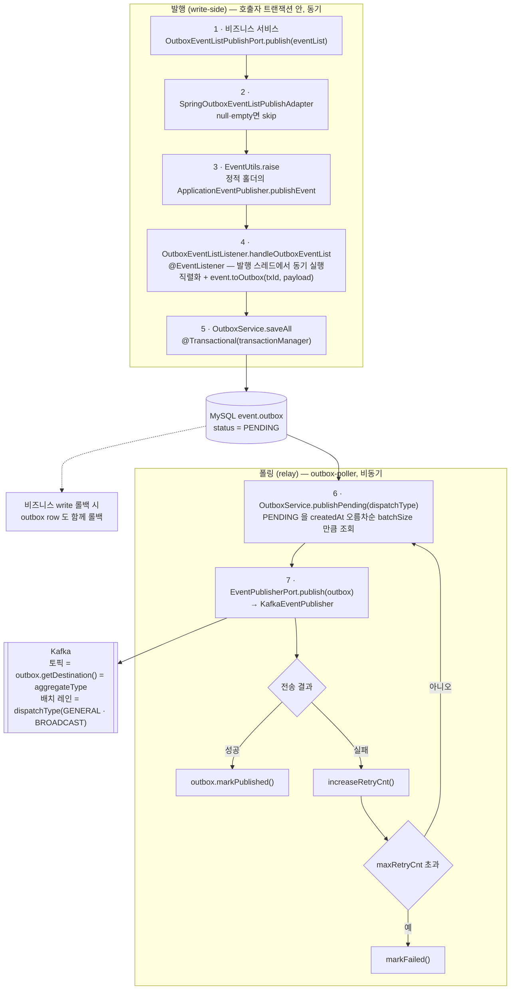
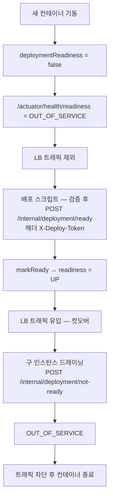

# COMMON — 공통 모듈(common-*) 상세 기준 문서

> - **문서 상태**: 검증 완료
> - **기준 브랜치**: `main`
> - **기준 일자**: 2026-07-24
> - **검증 기준**: 실제 소스(`common/*/src`) 및 `settings.gradle`·각 `build.gradle`
> - **재검증 조건**: 아래 중 하나라도 변경되면 이 문서를 다시 검증한다.
>   - 파사드 재수출 목록(`common/build.gradle`) 변경
>   - `common-core`의 계약 enum/프로퍼티(`RedisKey`·`KafkaTopic`·`KafkaHeaderKey`·`StompDestination`·`JwtClaimKey`·`HttpHeaderKey`·`RoleKey`·`AuthTokenKey` 등) 변경
>   - `common-outbox`/`common-event`의 도메인·이벤트 계약 변경
>   - `common-jpa`의 Read Replica 라우팅(`@ReadReplica`·`ReadReplicaAspect`) 변경
>   - `common-arch-test`의 ArchUnit 규칙(`ModuleArchitectureTest`·`PackageArchitectureTest`) 변경
>   - `common-actuator-*`의 배포 readiness/제어(`DeploymentReadiness`·`DeploymentReadinessHealthIndicator`·`DeploymentControlAuthFilter`) 또는 `git-config-repo/infrastructure/monitoring.yml` health group 변경

## 1. 문서 목적과 기준 시점

`common/` 하위 공통 모듈의 구조·역할·계약·근거를 사람과 AI가 찾아 읽기 위한 상세 문서다. 문서와 코드가 어긋나면 코드가 기준이다. 짧은 작업 규칙은 [`../../common/CLAUDE.md`](../../common/CLAUDE.md)에 있다. 상위 요약은 [`../ARCHITECTURE.md`](../ARCHITECTURE.md) §5.

## 2. 파사드 구조

- `common`(부모)은 **17개 모듈을 `api`로 재수출하는 파사드**다(`common/build.gradle`): 기존 공통 모듈과 `common-grpc-client`를 포함한다.
- 파사드를 compile 의존으로 쓰는 모듈은 없다. 유일한 소비처가 `common-arch-test`의 `testRuntimeOnly`라 실질 역할은 **ArchUnit 커버리지 통로**다 — 새 common 모듈은 여기에 등록해야 검사 대상이 된다.
- 서비스는 보통 `implementation project(':common')` 하나로 위 11개를 전이 확보한다.
- **파사드에서 제외**되어 필요한 모듈만 개별 의존하는 것: `common-test`(테스트), `common-arch-test`(CI 게이트), `common-actuator-core/webmvc/webflux`(모니터링). 예: 실행 모듈은 web/webflux에 맞춰 `common-actuator-webmvc` 또는 `-webflux`를 골라 의존한다.
- 모든 모듈은 `crypto-common-library` convention plugin으로 빌드된다.

## 3. 모듈별 요약

| 모듈 | 역할 | 핵심 산출물 | 주요 의존 |
|---|---|---|---|
| `common-core` | 계약 상수·공통 예외·프로퍼티·검증·시계 | enums(`RedisKey`·`KafkaTopic`·`KafkaHeaderKey`·`StompDestination`·`JwtClaimKey`·`JwtHeaderKey`·`HttpHeaderKey`·`AuthTokenKey`·`RoleKey`·`PriceAlertChangeRateThreshold`), 예외(`InfrastructureException`·`InvalidRequestException`·`ResourceNotFoundException` 등), 프로퍼티(`JwtProperties`·`ApiPathProperties`·`AppRedisProperties`·`FrontendProperties`), `ValidationResult`·`@NotBlankIfPresent`, `Clock`/`ClockService`, `ServiceTimeConverter`(서비스 존 `ZONE_ID` 상수 + LocalDateTime↔Instant 변환) | validation starter |
| `common-jpa` | JPA + Read Replica 라우팅 | `BaseEntity`, `@ReadReplica`, `ReadReplicaAspect`, `DataSourceContextHolder`, `DataSourceType`, `ReplicationRoutingDataSource` | data-jpa, aop, mysql(runtime) |
| `common-event` | Kafka 이벤트 계약·메시지 생성·발행 유틸 | `KafkaEvent`, `KafkaEventFactory`, `EventUtils`, `EventsInitializer`, `HandleableEvent`, `ProducibleEvent`, `RecoverableEvent`, `TypedKey`/`TypedPayload` | common-core, stream-kafka |
| `common-inbox` | Consumer Inbox 멱등 처리 | `AbstractInboxEvent`, `Inbox`/`InboxService`, `InboxException` 계층 | common-jpa, common-core, common-util, spring-messaging |
| `common-web` | REST(MVC) 공통 | `GlobalExceptionHandler`(`@RestControllerAdvice`), `CursorPage`/`CursorPages`, `MessageConverterConfig` | common-core, web, validation |
| `common-exception` | 공통 예외 계층·`ErrorResponse` | `InfrastructureException`, `InvalidRequestException`, `ResourceNotFoundException`, `ForbiddenException`, `ErrorResponse` 등 8종 | 없음(외부 의존 0) |
| `common-time` | 시각 조회·존 변환·경과시간 측정 | `Clock`/`ClockService`(`monotonicTimeNanos` 포함), `ServiceTimeConverter` | spring-boot 코어 |
| `common-validation` | Bean Validation 공통 | `ValidationResult`, `FieldErrorDetail`, `NotBlankIfPresent(+Validator)`, `common-validation-messages.properties` | spring-boot-starter-validation |
| `common-grpc-server` | gRPC 서버 예외 처리 | `AbstractGrpcExceptionAdvice` | common-core, common-exception, grpc server starter |
| `common-grpc-client` | gRPC client future·오류 처리 | `GrpcFutures`(ListenableFuture 변환, 매핑·취소 전파, 동기 경계 join), `GrpcExceptionTranslator`, `GrpcClientException`, `GrpcFailureCode` | grpc-stub |
| `common-outbox` | Outbox/DLQ 도메인·서비스(헥사고날) | `Outbox`/`OutboxStatus`/`OutboxService`/`OutboxEventListListener`, `Dlq`/`DlqStatus`/`DlqService`, `Abstract*OutboxEvent(List)`, `*PublishPort` | common-jpa, common-event, common-util, jackson |
| `common-redis` | Redis 코덱·Fail-open·연산 | `RedisValueCodec`, `RedisHashCodec`, `RedisCodecSupport`/`RedisCodecException`(codec 공통 헬퍼: str/parse/toJson/fromJson), `CacheFailOpen`(+`Aspect`), `StringRedisHashOperations`, `RedisConnectionFactorySupport` | common-core, data-redis, aop, jackson |
| `common-redisson` | 분산락 | `DistributedLockExecutor`, `DistributedLockPolicy`, `RedissonConfig` | common-core, redisson starter |
| `common-id` | ID 생성 | `SnowflakeIdGenerator`/`SnowflakeIdProvider`, `@SnowflakeId`, `ObjectIdGenerator`(Mongo `ObjectId`), `IdGenProperties` | common-core, mongodb-bson, data-jpa |
| `common-mongo` | Mongo 매핑 설정 | `SnakeCaseFieldNamingStrategy`, `Date↔LocalDateTime` 컨버터 | common-core, data-mongodb |
| `common-util` | 유틸리티 | `EventIdUtils`(단조 ULID·무작위 UUID) | ulid-creator, JDK UUID |
| `common-test` | 테스트 인프라 | Testcontainers(Kafka·Mongo·MySQL RW·Redis) + Initializer/Extension, `TestBootApplication` | boot-test, testcontainers* |
| `common-arch-test` | ArchUnit 아키텍처 게이트 | `ModuleArchitectureTest`, `PackageArchitectureTest` (전 서비스 `testRuntimeOnly` 참조) | archunit-junit5 |
| `common-actuator-core` | 배포 제어·readiness 코어 | `DeploymentReadiness`, `DeploymentReadinessHealthIndicator`, `DeploymentControlProperties` | actuator |
| `common-actuator-webmvc` | 배포 제어(MVC) | `DeploymentControlAuthFilter`, `DeploymentReadinessController` | actuator-core, web |
| `common-actuator-webflux` | 배포 제어(WebFlux, gateway용) | `DeploymentControlAuthWebFilter`, `DeploymentReadinessWebFluxController` | actuator-core, webflux |

## 4. 계약 허브: common-core

`common-core`는 **여러 서비스가 공유하는 계약 문자열·상수의 단일 출처**다. 아래는 외부 계약(→ `external-contracts.md`)으로 취급한다.

- `RedisKey`(pattern + expectedArgCount, hash tag `{chat}`/`{auth}`/`{session}`), `KafkaTopic`·`KafkaHeaderKey`(`event_id`·`transaction_id`·`dlq_id`·`__TypeId__` 등), `StompDestination`, `JwtClaimKey`/`JwtHeaderKey`, `HttpHeaderKey`(`X-User-Id` 등), `AuthTokenKey`(refresh 쿠키명 등), `RoleKey`(`ROLE_*`).
- 예외 계층: `InfrastructureException`/`InvalidRequestException`/`ResourceNotFoundException`을 기반으로 각 서비스·common 모듈이 파생(예: `common-outbox`의 `*PersistenceException`, `common-config`의 예외). REST 매핑은 `common-web/GlobalExceptionHandler`, gRPC 서버 매핑은 `common-grpc-server`가 담당한다.
- 프로퍼티 레코드: `JwtProperties`(`keyName`·`jwksUri`·`signUri`·TTL 등, → `SPRING_CLOUD_CONFIG.md`/`OAUTH2_*`), `ApiPathProperties`, `AppRedisProperties`, `FrontendProperties`.

## 5. 핵심 패턴 모듈

### 5.1 common-outbox (Outbox/DLQ)

Outbox 패턴의 핵심 모듈. **비즈니스 DB write와 이벤트 기록을 같은 트랜잭션에 묶어(transactional outbox)** 발행 유실을 막고, 실제 Kafka 전송은 `outbox-poller`가 별도로 폴링해 수행한다. 서비스는 Kafka로 직접 쏘지 않고 이 흐름만 사용한다.

#### 발행 흐름 (write-side, 동기 · 트랜잭션 내)

1. **서비스가 이벤트 목록 발행**: 비즈니스 서비스가 `OutboxEventListPublishPort.publish(eventList)`를 호출한다(예: `ChatMessageCommandService`, `ChatRoomCommandService`). 도메인 객체가 Spring 빈을 들고 있지 않아도 되도록, 발행은 이 포트를 통한다.
2. **`SpringOutboxEventListPublishAdapter`**(adapter-out): `eventList`가 null/empty면 skip, 아니면 `EventUtils.raise(eventList)`로 Spring 이벤트를 던진다. 직렬화/저장 예외는 `OutboxPersistenceExceptionTranslator`로 번역해 호출자에게 전파(재시도 판단은 호출자 `@Retryable` 몫).
3. **`EventUtils.raise`**(common-event): 정적 홀더가 감싼 `ApplicationEventPublisher`로 `publishEvent`. 홀더는 `EventsInitializer`(`ApplicationReadyEvent` 리스너)가 앱 기동 완료 시 주입한다 → 도메인/POJO에서도 정적 호출로 이벤트를 낼 수 있다(publisher 미주입이면 no-op).
4. **`OutboxEventListListener.handleOutboxEventList`**(adapter-in, `@EventListener`): **`@TransactionalEventListener`가 아니라 `@EventListener`이므로 발행 스레드에서 동기 실행되어 호출자의 트랜잭션 안에서 돈다.** 각 `AbstractOutboxEvent`를 `objectMapper.writeValueAsString`으로 직렬화하고 `event.toOutbox(txId, payload)`로 `Outbox` row를 만들어 모은 뒤 `OutboxService.saveAll`. → **비즈니스 write가 롤백되면 outbox row도 함께 롤백**된다(원자성). 직렬화 실패는 `OutboxPersistenceException`, DB 실패는 `OutboxPersistenceExceptionTranslator.translate`(→ `Temporary*` 가능)로 던져 호출 트랜잭션을 되돌린다.
5. **`OutboxService.saveAll`**(application, `@Transactional("transactionManager")`): `OutboxRepository`로 MySQL outbox 테이블에 `PENDING` 상태로 저장. 여기까지가 커맨드 응답 이전에 끝난다.

#### 폴링 흐름 (relay, 비동기 · outbox-poller)

6. **`OutboxService.publishPending(dispatchType)`**(`@Transactional("transactionManager")`, `outbox-poller`가 스케줄 호출): `findByDispatchTypeAndStatusOrderByCreatedAtAsc(dispatchType, PENDING, batchSize)`로 오래된 것부터 조회.
7. 각 건마다 `EventPublisherPort.publish(outbox)`(→ `KafkaEventPublisher`, outbox-poller에만 존재해 `ObjectProvider`로 지연 주입)로 Kafka 전송 후 `outbox.markPublished()`. 실패 시 `increaseRetryCnt()`, `maxRetryCnt` 초과면 `markFailed()`. 토픽은 `outbox.getDestination()`(= `aggregateType`), 발행 배치는 `dispatchType`(`GENERAL`/`BROADCAST`)으로 분리된다.

#### 이벤트/엔티티 구성

- **`AbstractOutboxEventList`**: `List<AbstractOutboxEvent>` + `txId`(생성자에서 `EventIdUtils.generateTxId()`로 채번, 한 커맨드에서 나온 이벤트들을 묶는 추적/멱등 키). 정적 `of(supplier, events...)`로 조립. `publish()`는 `@Deprecated`(직접 `EventUtils.raise`) — 신규는 포트 경유.
- **`AbstractOutboxEvent`**: `aggregateType`(=목적지/토픽)·`aggregateId`·`partitionKey`는 `@JsonIgnore`(outbox 컬럼이지 wire payload가 아님). `toOutbox`가 `Outbox`를 `PENDING`/`retryCnt=0`으로 만든다. 기본값: `getDispatchType()=GENERAL`(하위가 `BROADCAST` override), `getMessageType()=클래스 FQCN`. `getDomainType()`은 `abstract`라 각 이벤트가 자신의 도메인을 직접 반환한다(chat→`CHAT`, market→`MARKET`, notification→`NOTIFICATION`). 라우팅은 `aggregateType`/`dispatchType`이 결정, `domainType`은 메타데이터. JPA 저장은 `JpaOutbox(catalog="event")`로 `event.outbox`를 명시해 서비스 datasource의 기본 DB와 무관하게 공용 Outbox를 사용한다.
- **`Outbox`**(JPA `@Entity extends BaseEntity`): `id`(`EventIdUtils`), `transactionId`, `aggregateId`, `aggregateType`, `partitionKey`, `@Lob payload`, `eventType`, `domainType`/`dispatchType`/`status`(enum STRING). 상태 변경은 도메인 메서드로만: `markPublished()`·`markFailed()`·`increaseRetryCnt()`·`isRetryExhausted(int)`.

#### 구조·대칭

- 헥사고날 구조를 common 안에서 유지: `domain`/`application/service`/`application/port/out`/`adapter/in`/`adapter/out`.
- **DLQ도 대칭 구조**: `DlqEventListPublishPort` → `SpringDlqEventListPublishAdapter`(`EventUtils.raise`) → `@EventListener DlqEventListListener` → `DlqService`(`markCompleted()` 등). 재처리 완료/실패는 `DlqService.complete/fail`. `DlqStatus` 소비 실패 상태는 `CONSUME_FAILED`(과거 `COMSUME_FAILED` 오타를 정정). `@Enumerated(STRING)`으로 이름이 그대로 저장되므로 기존 `COMSUME_FAILED` row가 있으면 마이그레이션 필요.
- Spring `ApplicationEventPublisher`를 서비스에서 직접 쓰지 않고 항상 `EventUtils`/포트를 경유한다.

#### Consumer Inbox

호출 consumer 서비스가 `@Transactional("transactionManager")` 경계를 소유하고, 트랜잭션 시작 직후 `InboxService.save(consumerName,eventId)`를 호출한다. 이 메서드는 `inbox`의 `(consumer_name,event_id)`를 `saveAndFlush`로 즉시 INSERT해 비즈니스 처리 전에 unique 중복 검사를 확정한다. 동시 중복은 unique constraint에서 대기 후 하나만 성공하며, 최초 처리 실패 시 Inbox row와 Outbox write가 호출 서비스의 트랜잭션에서 함께 롤백되어 Kafka 재시도가 다시 처리할 수 있다. 서로 다른 consumer가 같은 이벤트를 각각 처리해야 하므로 event ID 단독이 아니라 consumer name과의 복합 unique를 사용한다.

중복 INSERT는 트랜잭션을 rollback-only로 만들 수 있으므로 `DuplicateInboxException`은 호출 서비스 밖의 Kafka adapter가 중복 성공으로 변환한다. `save()`만 사용하면 INSERT가 commit 직전까지 지연되어 두 consumer가 비즈니스 로직을 먼저 실행할 수 있으므로 선점에는 `saveAndFlush()`를 유지한다.

이 패턴은 자연 키가 없고 반복 실행 시 새로운 알림·fan-out처럼 결과가 누적되는 consumer에 사용한다. 자연 키 INSERT, 값 덮어쓰기, 삭제처럼 연산 자체가 멱등한 consumer에는 처리 이력 저장 비용을 추가하지 않는다. 외부 REST/STOMP 호출은 event DB 트랜잭션으로 원자화되지 않는다.

### 5.2 common-event / common-inbox
- `KafkaEvent`·`ProducibleEvent`·`HandleableEvent`·`RecoverableEvent`가 이벤트 계약 인터페이스. `EventUtils`가 수집·발행 진입점, `EventsInitializer`가 이벤트 목록 초기화. payload 타입 키는 `TypedKey`/`TypedPayload`.
- `KafkaEventFactory`가 Kafka `Message` 생성 책임을 집중한다. 일반 이벤트는 `createEventMessage`, Outbox는 `createOutboxEventMessage`, DLQ는 `createDlqEventMessage`를 사용하고 공통 헤더 조립은 private 메서드가 담당한다. Outbox/DLQ 발행의 `event_id`는 각각 레코드 ID를 사용해 poll 재시도에도 동일하게 유지한다. `KafkaEvent`는 partition key 계약만 제공하며, 발행 adapter가 Factory를 직접 호출한다.
- `AbstractInboxEvent`는 Inbox 중복 제거 대상이라는 타입 의미와 header용 `eventId` 생성을 제공한다. `eventId`는 `@JsonIgnore`로 payload에서 제외하고 Kafka `event_id` 헤더를 단일 기준으로 사용한다. consumer adapter는 header를 Command에 전달하며 역직렬화된 payload 객체 내부 ID를 처리 기준으로 사용하지 않는다.
- `AbstractInboxEvent.extractEventId(Message<?>)`는 `event_id`가 `byte[]` 또는 `String`으로 매핑되는 경우를 공통 처리하고 누락·공백이면 예외를 던진다. 이 API는 Inbox 대상 이벤트 하위 타입에서만 사용할 수 있다.
- Inbox 예외는 모듈 소속만 나타내는 `InboxException` 계층으로 묶고 HTTP·인프라 예외 의미를 부여하지 않는다. Kafka Inbox 중복은 MVC 예외 처리 경로가 아니므로 각 inbound adapter가 `DuplicateInboxException`을 성공적인 중복 제거로 종료한다.

### 5.3 common-jpa (Read Replica)
- `@ReadReplica`가 **명시적 read 라우팅 지시자**다. `@Transactional(readOnly=true)`만으로는 read 노드로 가지 않는다(`ReadReplicaAspect`가 `@ReadReplica`를 트리거로 `DataSourceContextHolder`를 통해 `ReplicationRoutingDataSource`를 전환). 이미 write 트랜잭션이 활성이면 write 우선.
- 이 인프라를 실제로 배선한 곳은 `market`(`MarketQueryService.getMarkets()` + `DatasourceConfig`의 write/read 2 Hikari + routing + lazy proxy, [`MARKET.md §10`](MARKET.md))다. `user`는 라우팅 인프라를 두지 않고 단일 데이터소스로 정리했다([`USER.md §10`](USER.md)).

### 5.4 common-redis / common-redisson
- Redis key는 `common-core/RedisKey` enum으로만 조립(임의 문자열 금지). 조회 실패는 `CacheFailOpen`(Aspect)로 fail-open 가능. 분산락은 `DistributedLockExecutor`(+`DistributedLockPolicy`), 설정 `RedissonConfig`.

### 5.5 common-arch-test (아키텍처 게이트)
- `ModuleArchitectureTest`: `settings.gradle`/`build.gradle`을 파싱해 **의존 방향**을 강제 — domain은 application/adapter/bootstrap 비의존, application은 adapter/bootstrap 비의존, adapter는 타 adapter/bootstrap 비의존, **common은 서비스 모듈에 비의존**, 서비스 간 구현 모듈 상호 비의존, **의존 그래프 순환 금지**. common 소스가 서비스 패키지를 import하지 못하게도 검사.
- `PackageArchitectureTest`: ArchUnit `layeredArchitecture`로 서비스별 domain/application/adapter 패키지 레이어 규칙 검사.
- 모든 서비스 CI(`serviceCi` 및 각 `*Ci`)에 `:common:common-arch-test:test`가 포함된다 → 계층 위반 시 CI 실패.

### 5.6 common-actuator-* (무중단 배포 readiness 게이트)

**왜 쓰나.** blue/green 무중단 배포에서 "앱이 기동됐다"와 "트래픽을 받아도 된다"를 분리하기 위해서다. Spring Boot 기본 `readinessState`는 기동이 끝나면 자동으로 UP이라 배포 오케스트레이션이 컷오버 시점을 통제할 수 없다. 그래서 배포 스크립트가 **명시적으로 on/off**하는 커스텀 readiness(`deploymentReadiness`, 초기값 `false`)를 두어, 스크립트가 검증을 마치기 전까지 새 인스턴스로 트래픽이 가지 않게 한다.

**구성요소.**

| 모듈 | 구성요소 | 역할 |
|---|---|---|
| `common-actuator-core` | `DeploymentReadiness` | in-memory `AtomicBoolean`(**초기 `false`**) + `markReady()`/`markNotReady()`/`updatedAt()` |
| `common-actuator-core` | `DeploymentReadinessHealthIndicator` | `deploymentReadiness` 헬스 인디케이터. ready면 `UP`, 아니면 `OUT_OF_SERVICE`(+ `deploymentReady`/`updatedAt` 상세) |
| `common-actuator-core` | `DeploymentControlProperties` | `deployment.control.token`(= `${DEPLOY_TOKEN}`) |
| `common-actuator-webmvc`(MVC) / `common-actuator-webflux`(gateway 등 WebFlux) | 제어 엔드포인트 `/internal/deployment` | `GET /status`, `POST /ready`(→ `markReady`), `POST /not-ready`(→ `markNotReady`) |
| 〃 | `DeploymentControlAuthFilter` / `DeploymentControlAuthWebFilter` | **`/internal/deployment/**` 경로만** `X-Deploy-Token`(= `deployment.control.token`) 일치 검사, 불일치 시 401 |

두 webmvc/webflux 모듈은 동일 API의 서블릿/리액티브 쌍이다.

**health group 연동.** `git-config-repo/infrastructure/monitoring.yml`이 전 서비스 공통으로 `management.endpoint.health.group.readiness.include: readinessState,deploymentReadiness`를 설정한다. 따라서 `deploymentReadiness`가 `false`면 `/actuator/health/readiness`가 `OUT_OF_SERVICE`가 되고, 로드밸런서/헬스체크가 그 인스턴스를 트래픽 대상에서 뺀다(liveness 그룹은 `livenessState`만).

**배포 스크립트 연동 흐름.** 실제 배포 스크립트는 별도 infra 저장소(`$INFRA_REPO_DIR/service/scripts/deploy/*.sh`, CD 워크플로우가 `DEPLOY_TOKEN`을 전달 → `docs/CI_CD.md §3`)에 있고 이 저장소에는 없다. 엔드포인트 설계상 blue/green 컷오버는 다음처럼 동작한다:

정확한 스크립트 호출 순서는 infra 저장소 소관이라 이 문서에서 코드로 검증하지 않는다(엔드포인트 계약만 기술). CD의 서비스별 전략(validated-recreate/blue-green)은 `docs/CI_CD.md §3`.

**운영 주의.** `deploymentReadiness`는 in-memory `AtomicBoolean(false)`라 **프로세스가 뜰 때마다 초기화된다.** CD 를 거치지 않고 `docker start`·수동 재기동으로 올린 인스턴스는 컨테이너가 `Up` 이어도 `/actuator/health/readiness`가 `OUT_OF_SERVICE`이고 Eureka·LB 에서 제외된 채로 남는다. 컨테이너 상태만 보면 정상으로 보여 원인을 찾기 어렵다 — 복구는 `POST /internal/deployment/ready`(헤더 `X-Deploy-Token`)를 직접 호출한다.

**주의.** 이 인증 필터는 `/internal/deployment/**`만 보호한다. 같은 `DEPLOY_TOKEN`을 쓰는 config server의 `/actuator/busrefresh`는 이 경로가 아니라 보호되지 않는다(→ `docs/CI_CD.md §4`, TODO 1.10).

## 6. 사용처(대표)

- 전 서비스: `common-core`(계약/예외), `common-web` 또는 `common-grpc-server`(서버 예외 매핑), `common-grpc-client`(client 연결), `common-actuator-*`(모니터링).
- Kafka/Outbox 사용 서비스(chat·market·notification·outbox-poller 등): `common-event`·`common-outbox`.
- JPA 서비스(user·market 등): `common-jpa`(+ Read Replica). Mongo 서비스(chat·notification): `common-mongo`.
- ID 필요 서비스(user 등): `common-id`(Snowflake, `idgen.yml`). 분산락 필요 시 `common-redisson`.
  - `SnowflakeIdProvider`는 `@ConditionalOnProperty(prefix="idgen", name="epoch")`로 **idgen 설정을 로드하는 서비스에서만 등록**된다(`@PostConstruct`가 epoch 등을 검증). `@SnowflakeId`를 쓰는 서비스(user·market)는 config.name에 `idgen`을 포함해야 한다. `common-id`를 넓게 스캔하지만 snowflake ID를 안 쓰는 서비스(websocket-gateway 등)는 idgen이 없어 이 빈이 등록되지 않으므로 부팅이 깨지지 않는다.

## 7. 테스트 · CI

- `common-jpa`·`common-redis`·`common-redisson` 등은 `common-test`(Testcontainers)로 통합 테스트.
- `common-arch-test`는 산출물 없이 **테스트만** 있는 게이트 모듈. 아키텍처 변경 시 `./gradlew :common:common-arch-test:test`를 반드시 실행한다.
- 개별 컴파일/테스트: `./gradlew :common:common-core:compileJava`, `./gradlew :common:common-jpa:test` 등. `commonCi`/`protobufCi` 같은 집계 task는 **없다**(→ `testing.md`).

## 8. 확인 필요 항목

미해결 확인/결정 항목은 [`../../TODO.md`](../../TODO.md)에서 통합 관리한다. common 관련 항목:

- 현재 common 관련 미해결 항목 없음. (과거 3.1 `DlqStatus` 철자, 3.2 `getDomainType` 기본값, 2.1 user Read Replica는 해소됨.)

## 9. 관련 문서와 rules

- 루트: [`../ARCHITECTURE.md`](../ARCHITECTURE.md) §5, [`../SERVICE_FLOWS.md`](../SERVICE_FLOWS.md), [`../CODE_STYLE.md`](../CODE_STYLE.md)
- 계약/아키텍처 rules: `../../.claude/rules/{external-contracts,architecture,testing}.md`
- 모듈 작업 규칙: [`../../common/CLAUDE.md`](../../common/CLAUDE.md)
