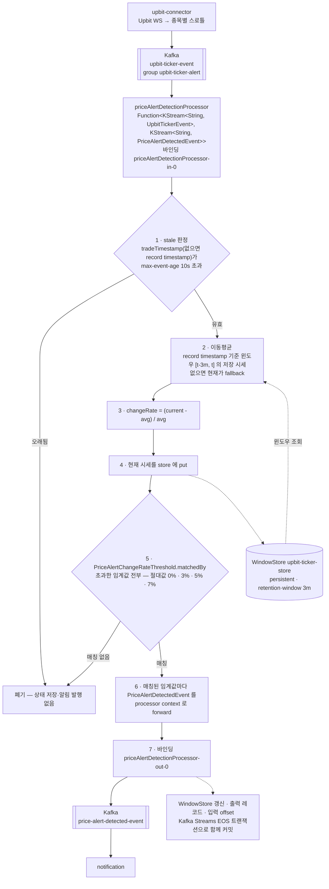

# MARKET_DETECTION — market-detection 서비스 상세 기준 문서

> - **문서 상태**: 검증 완료
> - **기준 브랜치**: `main`
> - **기준 일자**: 2026-07-25
> - **검증 기준**: 실제 애플리케이션 코드 및 Config Repository(`git-config-repo/`)
> - **재검증 조건**: 아래 중 하나라도 변경되면 이 문서를 다시 검증한다.
>   - Kafka Streams 바인딩·토픽(`market-detection.yml`의 `spring.cloud.stream.*`) 변경
>   - 생산 계약(`market-detection-contract`의 `PriceAlertDetectedEvent`) 변경
>   - 탐지 로직(`PriceChange`, `PriceAlertDetectionService`) 변경
>   - 소비 이벤트 계약(`upbit-connector-contract`의 `UpbitTickerEvent`) 변경
>   - 임계값(`common-core/PriceAlertChangeRateThreshold`)·WindowStore(`StateStoreConfig`, `PriceAlertDetectionProperties`) 변경

## 1. 문서 목적과 기준 시점

이 문서는 `market-detection` 서비스의 구조·데이터 흐름·계약·근거를 사람과 AI가 필요할 때 찾아 읽기 위한 상세 문서다. 문서와 코드가 어긋나면 코드가 기준이다(루트 `docs/ARCHITECTURE.md` 원칙과 동일). 짧은 작업 규칙은 [`../../market-detection/CLAUDE.md`](../../market-detection/CLAUDE.md)에 있으며 여기서는 반복하지 않는다.

## 2. 모듈 역할

Upbit 실시간 시세(`upbit-ticker-event`)를 소비해 **단기 이동평균 대비 변동률**을 계산하고, 임계값(0%/3%/5%/7%)을 넘으면 가격 알림 탐지 이벤트(`PriceAlertDetectedEvent`)를 발행하는 스트림 처리 서비스. 발행 이벤트는 `notification`이 소비해 사용자 알림으로 만든다(→ [`NOTIFICATION.md`](NOTIFICATION.md)).

- 저장소(DB) 없음. 상태는 Kafka Streams **WindowStore**(로컬 state store)로만 유지한다.
- REST/gRPC 서버를 노출하지 않고 외부 시스템에도 직접 접속하지 않는다. 구독 대상 마켓 조회와 Upbit 통신은 `upbit-connector` 소관이다.

## 3. 실행 구조와 주요 의존성

| 구분 | 내용 |
|---|---|
| Gradle·계층 | `:market-detection:*`; `-application`/`-adapter-in`/`-bootstrap`/`-contract`, `-domain`·`adapter-out` 없음 |
| 진입점·네트워크 | `org.example.marketdetection.Main`, 포트 `8500`, `market-detection-bootstrap`(`crypto-market-detection`) |
| Kafka Streams | `spring-cloud-stream-binder-kafka-streams`, `spring-cloud-starter-bus-kafka`, `application-id: market-detection`, `processing.guarantee: exactly_once_v2` |
| 서비스 모듈 | `upbit-connector-contract`(소비 이벤트 타입); 수집·스로틀·발행은 `upbit-connector` 담당 |
| 공통·설정 | Config `market-detection,eureka-client,kafka,monitoring`; `common-inbox` 전이 JPA는 auto-config 및 component scan에서 제외 |
| 외부 접속 | 직접 접속 없음. 브로커 공통 설정은 `infrastructure/kafka.yml`에서 로드 |

의존성 전체 그래프는 [`docs/dependencies.html`](../dependencies.html)에서 확인할 수 있다.

## 4. 데이터 흐름

### 4.1~4.2 수집·발행 (이 서비스 밖)

`upbit-ticker-event`를 만드는 수집·스로틀·발행은 **`upbit-connector`** 소관이다. Reactor Netty WebSocket → 종목별 스로틀 → Kafka 발행 흐름과 그 정책은 [`UPBIT_CONNECTOR.md`](UPBIT_CONNECTOR.md) §4를 본다.

이 서비스가 전제하는 것은 두 가지다.

- 토픽 `upbit-ticker-event`의 값은 `upbit-connector-contract`의 `UpbitTickerEvent`(JSON)다.
- 그 스트림은 이미 종목별로 스로틀된 **수집 샘플**이며 원시 ticker 전량이 아니다. 지연 시 오래된 값보다 최신값이 우선된다.

### 4.3 처리 (Kafka Streams → 임계 탐지 → `price-alert-detected-event`)



- `PriceAlertDetectedEvent` 필드: code·price·timestamp·avgInterval(= windowMinutes 3)·avgPrice·changeRate·threshold enum명.
- Upbit 체결 시각(`tradeTimestamp`)은 **stale 판정에만** 쓴다. 상태·출력 시각은 Kafka record timestamp를 사용해 기존 처리 의미를 유지한다.
- 0% 임계값은 `abs(changeRate) >= 0.0`이므로 처리 가능한 모든 ticker에서 감지 이벤트를 만든다. 실제 사용자 알림은 notification이 market에 `종목 + 0%`를 설정한 수신자를 조회한 뒤 해당 사용자에게만 생성한다.
- 소비자: `notification`(`price-alert-detected-event`).

### 4.4 Kafka Streams EOS 적용 배경과 트랜잭션 경계

이 모듈은 Outbox relay와 달리 Kafka 레코드를 소비해 상태 저장소를 갱신하고 다시 Kafka 레코드를 만드는 전형적인 **Consume–Process–Produce** 구조다. 입력 처리는 다음 세 결과를 하나의 논리적 작업으로 만든다.

1. `upbit-ticker-event` 입력 offset 진행
2. `upbit-ticker-store` WindowStore 및 changelog 변경
3. 하나 이상의 `PriceAlertDetectedEvent` 출력

리팩터링 전에도 탐지 binder는 `Function<KStream<...>, KStream<...>>`, `ProcessorContext.forward`, `exactly_once_v2`로 구성돼 있었다. 이번 변경은 EOS를 새로 도입한 것이 아니라, 이 처리 경계를 유지하면서 계산을 application 계층으로 분리하고 Upbit 수집 producer만 별도 서비스로 이관한 것이다. 기존 `StreamBridge`는 탐지 결과가 아니라 `upbit-ticker-event` 입력을 만들던 수집 worker에서 사용했으므로 원래부터 아래 Streams 트랜잭션의 바깥이었다.

현재 구성과 유지 조건은 다음과 같다.

- binder 빈은 `Function<KStream<String, UpbitTickerEvent>, KStream<String, PriceAlertDetectedEvent>>`이며 출력도 Streams 토폴로지에 포함한다.
- `PriceAlertDetectionProcessor`는 `ProcessorContext.forward`로 탐지 이벤트를 반환한다. 한 ticker가 0%·3%·5%·7%를 모두 충족해 여러 이벤트를 만들더라도 같은 입력 처리 트랜잭션에 포함된다.
- `spring.cloud.stream.kafka.streams.binder.configuration.processing.guarantee=exactly_once_v2`를 유지한다.
- `application-id: market-detection`을 명시해 함수 이름 변경과 무관하게 기존 application ID·state store·changelog를 유지한다.
- 일반 binder의 `spring.cloud.stream.kafka.binder.transaction.transaction-id-prefix`는 사용하지 않는다. Kafka Streams가 application/task 기준의 transactional producer와 transaction ID를 내부적으로 관리한다.

정상 처리와 장애 처리는 다음과 같다.

```text
입력 poll
 → WindowStore 갱신
 → PriceAlertDetectedEvent forward
 → 출력 레코드 + state changelog + 입력 offset을 Kafka transaction으로 commit
```

처리 도중 예외나 인스턴스 장애가 발생하면 Kafka transaction이 abort된다. `isolation.level=read_committed` consumer에게 abort된 출력은 보이지 않고, commit되지 않은 offset의 입력은 다시 처리된다. state store도 changelog를 기준으로 commit된 상태와 일치하도록 복구된다.

| 범위 | EOS가 보장하는 것 | EOS가 보장하지 않는 것 |
|---|---|---|
| `upbit-ticker-event` → Streams 처리 → `price-alert-detected-event` | 입력 offset, WindowStore/changelog, 출력 레코드의 Kafka 원자성 | 외부 DB·gRPC·HTTP side effect |
| 한 ticker에서 여러 임계값 이벤트 생성 | 출력 이벤트들을 같은 Streams transaction에 포함 | notification consumer의 MongoDB/Outbox 처리 |
| 장애 후 재처리 | abort된 출력 비노출, commit 전 입력 재처리 | 시스템 전체의 end-to-end exactly-once |
| `upbit-connector` → `upbit-ticker-event` | 단일 Kafka produce에 공통 producer idempotence 적용 | WebSocket 수집·발행과 이후 Streams 처리까지 하나로 묶는 트랜잭션 |

따라서 이 모듈에서 말하는 exactly-once는 **Kafka Streams 처리 구간의 EOS**다. 하류 notification이 수행하는 MySQL Outbox 저장이나 MongoDB 반영까지 포함하는 분산 트랜잭션은 아니며, 하류 consumer의 멱등성·재시도·DLQ는 별도로 필요하다.

### 컨슈머 멱등 전략

| 컨슈머 이벤트 | 하는 일 | 사용한 전략 |
|---|---|---|
| `UpbitTickerEvent` | WindowStore에 시세를 기록하고 이동평균·임계값을 계산해 `PriceAlertDetectedEvent` 발행 | Kafka Streams `exactly_once_v2`로 입력 offset·WindowStore·출력을 하나의 Kafka 트랜잭션으로 처리 |

탐지 결과의 `eventId`는 최초 `PriceAlertDetectedEvent` 생성 시 무작위 UUID로 한 번 생성해 Kafka `event_id` 헤더에만 전달한다. payload에서는 `@JsonIgnore`로 제외하며 Kafka 재전달에서는 header의 같은 ID가 보존되므로 하류 notification Inbox가 중복 알림 생성을 차단한다. 동일 입력이 별도의 새 이벤트로 다시 생성되면 새 ID를 갖는 별개 이벤트로 취급한다. 이 ID는 순서 제어용이 아니며, ticker 순서는 Kafka key인 market code로 같은 파티션에 모은다.

EOS의 트레이드오프는 다음과 같다.

| 선택 | 장점 | 비용·주의점 |
|---|---|---|
| at-least-once + 외부 `StreamBridge` | 구현 단순, transaction overhead 없음 | offset/state/output 사이 부분 성공과 중복 가능 |
| Kafka Streams `exactly_once_v2` | Consume–Process–Produce와 state store를 원자화, abort 레코드 격리 | transaction commit 비용으로 지연·처리량 부담, broker/transaction timeout·producer fencing 운영 고려 |
| Outbox 도입 | 외부 DB 상태와 이벤트 의도를 DB transaction으로 보존 가능 | 이 모듈은 DB가 없고 Kafka state store가 기준이므로 별도 DB/poller 운영 비용이 과함 |

market-detection은 stateful Kafka 처리 결과가 곧 Kafka 출력이고 외부 DB 변경이 없으므로, Outbox보다 Kafka Streams EOS가 문제와 경계에 직접 맞는다.

## 5. 계약

- **생산(외부 계약)**: `market-detection-contract`의 `PriceAlertDetectedEvent`(`AbstractInboxEvent` 상속, `implements KafkaEvent, ProducibleEvent`). 내부 `eventId`는 JSON에서 제외하고 Kafka header로 전달하며, payload는 `{ code, price, timestamp, avgInterval, avgPrice, changeRate, threshold }`로 구성한다. 토픽은 `PRICE_ALERT_DETECTED`(binding `priceAlertDetectionProcessor-out-0` → `price-alert-detected-event`), 파티션 키는 `code`다. `toPayload()`는 `PriceAlertDetectedPayloadKeys`(TypedKey)로 키-값 페이로드를 만든다(notification이 web push payload로 전달). 소비자 `notification`과 함께 변경한다(→ `../../.claude/rules/external-contracts.md`).
- **공유 임계값 계약**: `common-core/PriceAlertChangeRateThreshold`(`PERCENT_0/3/5/7`)는 market-detection(탐지)·notification(수신자 조회 rate 변환)·market(정확 일치 조회)이 공유한다.
- **소비 토픽**: `upbit-ticker-event`(`upbit-connector` 발행 → 이 서비스의 Kafka Streams 입력). 값 타입은 `upbit-connector-contract`의 `UpbitTickerEvent`이며 `__TypeId__` 헤더가 아니라 **선언된 타입**으로 역직렬화된다(→ [`UPBIT_CONNECTOR.md`](UPBIT_CONNECTOR.md) §6.1). auto-create(`auto-create-topics: true`).

## 6. 확인 필요 항목

미해결 확인/결정 항목은 [`../../TODO.md`](../../TODO.md)에서 통합 관리한다. market-detection 관련 항목:


## 7. 테스트 현황

- `-application`: `PriceChangeUnitTest`(평균·변동률·임계 매칭), `PriceAlertDetectionServiceUnitTest`(stale 판정·임계별 이벤트 생성), `PriceAlertDetectionPropertiesUnitTest`(시간·retention 설정 검증)
- `-adapter-in`: `PriceAlertDetectionProcessorTopologyIntegrationTest`(`TopologyTestDriver`, state store·event time·임계별 출력·`event_id` header)
- `BootSmokeTest`(Kafka Testcontainer). 수집 이관 후 외부 접속이 없어 mock 차단이 필요 없다.
- 수집 관련 테스트(WebSocket·coalescing buffer·publisher worker)는 `upbit-connector`로 이동했다.

## 8. 컴파일 · 테스트 · CI 명령

- 컴파일: `./gradlew :market-detection:market-detection-bootstrap:compileJava`
- 계산·설정 단위 테스트: `./gradlew :market-detection:market-detection-application:test`
- Streams 토폴로지 테스트: `./gradlew :market-detection:market-detection-adapter-in:test`
- 부팅 스모크: `./gradlew :market-detection:market-detection-bootstrap:test`
- 서비스 CI: `./gradlew marketDetectionCi`(빌드+테스트+ArchUnit 포함)
- 전체 build/test, `bootRun`, 실행, 배포는 명시적 요청 없이 수행하지 않는다.

## 9. 변경 위험도가 높은 파일

| 파일 | 이유 |
|---|---|
| `PriceAlertDetectedEvent` · `PriceAlertDetectedPayloadKeys` | notification이 소비하는 발행 계약 |
| `common-core/PriceAlertChangeRateThreshold` | 3서비스 공유 임계값 계약(탐지·수신자 조회·정확 일치) |
| `PriceChange` | 변동률 산식·임계 매칭 |
| `PriceAlertDetectionProcessor` / `StateStoreConfig.java` | WindowStore 접근·forward·store 정의 |
| `git-config-repo/dynamic/market-detection.yml` | Streams 바인딩·토픽·store·트랜잭션 |

## 10. 관련 문서와 rules

- 루트 흐름: [`../SERVICE_FLOWS.md`](../SERVICE_FLOWS.md)(§12–14 수집·처리·탐지), 구조 [`../ARCHITECTURE.md`](../ARCHITECTURE.md)
- 상·하류: 수집·발행 [`UPBIT_CONNECTOR.md`](UPBIT_CONNECTOR.md), 탐지 결과 소비자 [`NOTIFICATION.md`](NOTIFICATION.md)
- 계약/아키텍처/테스트 rules: `../../.claude/rules/{external-contracts,architecture,testing}.md`
