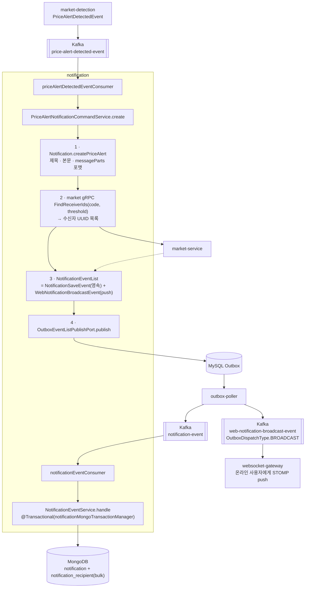

# NOTIFICATION — notification 서비스 상세 기준 문서

> - **문서 상태**: 검증 완료
> - **기준 브랜치**: `main`
> - **기준 일자**: 2026-07-25
> - **검증 기준**: 실제 애플리케이션 코드 및 Config Repository(`git-config-repo/`)
> - **재검증 조건**: 아래 중 하나라도 변경되면 이 문서를 다시 검증한다.
>   - REST 경로(`NotificationController`) 변경
>   - Kafka 바인딩(`notification-service.yml`의 `spring.cloud.stream.*`) 또는 `common-core/KafkaTopic`의 notification 항목 변경
>   - 소비 계약(`market-detection-contract`의 `PriceAlertDetectedEvent`), 생산 계약(`WebNotificationBroadcastEvent`) 변경
>   - market gRPC 클라이언트(`PriceAlertRecipientQueryAdapter`, `market.v1 FindReceiverIds`) 또는 임계값 매핑(`PriceAlertChangeRateThreshold`) 변경
>   - 도메인/Mongo 모델(`Notification`, `NotificationRecipient`, `MongoNotification*`) 또는 인덱스 변경

## 1. 문서 목적과 기준 시점

이 문서는 `notification` 서비스의 구조·요청 흐름·계약·근거를 사람과 AI가 필요할 때 찾아 읽기 위한 상세 문서다. 문서와 코드가 어긋나면 코드가 기준이다(루트 `docs/ARCHITECTURE.md` 원칙과 동일). 짧은 작업 규칙은 [`../../notification/CLAUDE.md`](../../notification/CLAUDE.md)에 있으며 여기서는 반복하지 않는다.

## 2. 모듈 역할

알림의 생성·저장·조회 소유 서비스. 현재 유일한 알림 종류는 **가격 알림(PRICE_ALERT)** 이다(도메인에 `SYSTEM` 타입 자리만 존재).

1. `market-detection`이 발행한 변동률 탐지 이벤트(`price-alert-detected-event`)를 소비해 알림을 생성한다.
2. `market` gRPC로 수신자(해당 마켓·임계값 알림을 켠 사용자)를 조회해 사용자별 알림 레코드를 fan-out 저장한다(MongoDB).
3. 실시간 push용 브로드캐스트 이벤트(`web-notification-broadcast-event`)를 발행한다(→ `websocket-gateway`).
4. 사용자별 알림함(inbox) 조회·읽음 처리를 REST로 노출한다.

이 서비스는 **gRPC 서버를 노출하지 않는다**(gRPC는 market을 부르는 클라이언트로만 사용). 변동률 탐지는 `market-detection`, 실시간 push 전송은 `websocket-gateway`의 몫이다.

## 3. 실행 구조와 주요 의존성

| 구분 | 내용 |
|---|---|
| Gradle·실행 | `:notification:*` 헥사고날 멀티모듈, `:notification:notification-bootstrap`(`crypto-notification-service`) |
| 진입점·네트워크 | `org.example.notification.Main`, REST `8300`, gRPC 서버 없음, 컨텍스트 `/api/v1` |
| 저장소 | MongoDB(`notification` DB, `notification`·`notification_recipient`), MySQL event DB(Inbox·Outbox) |
| 메시징 | Kafka 직접 발행 없음; MySQL Outbox 저장 후 `outbox-poller`가 발행, binder 트랜잭션 비활성 |
| 공통·플랫폼 | `common-actuator-webmvc`, Config Client, Eureka Client, `spring-cloud-starter-bus-kafka`, Micrometer/Prometheus |
| 원격 설정 | `notification-service,eureka-client,mysql,mongo,kafka,monitoring`; 공유 `api-contract.*`는 Config Repository 루트에서 병합 |

의존성 전체 그래프는 [`docs/dependencies.md`](../dependencies.md)에서 확인할 수 있다.

## 4. 모듈 구조 (헥사고날)

| Gradle 모듈 | 계층 | 핵심 내용 | 주요 의존 |
|---|---|---|---|
| `notification-domain` | domain | `Notification`, `NotificationRecipient`, `NotificationMessagePart`, `NotificationType` | `common-core` |
| `notification-application` | application | UseCase/Service, Port(in/out), 이벤트/페이로드, Command/Query/Result | `notification-domain`(api), `notification-contract`, `common-outbox`, `common-mongo`, caffeine/cache |
| `notification-adapter-in` | adapter-in | REST(`NotificationController`), Kafka 바인더(`KafkaNotificationBinder`) | `common-web`, `market-detection-contract`, `notification-application` |
| `notification-adapter-out` | adapter-out | Mongo 영속(`MongoNotification*`), market gRPC 클라이언트 어댑터, ObjectId 생성기, config | `common-id`, `common-mongo`, `market-client`, `notification-application` |
| `notification-bootstrap` | 실행 | `Main`, `application.yml` | 위 4개 + actuator/config/eureka/bus/prometheus |
| `notification-contract` | 계약 | 생산 이벤트(`WebNotificationBroadcastEvent`, `WebNotificationPayload`) | `common-core`, `common-outbox` |

- 의존 방향: adapter-in/out → application → domain. adapter-in은 `market-detection-contract`(소비 이벤트 타입), adapter-out은 `market-client`(gRPC 소비)에 의존.
- 계층별 convention plugin은 `notification-application`에 `crypto-application`, `notification-adapter-in`·`notification-adapter-out`에 `crypto-adapter`를 사용한다.

## 5. 핵심 흐름 — 탐지 이벤트 → fan-out 알림

- 쓰기는 **Outbox 경유**(chat/market과 동일 패턴, `../modules/COMMON.md §5.1` 참조). 영속(`NotificationSaveEvent`)과 push(`WebNotificationBroadcastEvent`)를 하나의 `NotificationEventList`로 묶어 발행한다.
- 수신자 조회는 `PriceAlertRecipientQueryAdapter` → `market-client`의 `PriceAlertSettingClient.findReceiverIds(marketCode, targetChangeRate)`. 임계값 문자열(`PERCENT_3/5/7`)은 `PriceAlertChangeRateThreshold.toBigDecimal`로 `0.0300/0.0500/0.0700`(scale 4)로 변환해 market의 **정확 일치** 조회에 쓴다(→ `MARKET.md §7`).
- `NotificationSaveEvent`/`WebNotificationBroadcastEvent`는 `@JsonCreator`/`@JsonProperty` 직렬화 계약(Outbox payload). `NotificationSaveEvent`는 `notification-event`(+`.dlq`), `WebNotificationBroadcastEvent`는 `web-notification-broadcast-event`이며 `OutboxDispatchType.BROADCAST`로 빠른 폴링 레인을 사용한다.

## 6. REST API 계약

컨텍스트 `/api/v1`. 컨트롤러에 `@RequestMapping` 베이스 없음.

| 메서드 | 전체 경로 | 헤더/파라미터 | 응답 |
|---|---|---|---|
| GET | `/api/v1/notifications/me` | `X-User-Id`(UUID), `limit`(기본 10), 커서(`NotificationCursor`) | 200 `CursorPage<NotificationResponse>` |
| PATCH | `/api/v1/notifications/{notificationId}/read` | `X-User-Id`(UUID), path `notificationId` | 변경됨 204 / 대상 없음 404 |

- `X-User-Id`는 게이트웨이가 검증된 JWT의 `id` claim에서 주입(`common-core/HttpHeaderKey.USER_ID_VALUE`). 컨트롤러는 `UUID`(receiverId)로 그대로 신뢰한다.
- 인박스 조회는 커서 페이지네이션이며 컨트롤러가 `limit+1`로 조회 후 `CursorPages.from(...)`로 다음 커서 유무를 판정한다.
- `read`는 본인(receiverId)의 recipient 레코드가 `read=false`일 때만 갱신되며, 갱신 0건이면 404.

## 7. 조회 · 읽음 처리

인박스는 **`notification_recipient`(사용자별 fan-out 레코드)를 페이지 조회한 뒤, 대응 `notification` 본문(master)을 로드**해 `NotificationInboxItem`으로 합친다(2단계). master 본문은 **Redis 1차 캐시**를 앞단에 둔다.

- **정렬/커서(인덱스) = Mongo `notification_recipient`**: 사용자별·가변(읽음 상태) 데이터라 캐싱하지 않는다.
  - 최신 페이지(`listLatestRecipients`): `receiverId` 기준 `deliveredAt desc, _id desc` `limit` 조회 — **`primaryMongoTemplate`**(primary read).
  - 이전 페이지(`listRecipientsBefore`): 커서(`deliveredAt < ts` 또는 `= ts && _id < lastId`) — **`secondaryMongoTemplate`**(`secondaryPreferred`, replica read). 최신은 primary, 과거 페이지는 secondary로 부하 분리(유지).
- **master 본문(`Notification`) = Redis 1차 캐시**: 한 알림이 여러 수신자에게 fan-out되는 **공유·불변** 데이터라 캐싱 이득이 크다. `NotificationQueryService`가 recipient의 `notificationId`를 모아 `NotificationCachePort.findByIds`로 조회하고(hit 은 불변이라 그대로 사용), **캐시에 없는 id만** `findMastersByIds`(Mongo primary)로 재조회 후 warm-up한다. recipient 순서대로 조립한다. 키는 `RedisKey.NOTIFICATION_MASTER`(`{noti}:master:%s`), 조회 경로는 `@CacheFailOpen`으로 Redis 장애 시 Mongo 폴백(fail-open).
- **생성 시 선적재(warm-up on create)**: `NotificationEventService.handle`이 fan-out 저장 후 **커밋 시점(afterCommit)** 에 master 를 캐시에 적재한다. master 는 불변이라 한 번 올려두면 갱신이 필요 없고, 조회 콜드 miss 를 없앤다(롤백 시 유령 항목 방지 위해 커밋 후 실행, 실패는 조회 lazy 적재로 흡수).
- **긴 TTL(7일) + LFU 축출**: master 는 불변이라 TTL 은 "만료 방어"가 아니라 **콜드 항목 상한(안전망)** 역할이다. 실제 교체는 Redis 서버 **`maxmemory-policy`(권장 `volatile-lfu`)** 축출이 담당 — 자주 조회되는 master 만 상주하고 안 쓰이는 것은 자동 제거된다. 키 카디널리티가 크므로(알림당 1키) LFU 축출이 없으면 메모리가 무한 증가할 수 있어 **서버 정책 설정이 전제**다(→ 아래 서버 설정, [`../../TODO.md`](../../TODO.md) 5.1).
- **cache stampede**: 불변 + 싼 조회(Mongo `_id in`) + 선적재 + 긴 TTL 이라 miss 자체가 드물고, 겹쳐도 **재조회 결과가 동일**(불변)하고 싸서 무해하다. 따라서 PER·분산락 같은 별도 장치를 쓰지 않는다. 훗날 특정 hot 키의 콜드 miss 폭풍이 실측되면 `SingleFlight`(in-process 중복 제거)를 reload 경로에 좁게 얹는다.
- master 는 불변(생성만, soft-delete 커맨드 없음)이라 `NotificationCachePort.invalidate`(Lua `invalidateNotification`)는 대응만 제공하고 현재 호출부 없음(대기).
- 포트의 `listLatestInboxItems`/`listInboxItemsBefore`(본문까지 조인한 기존 메서드)는 남아 있으나 조회 경로에서는 더 이상 쓰지 않는다.
- 읽음(`markAsRead`): `notificationId + receiverId + read=false` 조건 `updateFirst`로 `read=true, readAt` 설정. `modifiedCount>0`이면 성공. **recipient 상태만 바꾸므로 master 캐시와 무관**.
- 저장: `save`(notification 단건) + `saveRecipients`(recipient `BulkOperations.UNORDERED`, `BATCH_SIZE=1000`).

> **Redis 배선**: adapter-out `RedisConfig`(master 단일 커넥션·템플릿·Lua 빈), `RedisNotification`/`RedisNotificationCodec`. 운영 설정은 config server의 `notification-service` config name 목록에 **`redis`** 가 포함돼야 로드된다(`application.yml`에 반영).
>
> **Redis 서버 설정 요구(인프라)**: 긴 TTL + 다수 키 전략은 **`maxmemory` + `maxmemory-policy volatile-lfu`**(TTL 있는 키만 LFU 축출) 를 전제로 한다. 이는 **해당 Redis 클러스터를 공유하는 전 서비스(auth 토큰·session·chat)에 적용되는 전역 설정**이므로, 정책이 `noeviction`이면 메모리 포화 시 쓰기 에러가 난다. 현재 정책 확인·반영은 인프라 작업이다(→ TODO 5.1).

### 7.1 캐시 설계 결정 근거 (특성별 전략)

핵심 원칙: **"모든 데이터에 같은 캐시 전략을 쓰지 않는다"** — 데이터의 (불변/가변)·(재조회 비용)·(최신성 요구)·(키 카디널리티)에 맞춰 도구를 고른다. chat은 조회 캐시를 **인덱스까지 Redis 캐싱 + 분산락**으로 구현해 정합성·복구·락 대기가 복잡했다. notification은 데이터 특성이 달라 다르게 결정했다.

**결정 1 — master만 캐싱, 정렬 인덱스(ZSet)는 도입하지 않음**

- **왜 master는 캐싱**: fan-out되는 **공유·불변** 데이터라 한 번 적재하면 안 변한다 → **무효화·정합성 걱정 0**, inbox 한 페이지에서 가장 무거운 "본문 N건 조회"를 제거(가장 큰 이득).
- **왜 정렬 인덱스는 안 함**: 정렬 순서는 **파생·가변 상태**라 Redis에 두면 원본(Mongo)과 계속 동기화·복구해야 한다.
  - 콜드/TTL 만료/eviction/재시작 시 ZSet **부분 유실** → "인덱스 없음 vs 알림 없음" 구분 + 커서 skip/중복 → Mongo repair 필요. fan-out 마다 수신자 ZSet **dual-write**, 읽음까지 Redis면 `markAsRead` 이중 쓰기.
  - 없애주는 이득은 **이미 인덱싱된 가벼운 recipient 커서 쿼리(`idx_receiver_delivered`) 1개**뿐 → **비용 > 이득**. recipient 커서 쿼리가 **실측 병목으로 확인되기 전엔** 도입하지 않는다.

**결정 2 — stampede 방지: PER·분산락 모두 안 씀 (불변 데이터라 불필요)**

처음엔 PER(Probabilistic Early Recomputation)을 적용했으나, master 가 **불변**이라는 점에서 PER 의 이득이 사실상 0 임을 확인하고 **폐기**했다.

- **PER 이 사는 것**: ①만료 전 미리 갱신해 "항상 최신·무대기 hit" ②만료 순간 동시 miss 폭풍 방지.
- **왜 불변에선 무의미**: ①캐시값이 안 변하니 "미리 갱신해도 같은 값" → 최신성 이득 0. ②재조회가 Mongo 포인트 조회로 **싸서**, 만료 순간 몇 건 겹쳐도 DB 타격 미미 + fail-open → 폭풍 방지 이득도 작음. 즉 **PER ≈ "만료 후 lazy 재조회"** 로 퇴화(차이는 "만료 순간 동시성" 하나뿐).
- **PER 이 빛나는 조건(우리는 정반대)**: 가변(재조회 값이 바뀜) + 비싼 재계산(무거운 조인/외부 API) + 고트래픽. 이때만 "만료 전 조기 갱신"의 두 이득(최신 유지·폭풍 방지)이 모두 산다.
- **대체 결정**: **생성 시 선적재 + 긴 TTL + LFU 축출**. 불변이라 "만료를 드물게"만 하면 되고(긴 TTL), 콜드 항목은 LFU 가 자동 교체, 새 알림은 생성 시 선적재로 콜드 miss 제거. 남는 하드 miss 는 싸고 드물어 무해 — 필요 시 `SingleFlight` 로 좁게 완화.

**결정 매트릭스 — 기능 → 특성 → 목표(살리려는 것) → 트레이드오프(포기) → 선택**

| 기능(캐시 대상) | 데이터 특성 | 살리려는 목표 | 포기/감수(트레이드오프) | 선택 |
|---|---|---|---|---|
| **notification master 조회** | 불변·공유(fan-out)·키 많음(알림당 1키)·싼 reload(포인트) | 무거운 본문 N건 조회 제거 + 콜드 miss 최소 + 메모리 상한 | 강한 즉시 일관성(불변이라 무의미) + 만료 순간 소수 중복 조회(싸서 무해) | **생성 시 선적재 + 긴 TTL + LFU 축출** (PER·SWR·락 없음) |
| **notification 정렬/커서** | 파생·가변 상태, 이미 Mongo 인덱싱됨(`idx_receiver_delivered`) | 조회 서비스 단순성·정합성(repair·dual-write 회피) | 가벼운 recipient 커서 쿼리 1회는 Mongo에 남김 | **인덱스 미캐싱**(Mongo 원본 유지) |
| **chat 방 info 조회** | 가변·공유·**cache-first**·싼 reload(point)·miss 드묾 | 실시간 조회(락 대기 회피) + miss 폭풍 완화 | 전역 1회 보장 포기(인스턴스당 최악 1회 로드 감수, reload 싸서 무해) | **write-through + 미스는 `SingleFlight`** |
| **chat 메시지 조회** | 가변·per-room·**cache-first**·TTL 없음(접근시간+지역성 축출)·최신순·무거운 reload(range)·동시 miss 드묾 | 무거운 중복 range 로드 방지(전역 1회) | 드문 miss의 락 대기 감수(드물어 실질 없음) | **write-through + 미스는 분산락** |

핵심 축: **불변/가변** → 무효화·SWR 필요 여부, **cache-first 여부** → SWR 성립 여부(DB가 진실이 아니면 불가), **reload 비용(point vs range)** → 전역 1회(분산락) 대 경량 dedup(SingleFlight) 선택, **키 카디널리티** → LFU 축출 필요 여부.

> **왜 방 info 는 SingleFlight, 메시지는 분산락으로 갈렸나**: chat 은 둘 다 **cache-first**(쓰기가 캐시 먼저·Mongo 는 async consumer 로 나중에)라 **캐시에 값이 있으면 최신이고, miss(evict/TTL/cold)에서만 Mongo 로드**가 필요하다. 따라서 유일한 결정 요인은 **miss reload 의 비용**이다(SingleFlight/분산락 **둘 다 동기 대기**이며, "즉답(no-wait)"이 아님에 유의).
> - **방 info → `SingleFlight`**: reload 가 방 상세(`findByIdWithLatestMessage`) 중심으로 **싸고** miss 도 드물어 전역 1회 보장(분산락)의 이득이 작다 → 락 획득·대기·타임아웃·복구 왕복 없이 같은 key 동시 로드만 1회로 합치는 **경량 동기 dedup**. 대기는 짧은 로드 시간뿐.
> - **메시지 → 분산락**: reload 가 **range 쿼리(무거움)** 라, 드물게라도 여러 인스턴스가 동시에 중복 range 를 로드하면 손해 → **전역 1회 보장(분산락)**이 중복 range 를 막아 이득. miss 가 드물어 락 대기 비용은 실질적으로 안 든다.
> 전환 내역·근거는 [`CHAT.md`](CHAT.md) 캐시 절.
>
> **SWR(Stale-While-Revalidate) 는 왜 안 쓰나**: SWR(만료값 즉시 반환 + 비동기 재조회)은 **"DB=진실·가변·read-through"** 캐시에서만 성립한다. 우리 캐시는 둘 다 그 전제가 아니다 — ①**notification master** 는 read-through지만 **불변**이라 stale 자체가 없고, ②**chat**(방·메시지)는 **cache-first**(캐시가 Mongo 보다 앞섬)라 DB 에 재검증할 "더 최신" 소스가 없다. 오히려 SWR 로 Mongo 재조회해 덮으면 **아직 Mongo 에 반영 안 된 최신 캐시를 뒤처진 값으로 되돌릴 위험**이 있다. → SWR 도입 안 함.

**트레이드오프 요약**

| 항목 | 이득 | 손해 / 한계 |
|---|---|---|
| master-only 캐시 | 무거운 본문 N건 조회 제거, 불변이라 무효화 불필요, fail-open | recipient 커서·읽음은 여전히 Mongo |
| 정렬 인덱스 미도입 | repair·dual-write·정합성 복잡도 회피(조회 서비스 단순) | recipient 커서 쿼리(가벼움) 1개는 남음 |
| 선적재+긴 TTL+LFU (vs PER/락) | 별도 stampede 장치 없이 단순, 실시간 방해 없음 | **Redis 서버 `volatile-lfu` 정책이 전제**(전역 설정), 하드 miss 폭풍은 이론상 가능(불변·싼조회라 무해) |

**향후 옵션(현재 미적용)**: ① notification hot 키 콜드 miss 가 실측 병목이면 reload 경로에 `SingleFlight`, ② 정렬 인덱스 재검토(repair 비용 먼저). (SWR 은 cache-first·불변 특성상 부적합해 제외.)

## 8. 도메인 모델

- **`Notification`**(`notification-domain`): `id`(ObjectId hex), `type`, `title`, `message`, `messageParts:List<NotificationMessagePart>`, `link`, `payload:Map`, `deleted`/`deletedAt`, `createdAt`. 팩토리 `createPriceAlert(...)`가 변동률→방향(상승/하락)·`%.1f%%` 포맷과 **리치 텍스트 조각(messageParts)** 을 만든다. `rehydrate(...)`로 복원.
- **`NotificationRecipient`**: `id`, `notificationId`, `receiverId`(UUID), `read`/`readAt`, `deliveredAt`. 알림 1건이 수신자 수만큼 fan-out된다.
- **`NotificationMessagePart`**(record): `{ text, bold, lineBreakAfter }`. 정적 `plain`/`bold`. 프론트가 볼드 등 서식을 렌더링하도록 본문을 조각으로 표현.
- **`NotificationType`**: `PRICE_ALERT`, `SYSTEM`(현재 생성 경로는 PRICE_ALERT만).
- 도메인 모델은 `create*`/`rehydrate` 정적 팩토리 + `@Getter`, private builder(상태 변경 메서드는 최소).

## 9. Mongo 스키마 · 인덱스

DB `notification`(authSource `notification`). `MongoConfig`가 커넥션 풀(min 20/max 200), primary read, 스네이크케이스, `notificationMongoTransactionManager`(replica-set 트랜잭션)를 구성. `autoIndexCreation=true`.

| 컬렉션 | 인덱스 | 비고 |
|---|---|---|
| `notification` | `idx_deleted_created` `{deleted:1, createdAt:-1}`, `idx_type_deleted_created` `{type:1, deleted:1, createdAt:-1}` | soft-delete(`deleted`/`deletedAt`), `payload:Map` 보관 |
| `notification_recipient` | unique `ux_..._notification_receiver` `{notificationId:1, receiverId:1}`; `idx_receiver_delivered` `{receiverId:1, deliveredAt:-1}`; `idx_receiver_read_delivered` `{receiverId:1, read:1, deliveredAt:-1}`; `idx_notification` `{notificationId:1}` | 수신자별 인박스 커서·읽음 필터·fan-out 조회 |

- unique `(notificationId, receiverId)`가 동일 알림의 수신자 중복 저장을 막는다(멱등 기반).

### 컨슈머 멱등 전략

| 컨슈머 이벤트 | 하는 일 | 사용한 전략 |
|---|---|---|
| `PriceAlertDetectedEvent` | 새 알림 ID를 생성하고 `NotificationSaveEvent`·`WebNotificationBroadcastEvent`를 Outbox에 기록 | `(consumer_name,event_id)` unique Inbox를 Outbox 저장과 같은 event DB 트랜잭션에서 선점; 중복이면 알림 생성 전에 성공 종료 |
| `NotificationSaveEvent` | 알림 본문과 사용자별 수신자 레코드를 MongoDB에 저장 | `notificationId` 문서 저장 + `(notificationId,receiverId)` 자연 키 bulk upsert; 같은 Mongo 트랜잭션에서 반복 저장을 동일 결과로 수렴 |

market-detection은 탐지 이벤트를 발행할 때 무작위 UUID를 발급해 Kafka `event_id` 헤더에 기록하고, notification Binder는 payload가 아니라 이 헤더를 Command에 전달한다. Inbox INSERT가 성공한 consumer만 알림 ID 생성과 Outbox fan-out을 수행하며, 처리 중 실패하면 Inbox row와 Outbox row가 함께 롤백된다. `NotificationSaveEvent`는 event DB와 MongoDB를 하나의 트랜잭션으로 묶지 않고 도메인 자연 키로 재전달을 흡수한다. 기존 수신자 레코드는 `$setOnInsert` upsert로 보존하므로 이미 읽은 알림의 상태를 중복 이벤트가 되돌리지 않는다.

## 10. Kafka 계약

토픽 카탈로그: `common-core/KafkaTopic`. 바인딩: `notification-service.yml`.

| 토픽 | 방향 | 이벤트 | 처리 |
|---|---|---|---|
| `price-alert-detected-event` | 소비(group `notification`) | `PriceAlertDetectedEvent`(market-detection 생산) | `priceAlertDetectedEventConsumer` → 알림 생성·fan-out |
| `notification-event` (`.dlq`) | 소비(group `notification`) | `NotificationSaveEvent` | `notificationEventConsumer` → Mongo 영속 |
| `web-notification-broadcast-event` | 생산(Outbox) | `WebNotificationBroadcastEvent{payload, notificationId}` | **websocket-gateway** 소비 → STOMP push |

- consumer 함수: `priceAlertDetectedEventConsumer`, `notificationEventConsumer`(둘 다 `ack-mode: record`, `start-offset: latest`).
- `WebNotificationPayload`: `{ type, title, body, createdAtMs, link, messageParts, data }`. `data`는 탐지 원본(가격·평균·변동률 등)을 키-값으로 실어 프론트에 전달한다(STOMP `StompWebNotificationPayload.data`까지 그대로 이어진다).
- `TypedPayload`는 **생산 측 조립 전용 타입**이다. `TypedKey<T>`로 key·value 타입을 묶어 조립하고, 이벤트에 실을 때 `toMap()`으로 변환해 나간다. wire에는 `Map<String, Object>` JSON만 나간다(→ PR #32 계약). `TypedPayload` 객체 자체를 계약 필드로 두면 Jackson이 프로퍼티를 찾지 못해 `{}`로 나간다.

## 11. 확인 필요 항목

미해결 확인/결정 항목은 [`../../TODO.md`](../../TODO.md)에서 통합 관리한다. notification 관련 항목:

- **TODO 3.3** — `notification-event`에 `.dlq` 토픽이 정의돼 있으나 **DLQ consumer 바인딩이 없고**, `NotificationEventService.handle`에 `@Retryable`/`@Recover`가 없다(단순 `@Transactional`). chat이 갖춘 재시도→DLQ 복구 경로가 없어, Mongo 영속 실패 시 처리 방식(바인더 기본 재시도/유실 여부)이 불명확 → 확인 필요.
- **게이트웨이 라우트·인가** — `GET /notifications/me`·`PATCH /notifications/{id}/read`는 `ReactiveRouteConfig.notificationRoutes`(`lb://notification-service`, rewrite `/api/v1/${seg}`) + `ReactiveSecurityConfig`(`/notifications/**` `hasRole(USER)`)로 노출·보호된다. (프론트는 실시간 알림을 STOMP로 받고, 이 인박스 REST는 새로고침 후 조회 등에 사용 가능.)

## 12. 테스트 현황

| 계층 | 테스트 | 검증 범위·환경 |
|---|---|---|
| domain | `NotificationTest` | 알림 도메인 규칙 |
| application | `NotificationQueryServiceUnitTest`, `PriceAlertNotificationCommandServiceTest` | 캐시 우선·미스 재조회·recipient 인덱스 선택 및 가격 알림 명령 |
| adapter-in | `NotificationControllerMvcTest` | 알림 조회 입력 경로 |
| adapter-out | `MongoNotificationAdapterTest`, `MongoNotificationRecipientRepositoryImplTest`, **`RedisNotificationAdapterIntegrationTest`** | Mongo adapter/repository, Redis warmUp·findByIds 라운드트립·긴 TTL·invalidate. Redis 통합은 Testcontainers `redis:7.2.0` |
| common | `SingleFlightUnitTest` | in-process 중복 제거의 동시 로드 공유·완료 후 재실행·예외 전파 |

## 13. 컴파일 · 테스트 · CI 명령

- 컴파일: `./gradlew :notification:notification-application:compileJava` 등 서브모듈 단위.
- 서브모듈 테스트: `./gradlew :notification:notification-application:test`, `:notification:notification-adapter-in:test`, `:notification:notification-adapter-out:test`, `:notification:notification-domain:test`.
- 서비스 CI: `./gradlew notificationCi`(빌드+테스트+ArchUnit 포함).
- 전체 build/test, `bootRun`, 실행, 배포는 명시적 요청 없이 수행하지 않는다.

## 14. 변경 위험도가 높은 파일

| 파일 | 이유 |
|---|---|
| `market-detection-contract`(`PriceAlertDetectedEvent`) · `common-core/KafkaTopic` | 소비 이벤트/토픽 계약. market-detection과 함께 |
| `notification-contract/.../WebNotificationBroadcastEvent`·`WebNotificationPayload` | websocket-gateway가 역직렬화하는 push 계약 |
| `common-core/PriceAlertChangeRateThreshold` | 임계값 enum. market `FindReceiverIds` 정확 일치와 맞물림 |
| `MongoNotification`/`MongoNotificationRecipient` 인덱스 | 인박스 커서·unique·읽음 필터 |
| `RedisNotificationAdapter`·`warmUpNotification.lua`·`common-core/RedisKey`(`NOTIFICATION_MASTER`)·`NotificationEventService`(생성 시 선적재) | master 1차 캐시·선적재. key pattern/hash tag `{noti}`·TTL·LFU 축출 전제는 계약 |
| `git-config-repo/dynamic/notification-service.yml` · `notification-service` config name(`redis` 포함) | 포트·Kafka 바인딩·Mongo/MySQL·Redis. 게이트웨이 route와 함께 |

## 15. 관련 문서와 rules

- 루트 구조/흐름: [`../ARCHITECTURE.md`](../ARCHITECTURE.md), [`../SERVICE_FLOWS.md`](../SERVICE_FLOWS.md), 코드 스타일 [`../CODE_STYLE.md`](../CODE_STYLE.md)
- 상·하류: 알림 소스 [`MARKET.md`](MARKET.md)(수신자 조회 gRPC), 실시간 push는 `websocket-gateway`(모듈 문서 미작성), Outbox 흐름 [`COMMON.md §5.1`](COMMON.md)
- 계약/보안/아키텍처/테스트 rules: `../../.claude/rules/{external-contracts,security,architecture,testing}.md`
