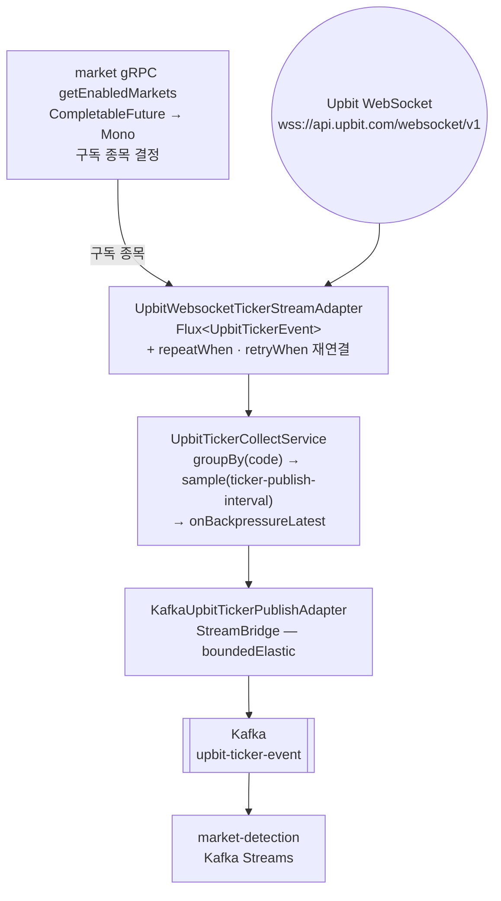

# UPBIT_CONNECTOR — upbit-connector 서비스 상세 기준 문서

> - **문서 상태**: 검증 완료(수집·발행 구현, REST 조회 미구현)
> - **기준 브랜치**: `main`
> - **기준 일자**: 2026-08-19
> - **검증 기준**: 실제 애플리케이션 코드 및 Config Repository(`git-config-repo/`)
> - **재검증 조건**: 아래 중 하나라도 변경되면 이 문서를 다시 검증한다.
>   - Upbit WebSocket 수집 파이프라인 구현·변경
>   - Kafka 바인딩·토픽(`upbit-connector.yml`의 `spring.cloud.stream.*`) 추가·변경
>   - REST 조회 API 추가(외부 계약 발생)
>   - `market-detection`에서 수집 책임을 이관하는 변경

## 1. 문서 목적과 기준 시점

이 문서는 `upbit-connector` 서비스의 구조·흐름·계약·근거를 찾아 읽기 위한 상세 문서다. 문서와 코드가 어긋나면 코드가 기준이다. 짧은 작업 규칙은 [`../../upbit-connector/CLAUDE.md`](../../upbit-connector/CLAUDE.md)에 있으며 여기서는 반복하지 않는다.

**현재 구현 범위**: Upbit WebSocket 실시간 시세 수집 → 종목별 스로틀 → Kafka 발행까지다. REST 조회 API는 아직 없다.

## 2. 모듈 역할

Upbit 외부 API와의 통신을 전담하는 **리액티브(WebFlux/Reactor) 커넥터 서비스**. 프로젝트에서 Upbit 접점을 한 모듈로 모으는 것이 목적이다.

- 1단계(완료): Upbit WebSocket 실시간 시세 수집 → 스로틀 → Kafka 발행
- 2단계(예정): Upbit REST 조회(캔들·호가 등)를 조합해 응답하는 API
- 저장소(DB) 없음. gRPC 서버 노출 없음.

### 2.1 왜 별도 모듈인가

`market-detection`에 함께 있던 Upbit WebSocket·coalescing buffer·worker pool과 market gRPC 구독 조회를 이 서비스로 이관했다. 두 서비스 사이의 Kafka 경계를 유지해 `upbit-connector`는 `upbit-ticker-event` 발행만, `market-detection`은 Kafka Streams 탐지만 담당한다.

## 3. 실행 구조와 주요 의존성

**계층 모듈 구성** — `-contract` / `-application` / `-adapter-out` / `-bootstrap`.

ArchUnit은 모든 `-bootstrap` 모듈에 `Main`만 두도록 강제한다.

| 항목 | 값 |
|---|---|
| 실행 모듈 | `upbit-connector/upbit-connector-bootstrap`(`Main`만) |
| 구독 종목 | market gRPC `MarketService.GetEnabledMarkets`(→ `market.v1`) |
| 메인 클래스 | `org.example.upbitconnector.Main` |
| 웹 스택 | **WebFlux**(Reactor Netty). 이 저장소에서 `spring-cloud-api-gateway` 다음으로 두 번째 |
| 서버 포트 | `8600`(`git-config-repo/dynamic/upbit-connector.yml`) |
| Docker 이미지 | `crypto-upbit-connector` |
| CI task | `./gradlew upbitConnectorCi` |
| 의존 방향 | `-adapter-out` → `-application` → `-contract`; `-bootstrap`은 각 모듈을 조립 |
| 프레임워크·클라이언트 | `spring-boot-starter-webflux`(Reactor Netty), `spring-boot-starter-validation`, `spring-cloud-config-client`, `spring-cloud-eureka-client` |
| 테스트 | `reactor-test`(`StepVerifier` 가상 시계) |

의존성 전체 그래프는 [`docs/dependencies.md`](../dependencies.md)에서 확인할 수 있다.

## 4. 데이터 흐름 (1단계 구현됨)

### 4.1 종목별 스로틀 계약

- 런타임 설정은 `ticker-publish-interval: 7s`다.
- 첫 ticker가 들어와 `groupBy(code)`의 종목 그룹이 만들어진 시점부터 각 종목의 7초 구간을 센다.
- `sample(7s)`은 해당 구간에 ticker가 있으면 가장 최신값 **최대 1개**만 내보낸다. 값이 없는 구간은 발행하지 않는다.
- Kafka 발행이 느리면 `onBackpressureLatest`가 같은 종목의 대기값을 최신 하나로 교체하고, `concatMap`이 같은 종목을 순서대로 하나씩 발행한다.
- 7초는 실제 Kafka 발행 완료 시점이 아니라 종목 Flux의 구간 기준이다. 따라서 Kafka 지연 시 실제 브로커 도착 간격이 정확히 7초라고 보장하지 않는다.

기존 `market-detection` 구현과의 대응 관계, 그리고 **의미가 등가가 아닌 지점**은 [`MARKET_DETECTION.md`](MARKET_DETECTION.md) §4.1–4.2와 함께 본다. 특히:

- 기존 `market-detection` 구현은 스로틀 윈도우의 **첫 값**을 통과시킨다. Reactor `sample`은 윈도우의 **마지막 값**을 내보낸다 → 이동평균에 들어가는 표본이 달라져 탐지 결과가 바뀔 수 있다.
- 기존 구현은 ready queue가 가득 차면 drop하고 카운터를 올린다. `onBackpressureLatest`에는 실패 개념이 없어 해당 지표가 사라진다.
- 기존 worker pool은 code와 무관하게 병렬 처리한다. `groupBy` + `flatMap`은 code별 병렬이라 같은 code의 순서 보장이 더 강해진다.

## 5. 이관 결과와 기존 구현의 차이

| 기존(market-detection) | 현재(upbit-connector) |
|---|---|
| OkHttp WebSocket + 수동 재연결 없음 | Reactor Netty + `repeatWhen`/`retryWhen`(지수 백오프·jitter) |
| 코드별 시간 스로틀: 구간의 **첫 값** 통과 | `sample`: 구간의 **마지막 값** 통과 |
| `UpbitTickerCoalescingBuffer`(유계 ready queue, full 시 drop + 카운터) | `onBackpressureLatest`(덮어쓰기, 실패 개념 없음) |
| worker pool 2개, code 무관 병렬 | `groupBy` + `flatMap`, code별 병렬(같은 code 순서 보장 강화) |
| Micrometer metric 6종(queue 크기·offer 실패·병합·처리 수·worker 오류·처리 시간) | Reactor 기준으로 재정의(§5.1) |

**스로틀 표본이 바뀌었다.** 구간의 첫 값 대신 마지막 값이 흐르므로 이동평균에 들어가는 표본이 달라진다. 탐지 임계 판정에 영향을 줄 수 있다(실측은 TODO 4.17).

### 5.1 관측 지표

Reactor 파이프라인에는 명시적 queue·worker 상태가 없어 기존 6종을 그대로 옮길 수 없다. 같은 질문("무엇이 얼마나 들어와서 얼마나 나갔나, 어디서 끊겼나")에 답하는 지표로 다시 정의했다.

| 지표 | 종류 | 태그 | 의미 |
|---|---|---|---|
| `upbit.ticker.received` | Counter | `code` | WebSocket 에서 받은 ticker 수(**스로틀 이전**) |
| `upbit.ticker.published` | Counter | `code` | `upbit-ticker-event` 발행 성공 수 |
| `upbit.ticker.publish.failed` | Counter | `code` | 발행 실패로 건너뛴 수 |
| `upbit.ticker.publish` | Timer | — | `StreamBridge` 발행 호출 소요시간 |
| `upbit.websocket.reconnect` | Counter | `reason=error\|completed` | WebSocket 재연결 횟수 |
| `upbit.collect.restart` | Counter | `reason=error\|completed` | 수집 파이프라인 전체 재조립 횟수 |

- **스로틀로 접힌 양은 `received - published - publish.failed`** 로 읽는다. `sample()` 은 버리는 값에 콜백이 없어 직접 셀 수 없고, 구간마다 몇 건이 하나로 접혔는지는 이 차이가 답한다.
- **`code` 태그가 "특정 종목만 끊김"을 잡는 수단**이다. 종목별 수신이 0이 되면 그 종목만 조용해진 것이고, 전 종목이 동시에 0이면 연결 문제다. 현재 활성 마켓은 6종목(market `schema.sql` 시드)이라 카디널리티 부담이 없다. 종목이 크게 늘면 태그 유지 여부를 다시 본다.
- **발행 지연은 종목으로 가르지 않는다.** Kafka 쪽 성질이라 종목별로 갈라도 같은 값을 본다.
- 재연결·재조립이 두 층인 이유는 §4의 이중 안전망 때문이다. WebSocket 어댑터가 자체 재연결하고, 그 바깥에서 `UpbitTickerCollectStarter` 가 파이프라인을 다시 조립한다. 후자가 오르면 어댑터 재연결로 복구되지 않은 종료가 있었다는 뜻이다.
- **계층**: 수집 정책이 세는 세 지표(`received`/`published`/`publish.failed`)는 `UpbitTickerMetricsPort`(application) → `MicrometerUpbitTickerMetricsAdapter`(adapter-out)로 나간다. application 이 Micrometer 를 모르게 하려는 것이다. 재연결·재조립은 adapter-out 자신의 사건이라 포트 없이 `MeterRegistry` 를 직접 쓴다(어댑터가 어댑터를 포트로 참조하지 않는다).

## 6. 계약

### 6.1 `__TypeId__`는 이 바인딩에서 wire까지 가지 않는다 (관찰됨)

`KafkaEventFactory.createEventMessage(...)`는 Spring 메시지에 `__TypeId__`를 넣지만, **바인딩에 `value.serializer`(JsonSerializer)를 지정하면 그 값이 Kafka 레코드 헤더로 전달되지 않는다.** 값 직렬화기가 타입 헤더 소유권을 갖기 때문이다. 실측:

| 바인딩 설정 | 결과 |
|---|---|
| `value.serializer` 미지정(payload = JSON 문자열) | 넣은 값 그대로 전달 |
| `value.serializer: JsonSerializer` | 헤더 없음 |
| `value.serializer: JsonSerializer` + `spring.json.add.type.headers=true` | payload 런타임 클래스로 덮임 |

이 서비스의 ticker 바인딩은 두 번째에 해당한다(market-detection의 기존 발행과 동일 구성). 따라서:

- 소비자는 타입 헤더가 아니라 **선언된 타입**으로 역직렬화해야 한다.
- 발행자 클래스의 패키지를 옮겨도 wire 계약은 깨지지 않는다.
- 이 단정은 `KafkaUpbitTickerPublishIntegrationTest`가 고정한다.

outbox 계열 발행(`outbox-poller`)은 payload가 JSON 문자열이고 `value.serializer` 오버라이드가 없어 `__TypeId__`가 보존된다. 즉 **`__TypeId__` 계약은 바인딩 구성에 따라 다르다**(규칙 반영: `.claude/rules/external-contracts.md` Kafka 절).

| 계약 | 내용 |
|---|---|
| Kafka `upbit-ticker-event` 발행 | 값 = `upbit-connector-contract`의 `UpbitTickerEvent`(JSON), 키 = 마켓 코드. 소비자는 `market-detection` |
| market gRPC `GetEnabledMarkets` 소비 | 구독 종목 결정. 결과가 비면 구독을 만들지 않고 예외 |
| REST 조회 API | 아직 없음(2단계 계획). 추가 시 Gateway route·CORS 함께 본다 |

## 7. 설정

- 로컬 `application.yml`: `spring.application.name`, Config Server import, `spring.cloud.config.name: upbit-connector,eureka-client,kafka,monitoring`
- 원격: `git-config-repo/dynamic/upbit-connector.yml` — 포트, market gRPC client, Kafka 출력 바인딩, WebSocket·스로틀·재연결 정책
- Upbit WebSocket URL은 `git-config-repo/application.yml`의 `uri.provider.upbit.websocket`에 이미 존재한다(재사용 대상)

### 7.1 설정 변경은 재시작으로 반영한다

이 서비스는 Kafka Bus(`spring-cloud-starter-bus-kafka`)에 연결하지 않는다. **의도한 선택이다.**

수집 파이프라인은 기동 시 한 번 조립되며 `ticker-publish-interval`·`url`을 그때 읽는다. busrefresh로 프로퍼티를 다시 바인딩해도 이미 조립된 파이프라인은 옛 값으로 계속 돈다. 값이 실제로 반영되게 하려면 refresh 시 파이프라인을 재조립해야 하고, 그러려면 이 저장소에 전례가 없는 `@RefreshScope` 도입과 refresh마다 WebSocket 재연결을 감수해야 한다. 얻는 것은 사실상 `ticker-publish-interval` 하나다.

이 서비스는 상태가 없어 재시작 비용이 낮다(safe-recreate 배포). 그래서 **설정을 바꾸면 재배포·재시작으로 반영한다.**

예외: `ticket`과 구독 종목은 재구독 때마다 다시 읽으므로 재연결 시 자동 반영된다.

## 8. 테스트 현황

| 층 | 현황 |
|---|---|
| 단위 | `UpbitTickerCollectServiceUnitTest`(`StepVerifier` 가상 시계로 종목별 7초 최신값·느린 발행 시 latest 1개·발행 실패 격리 검증) |
| 통합 | `KafkaUpbitTickerPublishIntegrationTest`(Kafka Testcontainer, 발행 wire 계약 고정) |
| E2E | 없음(웹 엔드포인트 없음) |
| 부팅 스모크 | `BootSmokeTest` 존재. 외부 인프라 의존 없이 `RANDOM_PORT`로 부팅 검증 |

부팅 스모크는 실제 `git-config-repo`를 직접 import한다(하니스 상세: [`../TESTING.md`](../TESTING.md) §3–4).

## 9. 컴파일 · 테스트 · CI 명령

- 컴파일: `./gradlew :upbit-connector:upbit-connector-bootstrap:compileJava`
- 테스트: `./gradlew :upbit-connector:upbit-connector-bootstrap:test`
- 서비스 CI: `./gradlew upbitConnectorCi`

## 10. 확인 필요 항목

확정된 결함으로 단정하지 않는다. 상세와 근거는 [`../../TODO.md`](../../TODO.md) **4.9**에서 단일 관리한다.

- 배포 첫 실행 전 `.deploy/upbit-connector.current-image` 초기화(TODO 4.9)
- REST 조회 API 미구현(TODO 4.11)
- 스케일아웃 시 인스턴스 간 종목 중복 구독·중복 발행 가능성(TODO 4.16)
- 스로틀 표본 차이(§5)가 탐지 결과에 주는 영향 미실측(TODO 4.17)

## 11. 관련 문서와 rules

- [`MARKET_DETECTION.md`](MARKET_DETECTION.md) — `upbit-ticker-event` 소비와 Kafka Streams 탐지
- [`../ARCHITECTURE.md`](../ARCHITECTURE.md) — 전체 구조·서비스 카탈로그
- [`../TESTING.md`](../TESTING.md) — 부팅 스모크 하니스
- [`../../.claude/rules/external-contracts.md`](../../.claude/rules/external-contracts.md) — Kafka·REST 계약 변경 절차
