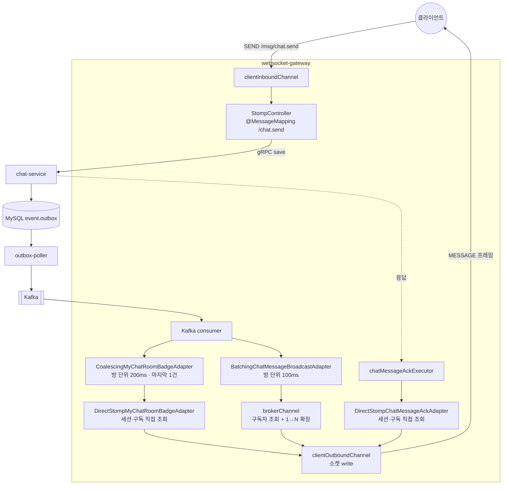
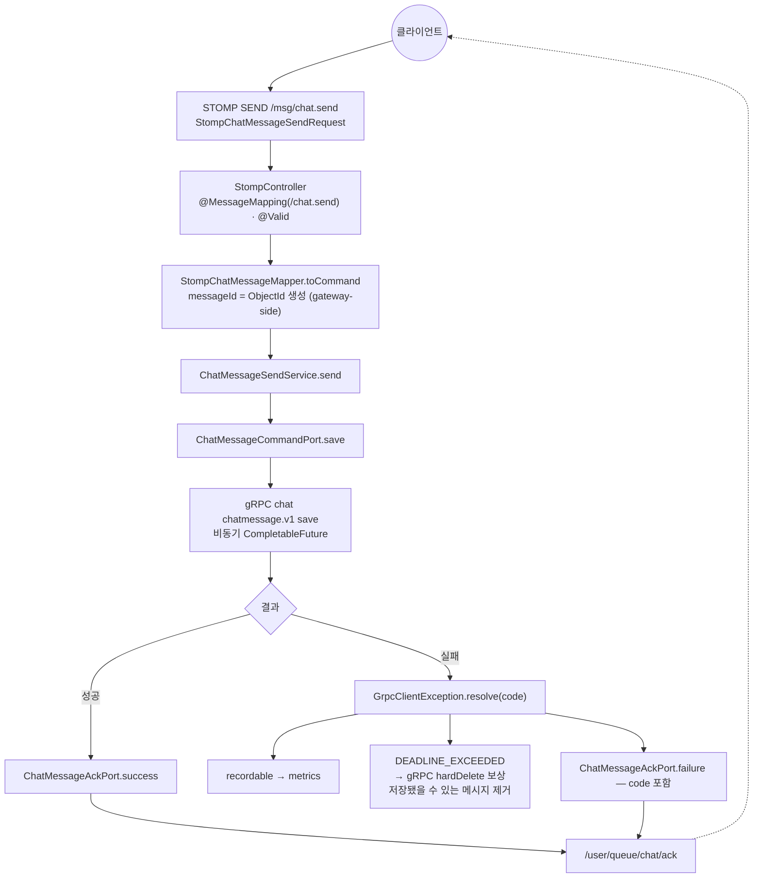

# WEBSOCKET_GATEWAY — websocket-gateway 서비스 상세 기준 문서

> - **문서 상태**: 검증 완료
> - **기준 브랜치**: `main`
> - **기준 일자**: 2026-07-25
> - **검증 기준**: 실제 애플리케이션 코드 및 Config Repository(`git-config-repo/`)
> - **재검증 조건**: 아래 중 하나라도 변경되면 이 문서를 다시 검증한다.
>   - STOMP 엔드포인트·prefix·destination(`StompConfig`, `common-core/StompDestination`, `websocket-gateway.yml`) 변경
>   - Kafka 소비 바인딩(`websocket-gateway.yml`의 `spring.cloud.stream.*`) 또는 소비 계약(`ChatMessageBroadcastEvent`, `MyChatRoomBadgeBroadcastEvent`, `WebNotificationBroadcastEvent`) 변경
>   - gRPC 소비 계약(`chatmessage.v1`, `GrpcChatMessageCommandAdapter`) 변경
>   - STOMP wire payload(`StompChatMessagePayload`, `*AckPayload`, `*BadgePayload`, `*WebNotificationPayload`) 변경
>   - 세션 위치(`LocalSessionCache`, `RedisSessionLocationAdapter`, `WebSocketSessionEventHandler`) 변경

## 1. 문서 목적과 기준 시점

이 문서는 `websocket-gateway` 서비스의 구조·요청 흐름·계약·근거를 사람과 AI가 필요할 때 찾아 읽기 위한 상세 문서다. 문서와 코드가 어긋나면 코드가 기준이다(루트 `docs/ARCHITECTURE.md` 원칙과 동일). 짧은 작업 규칙은 [`../../websocket-gateway/CLAUDE.md`](../../websocket-gateway/CLAUDE.md)에 있으며 여기서는 반복하지 않는다. 아웃바운드 wire payload 구조 요약은 [`../ARCHITECTURE.md §7.4`](../ARCHITECTURE.md)에도 있다.

## 2. 모듈 역할

프론트와 STOMP over WebSocket으로 연결되는 **실시간 게이트웨이**. 두 방향을 담당한다.

1. **인바운드(송신)**: 클라이언트의 STOMP `/msg/chat.send`를 받아 chat 서비스에 gRPC(`chatmessage.v1`)로 저장 요청하고, 결과를 ACK로 돌려준다.
2. **아웃바운드(수신·push)**: chat/notification이 Outbox로 발행한 브로드캐스트 Kafka 이벤트를 소비해, **해당 인스턴스에 연결된 사용자에게만** STOMP로 push한다.

메시지 영속·수신자 판정은 이 모듈이 아니라 chat/notification의 몫이다. websocket-gateway는 **연결·라우팅·push**만 책임진다(상태는 세션 위치 캐시뿐). gRPC 서버는 노출하지 않는다(`grpc.server.enabled: false`).

## 3. 실행 구조와 주요 의존성

| 구분 | 내용 |
|---|---|
| Gradle·실행 | `:websocket-gateway:*` 헥사고날 멀티모듈, `websocket-gateway-bootstrap`(`crypto-websocket-gateway`) |
| 진입점·네트워크 | `org.example.websocket.gateway.Main`, 포트 `8100`, gRPC 서버 비활성 |
| 저장소·로컬 상태 | Redis Cluster(세션 위치, `{session}`), DB 없음, Caffeine 로컬 세션 |
| gRPC 클라이언트 | `chat-client`(plaintext, max inbound 16MB, `uri.discovery.chat-service`) |
| 원격 설정 | `websocket-gateway,eureka-client,kafka,redis,monitoring`; 공유 `api-contract.*`는 Config Repository 루트에서 병합 |
| 관측성 | OpenTelemetry javaagent(`copyOtelAgent`), Micrometer/Prometheus, `ws_active_sessions` |

DB가 없지만 이벤트 계약의 전이 의존성으로 JPA가 classpath에 들어온다. 따라서 `websocket-gateway.yml`에서 `DataSourceAutoConfiguration`·`HibernateJpaAutoConfiguration`을 제외하고, `Main`의 component scan에서 `org.example.common.(outbox|dlq).*`를 제외한다. 이 설정을 제거하면 datasource·JPA 빈 구성으로 부팅이 깨진다.

의존성 전체 그래프는 [`docs/dependencies.md`](../dependencies.md)에서 확인할 수 있다.

## 4. 모듈 구조 (헥사고날)

| Gradle 모듈 | 계층 | 핵심 내용 | 주요 의존 |
|---|---|---|---|
| `websocket-gateway-application` | application | UseCase/Service, Port(in/out), Command/Result, `LocalSessionCache` | `common-grpc-client`, `notification-contract` |
| `websocket-gateway-adapter-in` | adapter-in | STOMP(`StompController`, `StompConfig`, 세션 이벤트), Kafka 바인더, 이벤트→커맨드 매퍼 | `websocket-gateway-application`, `chat-contract`, `notification-contract`, starter-websocket, stream-kafka |
| `websocket-gateway-adapter-out` | adapter-out | gRPC(chat), STOMP push 어댑터, Redis 세션, id 생성, metrics | `common-core/id/grpc/redis`, `chat-client`, grpc-netty/client-starter |
| `websocket-gateway-bootstrap` | 실행 | `Main`, `application.yml`, OTEL agent | 위 3개 + actuator/config/eureka/bus/prometheus |

- 서브도메인: `chatmessage`(송신·브로드캐스트), `chatroom`(뱃지), `notification`(push), `session`(위치).
- 소비 계약을 위해 adapter-in이 `chat-contract`(`ChatMessageBroadcastEvent`, `MyChatRoomBadgeBroadcastEvent`)·`notification-contract`(`WebNotificationBroadcastEvent`)에, adapter-out이 `chat-client`(gRPC)에 의존한다.

## 4-1. 채팅 메시지 경로 한눈에

**ACK 와 브로드캐스트는 갈라진다.** ACK 는 저장이 끝나면 바로 나가고, 브로드캐스트는 outbox·Kafka 를 돈다.



**읽는 법 셋**

- **ACK 와 뱃지는 `brokerChannel` 을 건너뛴다.** 로컬 세션·구독 ID 를 찾아 `clientOutboundChannel` 로 직접 보낸다(→ §8).
- **메시지 배칭은 `brokerChannel` 진입 직전에서 태스크 수를 줄이고, 뱃지 conflation 은 직접 전송 전에 발송 수를 줄인다.**
- **`brokerChannel` 에서 1건이 버려지면 방 전원이 못 받는다.** 확장 이전 단계이기 때문이다. `clientOutboundChannel` 은 확장 이후라 1명이다(→ [`SERVICE_FLOWS.md` §9](../SERVICE_FLOWS.md)).

## 5. 인바운드 — 메시지 송신 (STOMP → gRPC → ACK)



- 요청 검증(`StompChatMessageSendRequest`): `clientMessageId`/`roomId`/`writerId` `@NotBlank`, `content` `@NotBlank`+`@Size(max=1000)`. STOMP 예외는 `StompChatMessageExceptionHandler`.
- **messageId는 게이트웨이가 gRPC 호출 전에 생성**(`MessageIdGenerateAdapter` → `ObjectIdGenerator`)해 클라이언트가 `clientMessageId`로 상관(correlate)할 수 있게 한다.
- **DEADLINE_EXCEEDED 보상**: 저장 응답이 데드라인을 넘기면 메시지가 chat에 저장됐을 수 있으므로 `hardDelete`(reason=save timeout)로 되돌린다(중복/유령 메시지 방지). hardDelete 실패는 로그+metrics만.
- 저장은 `chatmessage.v1` gRPC 계약(→ [`CHAT.md §10`](CHAT.md)). ACK/실패코드는 프론트 계약.

## 6. 아웃바운드 — 브로드캐스트 push (Kafka → STOMP)

`KafkaWebsocketGatewayBinder`는 채팅 메시지·방 배지·웹 알림을 각각 Kafka consumer로 등록한다. 세 consumer 모두 **인스턴스별 고유 group**(`...-${app.instance-id}`)·`concurrency: 2`·`ack-mode: record`를 사용한다. 따라서 모든 gateway 인스턴스가 같은 이벤트를 받아 자신의 로컬 세션에만 전달한다.

### 6.1 소비 모델과 전달 대상

| consumer | 소비 토픽 | 이벤트 | 로컬 전달 대상 |
|---|---|---|---|
| `chatMessageBroadcastEventConsumer` | `chatmessage-broadcast-event` | `ChatMessageBroadcastEvent{payload, clientMessageId}` | 해당 방을 구독한 로컬 세션의 `/topic/chat/{roomId}` |
| `myChatRoomBadgeBroadcastEventConsumer` | `chatroom-broadcast-event` | `MyChatRoomBadgeBroadcastEvent` | 로컬 사용자 세션의 `/user/queue/chat/badge` |
| `webNotificationBroadcastEventConsumer` | `web-notification-broadcast-event` | `WebNotificationBroadcastEvent` | 로컬 수신자 세션의 `/user/queue/notification` |

세 consumer는 모든 인스턴스가 처리해야 하므로 인스턴스별 group을 사용한다. 공유 `(consumer_name,event_id)` Inbox는 사용하지 않는다. 한 인스턴스가 이벤트를 선점하면 다른 인스턴스의 로컬 세션 전송이 차단되기 때문이다.

Kafka `event_id`는 로그와 추적에 사용한다. STOMP 전송은 DB 트랜잭션으로 원자화할 수 없으므로 서버 측 exactly-once를 보장하지 않는다. 중복은 이벤트 성격에 따라 클라이언트가 안정적인 `messageId` 또는 `notificationId`로 제거하고, 알림은 영속 알림함 REST 조회로 상태를 보정한다.

### 6.2 채팅 메시지 브로드캐스트

```text
Kafka 이벤트
  → ChatMessageBroadcastEventMapper
  → LocalSessionCache.hasLocalSubscriber(roomId)
  → 방별 100ms 배칭
  → brokerChannel
  → /topic/chat/{roomId} 구독 세션으로 확장
```

- 이벤트에는 멤버 목록을 넣지 않는다. `SUBSCRIBE`·`UNSUBSCRIBE` 때 `LocalSessionCache`가 관리하는 방별 구독 레지스트리로 `hasLocalSubscriber(roomId)`를 판정한다. 멤버 목록을 이벤트에 넣으면 outbox 행 크기가 방 크기에 비례하기 때문이다.
- `/topic/chat/{roomId}`로 나가는 wire는 `StompChatMessageBatchPayload{roomId, messages[]}` 봉투다(§8). 한 건만 담겨도 같은 봉투 형식을 사용한다.
- 방별 100ms 시간창으로 묶는 것은 **메시지를 버리는 것이 아니라 프레임 수를 줄이는 것**이다. 전달 메시지 수와 구독자 확장(×N)은 변하지 않지만, `brokerChannel`에 제출하는 태스크와 `clientOutboundChannel` 프레임 수가 줄어든다.
- 근거와 수치는 [부하테스트 문서 §3-0](../../chat/load-test-results/chatmessage/websocket-gateway/README.md)에 정리돼 있다.

### 6.3 방 배지

```text
Kafka 이벤트
  → LocalSessionCache.hasUser(userId)
  → 방별 200ms conflation
  → 최신 상태 1건만 유지
  → 로컬 세션별 /user/queue/chat/badge 직접 전송
```

- 배지는 메시지 내용이 아니라 상태 알림이다. 따라서 200ms 구간의 마지막 1건만 남기고 이전 상태는 버린다(`CoalescingMyChatRoomBadgeAdapter` → `DirectStompMyChatRoomBadgeAdapter`). 메시지 브로드캐스트와 달리 전달 메시지 수를 보존해야 하는 경로가 아니다.
- 이 최적화가 가능한 이유는 payload(`StompMyChatRoomBadgePayload{roomId, lastMsgContent, lastMsgCreatedAt}`)에 개인별 값이 없기 때문이다. 개인별 필드가 추가되면 방 단위 conflation을 재검토해야 한다.
- 로컬 세션이 없는 멤버는 정상 skip(`chat.badge.direct.skipped`)이다. 세션은 있지만 뱃지 구독 ID가 없거나 전송에 실패한 경우만 `chat.badge.direct.failed`로 센다.
- 도입 당시 뱃지는 broker 태스크의 98.8%(6,400/초)를 차지했고 broker 거절 75,694건의 주원인이었다(PR #263).

배칭과 conflation은 맵과 전용 스케줄러로 구현했다. Kafka consumer 콜백이 블로킹이라 WebFlux의 `Flux.sample`을 그대로 사용할 수 없기 때문이다. 현재는 전역 타이머 하나가 단일 스레드로 전 방을 순회한다. 방 수가 늘어나면 `chat.badge.flush`와 드레인 건수를 기준으로 타이머 분산·병렬화를 검토한다(PR #281).

### 6.4 웹 알림

웹 알림은 `LocalSessionCache.hasUser(receiverId)`로 대상 사용자가 이 인스턴스에 연결돼 있는지 확인한 뒤 `/user/queue/notification`으로 전송한다. 연결된 인스턴스가 없으면 skip한다.

알림은 `notificationId`를 기준으로 클라이언트에서 중복 제거하고, 누락이나 재연결 이후 상태는 영속 알림함 REST 조회로 보정한다.

### 6.5 전달 보장과 한계

- 세 consumer는 DLQ 소비·재시도가 없고 `ack-mode: record`다. STOMP executor 큐가 포화하면 push 태스크가 거절될 수 있으며, `stomp.executor.rejected{pool,kind}`의 `kind`로 브로드캐스트·ACK·뱃지를 구분한다.
- 배칭·conflation은 Kafka offset이 실제 STOMP 전송보다 먼저 commit될 수 있다. 인스턴스가 중간에 종료되면 버퍼의 이벤트는 전달되지 않는다. 뱃지는 방 목록 재조회로, 메시지는 방 재진입 시 Mongo 조회로 회복할 수 있어 이 비용을 허용한다.
- 회복 경로가 없는 ACK에는 배칭·conflation을 적용하지 않는다.
- 이 경로는 durable 영속 경로와 구분되는 best-effort push다. 현재 wire payload에 방별 순번이 없어 클라이언트가 유실을 감지해 즉시 재조회할 수 없다. 재연결은 재구독만 수행하므로, 유실된 메시지는 방 재진입이나 새로고침 전까지 보이지 않는다(→ **TODO 5.5**).

## 7. 세션 위치 관리

연결된 사용자의 위치를 **로컬(Caffeine) + 전역(Redis)** 이중으로 관리한다(`WebSocketSessionEventHandler`, `@EventListener`).

- **`LocalSessionCache`**: `sessionId→userId`·`userId→Set<sessionId>`·`sessionId→구독(ACK·뱃지 구독 ID + 방 구독)`·`roomId→Set<sessionId>` 네 가지를 **전부 `ConcurrentHashMap`**으로 들고 있다. 항목의 수명은 STOMP 이벤트(connect·subscribe·unsubscribe·disconnect)가 정하므로 상한 축출은 그 수명과 무관하게 불변식을 깬다 — 방에서 지워지면 구독자가 있는데 없다고 답하고, 세션 구독이 지워지면 방을 되찾지 못해 죽은 세션이 방에 남는다(둘 다 로그를 남기지 않는다). 마지막 구독자가 빠질 때 방 키를 지우고 마지막 세션이 빠질 때 사용자 키를 지운다. 크기는 `ws_local_sessions`·`ws_local_subscribed_rooms` 게이지로 노출하며 `ws_active_sessions` 와 벌어지면 세션 정리가 안 되고 있다는 신호다. **이 인스턴스에 연결된 세션만** 들고 있으며 push 대상 판정(`hasUser`/`hasLocalSubscriber`)과 ACK·뱃지 직접 전송(구독 ID)의 근거다.
- **`RedisSessionLocationAdapter`**(`SessionLocationPort`, Redis hash `{session}:user:{userId}` field=sessionId value=serverId): 어느 사용자가 어느 인스턴스(serverId)에 붙었는지. TTL 3분.
- 이벤트: **connect** → 로컬 register + Redis save(+TTL); **subscribe** → Redis `refreshTtl`; **disconnect** → `deleteIfServerMatches`(serverId 일치할 때만 삭제, 재접속 레이스 방지) + 로컬 remove. `ws_active_sessions` gauge 갱신.
- **핸드셰이크 인증**: `StompConfig`의 `determineUser`가 `X-User-Id` 헤더로 `Principal`을 만든다(없으면 연결 거부). 이 헤더는 업스트림(게이트웨이/oauth2-client 핸드셰이크 필터)이 주입한다(웹소켓 토큰 전달 방식은 TODO 1.5와 연결).

## 8. STOMP 계약 (프론트·부하테스트 의존)

- **엔드포인트**(`websocket.yml`): 기본 transport는 native `/ws-native`이며 프론트와 현행 k6 시나리오가 사용한다. SockJS `/ws-sockjs`는 fallback이 필요한 클라이언트를 위한 선택 옵션으로 등록만 유지한다. 둘 다 `setAllowedOriginPatterns("*")`를 적용한다.
- **prefix**: application `/msg`(@MessageMapping), user `/user`(`convertAndSendToUser`), broker simple `/topic`,`/queue`.
- **destination**(`common-core/StompDestination`):

| 방향 | destination | 전송 방식 | payload |
|---|---|---|---|
| inbound | `/msg/chat.send` | `@MessageMapping("/chat.send")` | `StompChatMessageSendRequest{clientMessageId, roomId, writerId, content}` |
| outbound | `/topic/chat/{roomId}` | `convertAndSend`(방 공유) | **봉투** `StompChatMessageBatchPayload{roomId, messages[]}`. 각 원소는 `StompChatMessagePayload{messageId, roomId, writerId, content, timestamp(long), clientMessageId}` |
| outbound | `/user/queue/chat/ack` | **`clientOutboundChannel` 직접**(brokerChannel 우회) | `StompChatMessageAckPayload`(성공/실패, errorCode) |
| outbound | `/user/queue/chat/badge` | **`clientOutboundChannel` 직접** | `StompMyChatRoomBadgePayload` |
| outbound | `/user/queue/notification` | `convertAndSendToUser` | `StompWebNotificationPayload` |

- 이들은 프론트와 `websocket-gateway/k6` 부하 테스트가 의존하는 **외부 계약**이다. 변경 전 의존성 확인(→ `../../.claude/rules/external-contracts.md`). 특히 `/topic/chat/{roomId}` wire는 내부 Kafka `ChatMessageBroadcastEvent`와 구조가 다르다.
- **ACK 는 brokerChannel 을 지나지 않는다.** `LocalSessionCache` 에서 세션과 구독 ID 를 찾아 `clientOutboundChannel` 로 직접 보낸다(`DirectStompChatMessageAckAdapter`). 세션이나 구독을 못 찾거나 전송에 실패하면 보내지 않고 `chat.message.ack.direct.failed` 로 센다. 구독 ID 는 `SessionSubscribeEvent` 에서 잡아 `LocalSessionCache` 에 함께 둔다 — 없으면 클라이언트가 MESSAGE 프레임을 매칭하지 못한다.
- **뱃지도 brokerChannel 을 지나지 않는다.** `DirectStompMyChatRoomBadgeAdapter` 가 같은 방식으로 세션·뱃지 구독 ID 를 헤더에 넣어 직접 보낸다. 로컬 세션이 없으면 `chat.badge.direct.skipped`, 로컬 세션은 있지만 구독 ID를 찾지 못하거나 전송에 실패하면 `chat.badge.direct.failed` 로 센다.
- 메시지 변환: `MappingJackson2MessageConverter`(JSON), 커스텀 executor(broker/inbound/outbound `ThreadPoolTaskExecutor`), broker cacheLimit 8192.

## 9. 확인 필요 항목

미해결 확인/결정 항목은 [`../../TODO.md`](../../TODO.md)에서 통합 관리한다. websocket-gateway 관련 항목:

- 세션 위치 TTL은 `websocket.session.ttl`(기본 `3m`, `git-config-repo/dynamic/websocket-gateway.yml`)로 주입된다. 값 조정은 Config 변경만으로 가능하다.
- **TODO 1.5**(기존, oauth2-client) — WebSocket 핸드셰이크의 `?access_token=` 쿼리 토큰 전달과 `X-User-Id` 주입 경로. 핸드셰이크 인증 전제와 연결.
- **TODO 5.5** — 브로드캐스트 유실을 클라이언트가 감지·복구할 경로가 없다(§6 best-effort 절). 순번 추가는 STOMP wire payload 변경(외부 계약).

## 10. 테스트 현황

- application: `ChatMessageSendServiceUnitTest`, `LocalSessionCacheUnitTest`(세션·ACK·뱃지 구독 ID, unsubscribe·세션 제거 시 동반 삭제)
- adapter-in: `StompControllerUnitTest`, `StompChatMessageExceptionHandlerUnitTest`(실패 ACK 의 `clientMessageId`), `ExecutorConfigUnitTest`, `ExecutorConfigRejectionKindUnitTest`(거절 태스크 목적지 분류), `RedisChatMessageRateLimiter*Test`
- adapter-out: `BatchingChatMessageBroadcastAdapterUnitTest`(순서 보존·상한 초과 즉시 전송), `CoalescingMyChatRoomBadgeAdapterUnitTest`(마지막 1건·타임스탬프 역전·flush Timer), `DirectStompMyChatRoomBadgeAdapterUnitTest`·`DirectStompChatMessageAckAdapterUnitTest`(헤더 3종·세션·구독 부재·다중 세션), `GrpcChatMessageCommandAdapterUnitTest`, `RedisSessionLocationAdapterUnitTest`
- bootstrap: `BootSmokeTest` — 실제 `git-config-repo` 설정을 import 하므로 **설정 키 누락이 부팅 실패로 잡힌다**
- 부하: [`chat/load-test-results/.../README.md`](../../chat/load-test-results/chatmessage/websocket-gateway/README.md) — 결과는 §2. **거기 지연 수치는 목표치도 확정 용량도 아니다.** 16GB 단일 호스트에 컨테이너 23개를 올린 상태라 같은 조건 3회에서 p90 이 3배까지 흔들린다. 피크·SLO 는 운영계에서 다시 잰다. 확정된 것은 **유실 0·ACK 실패 0**과 **병목이 어디였는가**다

## 11. 컴파일 · 테스트 · CI 명령

- 컴파일: `./gradlew :websocket-gateway:websocket-gateway-application:compileJava` 등 서브모듈 단위.
- 서브모듈 테스트: `./gradlew :websocket-gateway:websocket-gateway-application:test`, `:websocket-gateway:websocket-gateway-adapter-out:test`.
- 서비스 CI: `./gradlew websocketGatewayCi`(빌드+테스트+ArchUnit 포함).
- 전체 build/test, `bootRun`, 실행, 배포는 명시적 요청 없이 수행하지 않는다.

## 12. 변경 위험도가 높은 파일

| 파일 | 이유 |
|---|---|
| `common-core/StompDestination` · `StompConfig` | STOMP destination/endpoint/prefix 계약(프론트·k6) |
| `StompChatMessageBatchPayload`/`StompChatMessagePayload`/`*AckPayload`/`*BadgePayload`/`*WebNotificationPayload` | wire payload 계약 |
| `BatchingChatMessageBroadcastAdapter` · `CoalescingMyChatRoomBadgeAdapter` | 배칭·conflation 창과 버퍼. 프레임 수와 지연을 동시에 정한다 |
| `DirectStompChatMessageAckAdapter` | ACK 가 브로커를 우회한다. 헤더(세션·구독 ID)가 틀리면 **조용히 전달되지 않는다** |
| `DirectStompMyChatRoomBadgeAdapter` | 뱃지가 브로커를 우회한다. 뱃지 구독 ID 수명과 직접 전송 실패 지표를 함께 유지해야 한다 |
| `KafkaWebsocketGatewayBinder` · `websocket-gateway.yml` stream | 소비 토픽·group(per-instance)·concurrency |
| `GrpcChatMessageCommandAdapter` | `chatmessage.v1` 소비(저장·hardDelete 보상) |
| `LocalSessionCache`/`RedisSessionLocationAdapter`/`WebSocketSessionEventHandler` | 세션 위치·push 라우팅 정합성. **ACK·뱃지 구독 ID 도 여기 있다** — 구독·세션 제거 경로가 늘면 함께 지워야 한다 |

## 13. 관련 문서와 rules

- 상류(메시지 저장·브로드캐스트 발행): [`CHAT.md`](CHAT.md)(`chatmessage.v1`, broadcast 이벤트), [`NOTIFICATION.md`](NOTIFICATION.md)(`web-notification-broadcast-event`)
- 루트 흐름: [`../SERVICE_FLOWS.md`](../SERVICE_FLOWS.md)(§8 채팅 송신), wire payload [`../ARCHITECTURE.md §7.4`](../ARCHITECTURE.md)
- 인증·헤더 전파: [`API_GATEWAY.md`](API_GATEWAY.md)
- 계약/보안/아키텍처/테스트 rules: `../../.claude/rules/{external-contracts,security,architecture,testing}.md`
